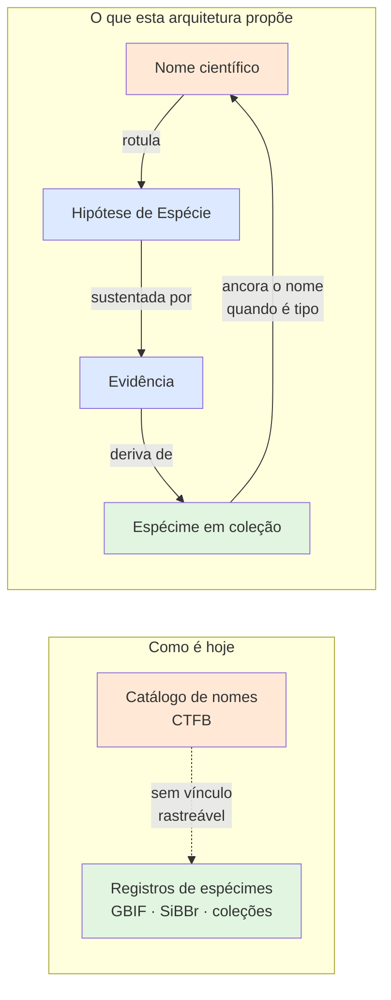
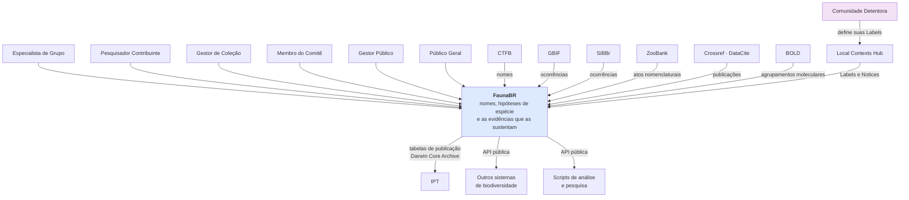
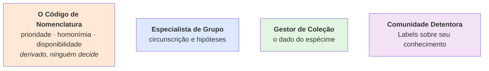

# FaunaBR — arquitetura para um sistema de informações baseado em evidências sobre a fauna brasileira

> **Este é um projeto de pesquisa.** Nada aqui é software em produção, e nada substitui o [Catálogo Taxonômico da Fauna do Brasil](https://fauna.jbrj.gov.br/), o [GBIF](https://www.gbif.org/) ou o [SiBBr](https://sibbr.gov.br/). O que este repositório contém é o desenho de **como seria um sistema ideal** — e o registro das decisões que levaram a ele. Ver [`docs/projetoPesquisa.md`](./docs/projetoPesquisa.md).

---

## O problema, em uma frase

Hoje um nome científico da fauna brasileira e os espécimes que o sustentam vivem em sistemas separados, e **não há como perguntar "quais evidências sustentam este nome?"** — nem quantas espécies do catálogo nacional não têm nenhuma.

## A ideia central

**Uma espécie não é uma linha em uma tabela de nomes. É uma hipótese, datada, assinada e sustentada por evidências.**

O nome é o rótulo; a evidência é o conteúdo. Disso decorre tudo o mais nesta arquitetura. O conceito de espécie adotado — linhagem metapopulacional que evolui separadamente, de De Queiroz (2007) — está detalhado em [`docs/specieConcept.md`](./docs/specieConcept.md).

## Quatro coisas que o sistema nunca confunde

Confundi-las é o erro estrutural que produz o descolamento atual entre catálogo e coleções.

| | O que é | Quem manda | Muda? |
|---|---|---|---|
| **Nome científico** | O rótulo | O Código de Nomenclatura Zoológica | Não — prioridade é regra, não opinião |
| **Conceito de Táxon** | O que o nome abrange, **segundo quem** | O taxonomista que o publicou | Sim, a cada revisão |
| **Hipótese de Espécie** | A linhagem e a evidência que a sustenta | O método científico | Sim, é testável |
| **Espécime** | O objeto na coleção | A coleção que o custodia | Não |

## O que muda para você

### Se você é taxonomista

- Sua revisão **prevalece** na visão publicada do catálogo, e a identificação anterior não desaparece: fica no histórico, com autor e data.
- Cada asserção sua é assinada e citável. Asserções concorrentes coexistem, com proveniência — o sistema não apaga a discordância.
- Prioridade, homonímia e disponibilidade de nomes são **calculadas pelo sistema** a partir dos dados de publicação e tipificação. Você não digita o que o Código já determina.
- Grupos sem especialista designado ficam marcados como **órfãos**, e ali nenhuma asserção ganha precedência automática. A lacuna vira número publicado, não silêncio.

### Se você gerencia uma coleção científica

- O dado do espécime é seu: tombo, evento de coleta, localidade, mídia. A cópia que o sistema mantém é derivada, e você pode corrigi-la ou retirá-la **sem justificar**.
- Você recebe uma **fila de divergências** com três tipos: identificação superada por revisão, espécie do catálogo sem nenhuma evidência vinculada, e registro que sumiu da última publicação do seu IPT.
- Você **resolve** cada divergência — aceita, rejeita ou reconhece sem ação —, e a sua resposta vira dado científico. Divergência rejeitada por você permanece visível como discordância declarada.
- Registro ausente de uma republicação é marcado como ausente, **nunca apagado**.

### Se você formula política pública

- Existe uma resposta única e datada para "qual é o nome válido de X" — a **Visão Curada** —, e ao lado dela, sempre acessível, a evidência que a sustenta e as asserções que a contestam.
- Cada espécie carrega o **grau de sustentação** da sua presença no Brasil: de "tipo com localidade-tipo nacional" até "nenhuma evidência vinculada".

### Se você é de uma comunidade indígena ou tradicional

- A autoridade sobre o conhecimento associado é **sua**, exercida no [Local Contexts Hub](https://localcontexts.org/) por meio de TK e BC Labels — não neste sistema, e sem intermediação de curador.
- Dado com Label **não** recebe licença aberta, porque licença aberta é irrevogável e a sua autoridade não é.
- O sistema, do lado institucional, aplica *Notices*: reconhece que existem direitos, mesmo antes de saber de quem.

## Como o sistema se encaixa no mundo

Diagrama de contexto — as pessoas e os sistemas com que ele conversa. Os dados saem por dois caminhos: **tabelas de publicação** mapeadas pelo IPT, que gera os arquivos Darwin Core Archive, e a **API pública**, para outros sistemas de biodiversidade e para scripts de análise.

Detalhamento técnico completo — níveis 2 e 3, componentes, persistência, implantação — em [`docs/arquitetura.md`](./docs/arquitetura.md).

## Quem decide o quê

A governança tem três camadas, e a camada de conteúdo tem **quatro titulares diferentes**. O primeiro deles não é uma pessoa.

Nenhum decide pelos outros. Proposta completa, com matriz de decisão e lacunas declaradas, em [`docs/governanca.md`](./docs/governanca.md).

## Princípios

- **Baseado em evidências** — todo nome aponta, quando existe, para objetos rastreáveis em coleções científicas.
- **Nada é sobrescrito** — asserção, identificação e ingestão são versionadas, com autor e data.
- **Aberto por padrão, restrito por exceção declarada** — FAIR e CARE conciliados: tão aberto quanto possível, tão fechado quanto necessário, com a linha decidida por quem tem legitimidade.
- **Padrões, não invenção** — Código de Nomenclatura Zoológica, Darwin Core, TDWG TCS, Local Contexts.

## Documentação

| Documento | Para quem | O que traz |
|---|---|---|
| [`docs/projetoPesquisa.md`](./docs/projetoPesquisa.md) | Todos | Pergunta de pesquisa, método, limitações declaradas |
| [`docs/specieConcept.md`](./docs/specieConcept.md) | Taxonomistas | O conceito de espécie adotado e suas consequências |
| [`docs/governanca.md`](./docs/governanca.md) | Taxonomistas, gestores, gestores públicos | Quem decide o quê, e o que ainda não existe |
| [`docs/arquitetura.md`](./docs/arquitetura.md) | Sistemas, infraestrutura, TI | C4 níveis 1 a 3, persistência, implantação |
| [`docs/adr/`](./docs/adr/) | Quem for implementar | 19 decisões, com as alternativas rejeitadas e o porquê |
| [`CONTEXT.md`](./CONTEXT.md) | Todos | Glossário — os termos usados de forma consistente |
| [`docs/contexto.md`](./docs/contexto.md) | Todos | Requisitos e diretrizes do projeto |
| [`LICENSES.md`](./LICENSES.md) | Todos | Três regimes: código, documentação, dados |

## Licença

Código sob [Apache-2.0](./LICENSE); documentação e dados sob CC BY 4.0; dados com TK/BC Label **fora de licença aberta**. Ver [`LICENSES.md`](./LICENSES.md).

## Referências principais

- DE QUEIROZ, K. Species Concepts and Species Delimitation. **Systematic Biology**, v. 56, n. 6, p. 879–886, 2007. DOI: [10.1080/10635150701701083](https://doi.org/10.1080/10635150701701083)
- BOEGER, W. A. et al. Catálogo Taxonômico da Fauna do Brasil: Setting the baseline knowledge on the animal diversity in Brazil. **Zoologia**, v. 41, e24005, 2024. DOI: [10.1590/S1984-4689.v41.e24005](https://doi.org/10.1590/S1984-4689.v41.e24005)
- ANDERSON, J. et al. **Guidance for Indigenous Collections and Indigenous Data**. Creative Commons; Local Contexts, 2026. DOI: [10.5281/zenodo.21071544](https://doi.org/10.5281/zenodo.21071544)
- **International Code of Zoological Nomenclature**. 4. ed. Disponível em: https://www.iczn.org/the-code/the-international-code-of-zoological-nomenclature/
