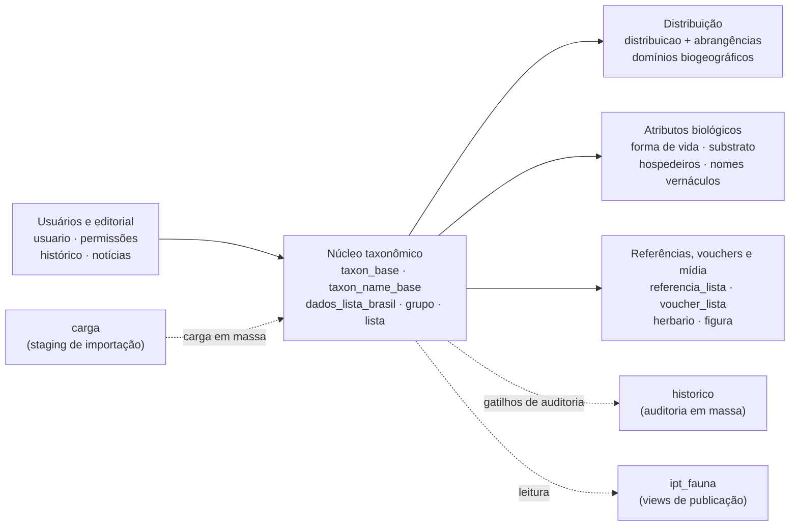
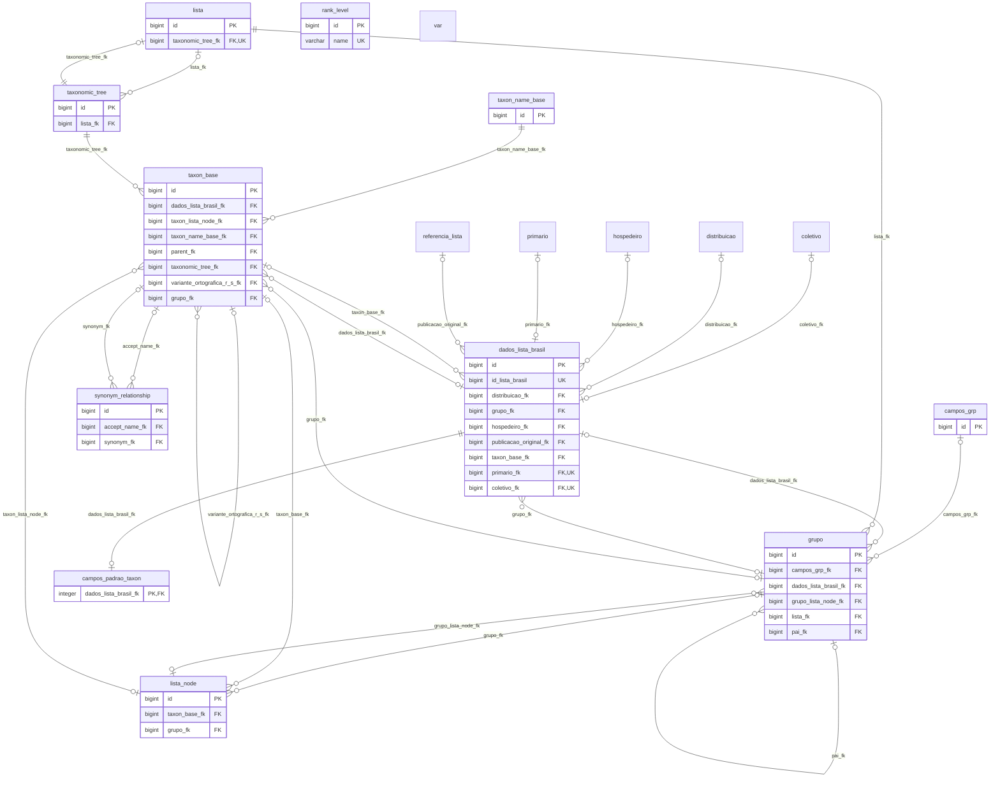
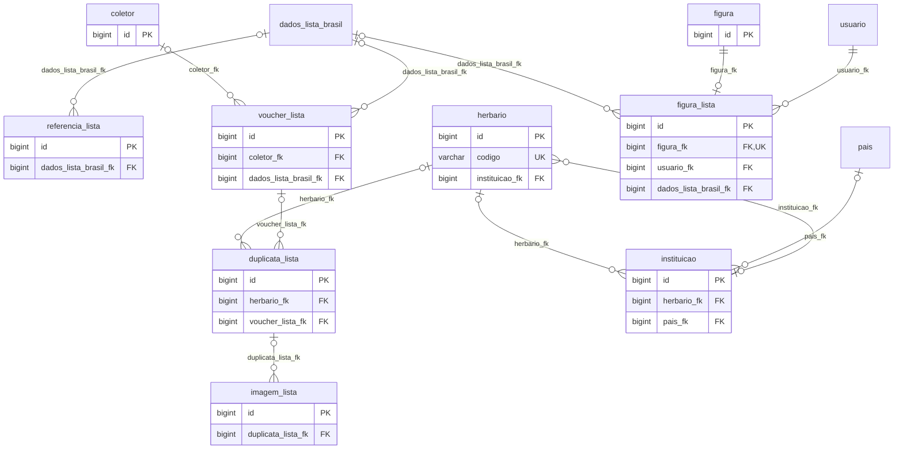
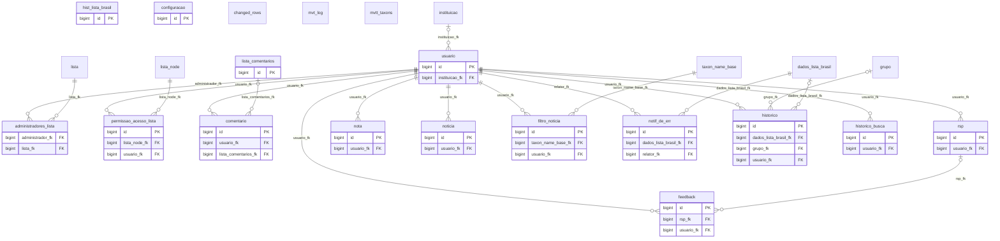

# Modelo Entidade-Relacionamento — Catálogo Taxonômico da Fauna do Brasil

Fonte: `dados/backup_fauna_2026_09_09.dump` (PostgreSQL custom dump v1.16, banco `fauna`, servidor 15.1, `pg_dump` 18.6).
Modelo extraído do TOC do dump (DDL em texto claro): **94 tabelas**, **98 chaves estrangeiras**, **29 views/materialized views**, distribuídas em 5 schemas.

| Schema | Papel | Tabelas |
|---|---|---|
| `public` | modelo de dados do catálogo (aplicação Hibernate) | 78 |
| `carga` | staging de importação em massa e registro de erros | 10 |
| `historico` | auditoria de alterações/remoções em massa | 5 |
| `postgrest` | autenticação da API PostgREST | 1 |
| `ipt_fauna` | apenas views/matviews de publicação para o IPT/GBIF | 0 (só views) |

## Convenções de leitura

- Os diagramas mostram apenas colunas **PK**, **FK** e **UK**; todos os demais atributos estão no [dicionário de dados](#dicionário-de-dados).
- Cardinalidade: `||` = obrigatório (FK `NOT NULL`), `|o` = opcional (FK anulável), `o{` = zero ou muitos, `o|` = zero ou um (FK com restrição `UNIQUE` ⇒ relação 1:1).
- Entidades desenhadas **sem atributos** pertencem a outro domínio e aparecem só para fechar a relação; sua definição completa está no diagrama do respectivo domínio.
- Cada chave estrangeira aparece em exatamente um diagrama (no domínio da tabela filha), portanto as 98 FKs estão integralmente representadas.
- Toda tabela de entidade usa PK sintética `id bigint` e coluna `hibernate_version` (controle de concorrência otimista do Hibernate). Tabelas associativas N:N não têm PK declarada.

## Visão geral dos domínios

## 1. Núcleo taxonômico

`taxon_base` é o nó da árvore taxonômica (auto-relacionado por `parent_fk`); `taxon_name_base` guarda o nome científico parseado (rank, epítetos, autor, ano); `dados_lista_brasil` é o registro editorial de cada táxon e o hub para quase todos os atributos; `lista` / `taxonomic_tree` / `lista_node` / `grupo` formam a estrutura de trabalho editorial (a lista publicada, sua árvore, os nós e os grupos taxonômicos com hierarquia própria via `pai_fk`).

Entidades externas ao domínio neste diagrama: `coletivo`, `distribuicao`, `hospedeiro`, `primario`, `referencia_lista`.

## 2. Distribuição geográfica e ecológica

`distribuicao` tem relação 1:1 recíproca com `dados_lista_brasil` e agrega as ocorrências por meio de tabelas associativas: estados/UF (`abrangencia_geografica`), bacias (`abrangencia_hidrografica`), mar (`abrangencia_marinha`), países, domínios biogeográficos (terrestre, marinho e epicontinental), macrohabitats e ambientes.

```mermaid
erDiagram
  distribuicao {
    bigint id PK
    bigint dados_lista_brasil_fk FK,UK
  }
  distribuicao_abrangencia {
    bigint id PK
    bigint abrangencia_geografica_fk FK
    bigint distribuicao_fk FK
  }
  abrangencia_geografica {
    bigint id PK
    varchar estado UK
  }
  distribuicao_hidrografica {
    bigint id PK
    bigint abrangencia_hidrografica_fk FK
    bigint distribuicao_fk FK
  }
  abrangencia_hidrografica {
    bigint id PK
    varchar bacias_hidrograficas UK
  }
  distribuicao_marinha {
    bigint id PK
    bigint abrangencia_marinha_fk FK
    bigint distribuicao_fk FK
  }
  abrangencia_marinha {
    bigint id PK
    varchar regioes_marinhas UK
  }
  distribuicao_paises {
    bigint distribuicao_fk FK
    bigint paises_fk FK
  }
  pais {
    bigint id PK
    text codigo UK
  }
  est {
    bigint id PK
    bigint pais_fk FK
  }
  municipio {
    bigint id PK
    bigint est_fk FK
  }
  distribuicao_dom_biogeografico {
    bigint distribuicao_fk FK
    bigint dom_biogeografico_fk FK
  }
  dom_biogeografico {
    bigint id PK
    varchar nome UK
  }
  distribuicao_dom_bio_marinho {
    bigint distribuicao_fk FK
    bigint dom_bio_marinho_fk FK
  }
  dom_bio_marinho {
    bigint id PK
    varchar nome_marinho UK
  }
  distribuicao_dom_bio_epicontin {
    bigint distribuicao_fk FK
    bigint dom_bio_epicontinental_fk FK
  }
  dom_bio_epicontinental {
    bigint id PK
    varchar nome UK
  }
  distribuicao_macrohabitat {
    bigint distribuicao_fk FK
    bigint macrohabitat_fk FK
  }
  macrohabitat {
    bigint id PK
    varchar tipo UK
  }
  ambiente_distribuicao {
    bigint distribuicao_fk FK
    bigint ambiente_fk FK
  }
  ambiente {
    bigint id PK
    varchar tipo UK
  }
  mv_distribuicao {
  }
  dados_lista_brasil {
  }
  abrangencia_geografica ||--o{ distribuicao_abrangencia : "abrangencia_geografica_fk"
  abrangencia_hidrografica ||--o{ distribuicao_hidrografica : "abrangencia_hidrografica_fk"
  abrangencia_marinha ||--o{ distribuicao_marinha : "abrangencia_marinha_fk"
  ambiente ||--o{ ambiente_distribuicao : "ambiente_fk"
  dados_lista_brasil ||--o| distribuicao : "dados_lista_brasil_fk"
  distribuicao ||--o{ ambiente_distribuicao : "distribuicao_fk"
  distribuicao ||--o{ distribuicao_abrangencia : "distribuicao_fk"
  distribuicao ||--o{ distribuicao_dom_bio_epicontin : "distribuicao_fk"
  distribuicao ||--o{ distribuicao_dom_bio_marinho : "distribuicao_fk"
  distribuicao ||--o{ distribuicao_dom_biogeografico : "distribuicao_fk"
  distribuicao ||--o{ distribuicao_hidrografica : "distribuicao_fk"
  distribuicao ||--o{ distribuicao_macrohabitat : "distribuicao_fk"
  distribuicao ||--o{ distribuicao_marinha : "distribuicao_fk"
  distribuicao ||--o{ distribuicao_paises : "distribuicao_fk"
  dom_bio_epicontinental ||--o{ distribuicao_dom_bio_epicontin : "dom_bio_epicontinental_fk"
  dom_bio_marinho ||--o{ distribuicao_dom_bio_marinho : "dom_bio_marinho_fk"
  dom_biogeografico ||--o{ distribuicao_dom_biogeografico : "dom_biogeografico_fk"
  est |o--o{ municipio : "est_fk"
  macrohabitat ||--o{ distribuicao_macrohabitat : "macrohabitat_fk"
  pais |o--o{ est : "pais_fk"
  pais ||--o{ distribuicao_paises : "paises_fk"
```

Entidades externas ao domínio neste diagrama: `dados_lista_brasil`.

## 3. Atributos biológicos e hospedeiros

Atributos multivalorados de `dados_lista_brasil` em tabelas N:N (forma de vida, substrato, qualificador) e hospedeiros — `hospedeiro` liga-se a hospedeiros vegetais, a nomes de hospedeiros animais externos (`animal_host_name`) e a táxons de fauna do próprio catálogo (`hospedeiro_hospedeiros_animais` → `taxon_name_base`).

```mermaid
erDiagram
  hospedeiro {
    bigint id PK
  }
  hospedeiro_vegetal {
    bigint id PK
    bigint hospedeiro_fk FK
  }
  hospedeiro_hospedeiros_animais {
    bigint hospedeiro_fk FK
    bigint hospedeiros_animais_fauna_fk FK
  }
  animal_host_name {
    bigint id PK
  }
  animal_host_name_hospedeiro {
    bigint hospedeiro_fk FK
    bigint animal_host_name_fk FK
  }
  dados_lista_brasil_forma_vida {
    bigint dados_lista_brasil_fk FK
    bigint forma_vida_fk FK
  }
  forma_vida {
    bigint id PK
    varchar tipo UK
    varchar tipo_ingles UK
  }
  forma_vida_grp {
    bigint grp_fk FK
    bigint forma_vida_fk FK
  }
  dados_lista_brasil_substrato {
    bigint dados_lista_brasil_fk FK
    bigint substrato_fk FK
  }
  substrato {
    bigint id PK
    varchar tipo UK
    varchar tipo_ingles UK
  }
  grp_substrato {
    bigint grp_fk FK
    bigint substrato_fk FK
  }
  dados_lista_brasil_qualif {
    bigint dados_lista_brasil_fk FK
    bigint qualif_fk FK
  }
  qualificador {
    bigint id PK
    varchar tipo UK
  }
  nm_vernaculo {
    bigint id PK
    bigint dados_lista_brasil_fk FK
  }
  coletivo {
    bigint id PK
    bigint dados_lista_brasil_fk FK,UK
  }
  primario {
    bigint id PK
    bigint dados_lista_brasil_fk FK,UK
  }
  secundario {
    bigint id PK
    bigint dados_lista_brasil_fk FK
  }
  dados_lista_brasil {
  }
  grupo {
  }
  taxon_name_base {
  }
  animal_host_name ||--o{ animal_host_name_hospedeiro : "animal_host_name_fk"
  dados_lista_brasil ||--o{ dados_lista_brasil_forma_vida : "dados_lista_brasil_fk"
  dados_lista_brasil ||--o{ dados_lista_brasil_qualif : "dados_lista_brasil_fk"
  dados_lista_brasil ||--o{ dados_lista_brasil_substrato : "dados_lista_brasil_fk"
  dados_lista_brasil ||--o{ nm_vernaculo : "dados_lista_brasil_fk"
  dados_lista_brasil ||--o{ secundario : "dados_lista_brasil_fk"
  dados_lista_brasil ||--o| coletivo : "dados_lista_brasil_fk"
  dados_lista_brasil ||--o| primario : "dados_lista_brasil_fk"
  forma_vida ||--o{ dados_lista_brasil_forma_vida : "forma_vida_fk"
  forma_vida ||--o{ forma_vida_grp : "forma_vida_fk"
  grupo ||--o{ forma_vida_grp : "grp_fk"
  grupo ||--o{ grp_substrato : "grp_fk"
  hospedeiro |o--o{ hospedeiro_vegetal : "hospedeiro_fk"
  hospedeiro ||--o{ animal_host_name_hospedeiro : "hospedeiro_fk"
  hospedeiro ||--o{ hospedeiro_hospedeiros_animais : "hospedeiro_fk"
  qualificador ||--o{ dados_lista_brasil_qualif : "qualif_fk"
  substrato ||--o{ dados_lista_brasil_substrato : "substrato_fk"
  substrato ||--o{ grp_substrato : "substrato_fk"
  taxon_name_base ||--o{ hospedeiro_hospedeiros_animais : "hospedeiros_animais_fauna_fk"
```

Entidades externas ao domínio neste diagrama: `dados_lista_brasil`, `grupo`, `taxon_name_base`.

## 4. Referências, vouchers e mídia

Publicação original e demais referências (`referencia_lista`), material testemunho (`voucher_lista` → `duplicata_lista` → `herbario`/`instituicao`) e imagens (`imagem_lista`, `figura`/`figura_lista`, esta com termo de responsabilidade por usuário).

Entidades externas ao domínio neste diagrama: `dados_lista_brasil`, `pais`, `usuario`.

## 5. Usuários, permissões e editorial

`usuario` é o ator do fluxo editorial: administra listas (`administradores_lista`), recebe permissão por nó (`permissao_acesso_lista`), gera histórico de edição (`historico`), buscas, comentários, notas, notícias, feedback e notificações de erro.

Entidades externas ao domínio neste diagrama: `dados_lista_brasil`, `grupo`, `instituicao`, `lista`, `lista_node`, `taxon_name_base`.

## 6. Schemas auxiliares

### `carga`

Recebe planilhas de carga em massa; cada tabela `cargaX` tem uma `erro_cargaX` correspondente. Sem chaves estrangeiras — ligação com `public` é feita por código na aplicação.

- `carga.cargafauna` — 23 colunas (sem PK)
- `carga.cargafauna_extendido` — 41 colunas (sem PK)
- `carga.cargausuarios` — 11 colunas (sem PK)
- `carga.cargausuarios_permissoes_inseridas` — 5 colunas (sem PK)
- `carga.correcao` — 23 colunas (sem PK)
- `carga.correcao_taxons` — 36 colunas (sem PK)
- `carga.erro_cargafauna` — 24 colunas (sem PK)
- `carga.erro_cargafauna_extendido` — 42 colunas (sem PK)
- `carga.erro_cargausuarios` — 11 colunas (sem PK)
- `carga.erro_importacao_cargafauna` — 23 colunas (sem PK)

### `historico`

Log de operações em massa (alteração/remoção de táxons, correções) e log geral. Sem chaves estrangeiras.

- `historico.alterar_taxons_em_massa` — 9 colunas
- `historico.correcao_taxons` — 8 colunas
- `historico.log` — 7 colunas
- `historico.old_log_01` — 7 colunas
- `historico.remover_taxons` — 10 colunas

### `postgrest`

Tabela `auth` usada pelo PostgREST para autenticação da API.

- `postgrest.auth` — 3 colunas

### Views e materialized views

Sem representação no MER (derivadas), listadas para completude:

- `ipt_fauna.mv_planilha_extendida` *(materialized view)*
- `ipt_fauna.mv_relatorio_atividade_usuarios` *(materialized view)*
- `ipt_fauna.mv_relatorio_contribuicao_usuarios` *(materialized view)*
- `ipt_fauna.v_distribuicao`
- `ipt_fauna.v_forma_de_vida_e_substrato`
- `ipt_fauna.v_hospedeiros`
- `ipt_fauna.v_nomes_vernaculares`
- `ipt_fauna.v_sinonimos`
- `ipt_fauna.v_taxon_data`
- `ipt_fauna.v_taxonomia_hierarquia`
- `public.estatistica_geral`
- `public.estatistica_geral_level_one`
- `public.estatistica_geral_level_two`
- `public.mvt_caminho_grupo`
- `public.mvt_caminho_taxon`
- `public.mvt_taxons`
- `public.v_colunas`
- `public.v_grupo_lista`
- `public.v_grupo_lista_expandido`
- `public.v_historico_agrupado`
- `public.v_queries`
- `public.v_relatorio_contribuicao_usuarios`
- `public.v_sao_sinonimos`
- `public.v_taxons`
- `public.v_tem_como_sinonimos`
- `public.v_todos_autores`
- `public.v_todos_coordenadores`
- `public.v_usuarios_logados`
- `public.v_usuarios_logados_hoje`

## Domínios de valores (CHECK)

- `abrangencia_geografica.estado`: `AC`, `AL`, `AP`, `AM`, `BA`, `CE`, `DF`, `ES`, `GO`, `MA`, `MT`, `MS`, `MG`, `PA`, `PB`, `PR`, `PE`, `PI`, `RJ`, `RN`, `RS`, `RO`, `RR`, `SC`, `SP`, `SE`, `TO`
- `abrangencia_hidrografica.bacias_hidrograficas`: `BHAM`, `BHTOAR`, `BHANO`, `BHPB`, `BHANE`, `BHSF`, `BHAL`, `BHASE`, `BHUY`, `BHAS`, `BHPR_BHPY`
- `abrangencia_marinha.regioes_marinhas`: `NORTHERN_BRAZIL_CONTINETAL_SHELF`, `GUIANAN`, `AMAZONIA`, `TROPICAL_SOUTHWESTERN_ATLANTIC`, `SAO_PEDRO_AND_SAO_PAULO_ISLANDS`, `FERNANDO_DE_NARONHA_AND_ATOLL_DAS_ROCAS`, `NORTHEASTERN_BRAZIL`, `EASTERN_BRAZIL`, `TRINDADE_AND_MARTIN_VAZ_ISLANDS`, `WARM_TEMPERATE_SOUTHWESTERN_ATLANTIC`, `SOUTHEASTERN_BRAZIL`, `RIO_GRANDE`
- `ambiente.tipo`: `MARINHO`, `EPICONTINENTAL`, `VAZIO`
- `coletivo.meio_coletivo`: `LAMINA`, `VIA_UMIDA`, `ALFINETADO`, `COLADO_EM_TRIANGULO`, `DESIDRATADO`, `METALIZADO`
- `coletivo.tipo_coletivo`: `SINTIPOS`, `COTIPOS`, `HAPANTOTIPOS`
- `configuracao.tipo_ambiente`: `DESENVOLVIMENTO`, `HOMOLOGACAO`, `PRODUCAO`
- `dados_lista_brasil.qualificador`: `ORIGINAL_COMBINATION`, `CHANGED_COMBINATION`, `REPLACEMENT_NAME`, `VARIANT_SPELLING`, `MISIDENTIFICATION`, `NOMEN_PROTECTUM`, `JUSTIFIED_EMENDATION`, `UNPLACED_TAXON`, `PARTIM`, `JUNIOR_SYNONYM_ORIGINAL_COMBINATION`, `JUNIOR_SYNONYM_CHANGED_COMBINATION`, `HOMONYM_JUNIOR`, `NOMEN_OBLITUM`, `SUPPRESSED_NAME`, `UNJUSTIFIED_EMENDATION`, `UNRECOGNIZED_TAXON`, `UNJUSTIFIED_SUBSTITUTE_NAME`, `NOMEN_NUDUM`, `UNAVAILABLE_NAME`, `INCORRECT_SUBSEQUENT_SPELLING`
- `dados_lista_brasil.registro`: `NAO_CHECADO`, `CHECADO`
- `dados_lista_brasil.tipo_primario`: `HOLOTIPOS`, `LECTOTIPOS`, `SINTIPOS`, `NEOTIPOS`
- `distribuicao.origem`: `NATIVA`, `CRIPTOGENICA`, `EXOTICA`
- `dom_bio_epicontinental.nome`: `AMAZONIA`, `CAATINGA`, `CERRADO`, `MATA_ATLANTICA`, `PAMPA`, `PANTANAL`, `BACIA_AMAZONICA`, `BACIA_TOCANTINS_ARAGUAIA`, `BACIA_ATLANTICO_NORDESTE_OCIDENTAL`, `BACIA_PARNAIBA`, `BACIA_ATLANTICO_NORDESTE_ORIENTAL`, `BACIA_SAO_FRANCISCO`, `BACIA_ATLANTICO_LESTE`, `BACIA_ATLANTICO_SUDESTE`, `BACIA_PARANA`, `BACIA_PARAGUAI`, `BACIA_URUGUAI`, `BACIA_ATLANTICO_SUL`
- `dom_bio_marinho.nome_marinho`: `PLATAFORMA_CONTINENTAL_BRASILEIRA_NORTE`, `GUIANENSE`, `AMAZONIA`, `ATLANTICO_SUDOESTE_TROPICAL`, `ILHAS_DE_SAO_PEDRO_E_SAO_PAULO`, `FERNANDO_DE_NORONHA_E_ATOL_DAS_ROCAS`, `NORDESTE_BRASILEIRO`, `LESTE_BRASILEIRO`, `ILHAS_DA_TRINDADE_E_MARTIN_VAZ`, `ATLANTICO_SUDOESTE_TEMPERADO_QUENTE`, `SUDESTE_BRASILEIRO`, `RIO_GRANDE`, `ILHAS_OCEANICAS`
- `dom_biogeografico.nome`: `ARAUCARIA_MOIST_FORESTS`, `ATLANTIC_COAST_RESTINGAS`, `BAHIA_COASTAL_FORESTS`, `BAHIA_INTERIOR_FORESTS`, `BOLIVIAN_YUNGAS`, `CAATINGA_ENCLAVES_MOIST_FORESTS`, `CAQUETA_MOIST_FORESTS`, `CATATUMBO_MOIST_FORESTS`, `CAUCA_VALLEY_MONTANE_FORESTS`, `CAYOS_MISKITOS_SAN_ANDRES_AND_PROVIDENCIA_MOIST_FORESTS`, `CENTRAL_AMERICAN_ATLANTIC_MOIST_FORESTS`, `CENTRAL_AMERICAN_MONTANE_FORESTS`, `CHIAPAS_MONTANE_FORESTS`, `CHIMALAPAS_MONTANE_FORESTS`, `CHOCO_DARIEN_MOIST_FORESTS`, `COCOS_ISLAND_MOIST_FORESTS`, `CORDILLERA_LA_COSTA_MONTANE_FORESTS`, `CORDILLERA_ORIENTAL_MONTANE_FORESTS`, `COSTA_RICAN_SEASONAL_MOIST_FORESTS`, `CUBAN_MOIST_FORESTS`, `EASTERN_CORDILLERA_REAL_MONTANE_FORESTS`, `EASTERN_PANAMANIAN_MONTANE_FORESTS`, `FERNANDA_DE_NORONHA_ATOL_DAS_ROCAS_MOIST_FORESTS`, `GUAYANAN_HIGHLANDS_MOIST_FORESTS`, `GUIANAN_MOIST_FORESTS`, `GURUPA_VARZEA`, `HISPANIOLAN_MOIST_FORESTS`, `IQUITOS_VARZEA`, `ISTHMIAN_ATLANTIC_MOIST_FORESTS`, `ISTHMIAN_PACIFIC_MOIST_FORESTS`, `JAMAICAN_MOIST_FORESTS`, `JAPURA_SOLIMOES_NEGRO_MOIST_FORESTS`, `JURUA_PURUS_MOIST_FORESTS`, `LEEWARD_ISLANDS_MOIST_FORESTS`, `MADEIRA_TAPAJOS_MOIST_FORESTS`, `MAGDALENA_VALLEY_MONTANE_FORESTS`, `MAGDALENA_URABA_MOIST_FORESTS`, `MARAJO_VARZEA`, `MARANHAO_BABACU_FORESTS`, `MATO_GROSSO_TROPICAL_DRY_FORESTS`, `MONTE_ALEGRE_VARZEA`, `NAPO_MOIST_FORESTS`, `NEGRO_BRANCO_MOIST_FORESTS`, `NORTHEASTERN_BRAZIL_RESTINGAS`, `NORTHWESTERN_ANDEAN_MONTANE_FORESTS`, `OAXACAN_MONTANE_FORESTS`, `ORINOCO_DELTA_SWAMP_FORESTS`, `PANTANOS_DE_CENTLA`, `PARAMARIBO_SWAMP_FORESTS`, `PARANA_PARAIBA_INTERIOR_FORESTS`, `PERNAMBUCO_COASTAL_FORESTS`, `PERNAMBUCO_INTERIOR_FORESTS`, `PERUVIAN_YUNGAS`, `PETEN_VERACRUZ_MOIST_FORESTS`, `PUERTO_RICAN_MOIST_FORESTS`, `PURUS_VARZEA`, `PURUS_MADEIRA_MOIST_FORESTS`, `RIO_NEGRO_CAMPINARANA`, `SANTA_MARTA_MONTANE_FORESTS`, `SERRA_DO_MAR_COASTAL_FORESTS`, `SIERRA_DE_LOS_TUXTLAS`, `SIERRA_MADRE_DE_CHIAPAS_MOIST_FOREST`, `SOLIMOES_JAPURA_MOIST_FOREST`, `SOUTH_FLORIDA_ROCKLANDS`, `SOUTHERN_ANDEAN_YUNGAS`, `SOUTHWEST_AMAZON_MOIST_FORESTS`, `TALAMANCAN_MONTANE_FORESTS`, `TAPAJOS_XINGU_MOIST_FORESTS`, `TEPUIS`, `TOCANTINS_ARAGUAIA_MARANHAO_MOIST_FORESTS`, `TRINIDAD_AND_TOBAGO_MOIST_FORESTS`, `TRINIDADE_MARTIN_VAZ_ISLANDS_TROPICAL_FORESTS`, `UATUMA_TROMBETAS_MOIST_FORESTS`, `UCAYALI_MOIST_FORESTS`, `VENEZUELAN_ANDES_MONTANE_FORESTS`, `VERACRUZ_MOIST_FORESTS`, `VERACRUZ_MONTANE_FORESTS`, `WESTERN_ECUADOR_MOIST_FORESTS`, `WINDWARD_ISLANDS_MOIST_FORESTS`, `XINGU_TOCANTINS_ARAGUAIA_MOIST_FORESTS`, `YUCATAN_MOIST_FORESTS`, `APURE_VILLAVICENCIO_DRY_FORESTS`, `ATLANTIC_DRY_FORESTS`, `BAHAMIAN_DRY_FORESTS`, `BAJIO_DRY_FORESTS`, `BALSAS_DRY_FORESTS`, `BOLIVIAN_MONTANE_DRY_FORESTS`, `CAUCA_VALLEY_DRY_FORESTS`, `CAYMAN_ISLANDS_DRY_FORESTS`, `CENTRAL_AMERICAN_DRY_FORESTS`, `CHACO`, `CHIAPAS_DEPRESSION_DRY_FORESTS`, `CHIQUITANO_DRY_FORESTS`, `CUBAN_DRY_FORESTS`, `ECUADORIAN_DRY_FORESTS`, `HISPANIOLAN_DRY_FORESTS`, `ISLAS_REVILLAGIGEDO_DRY_FORESTS`, `JALISCO_DRY_FORESTS`, `JAMAICAN_DRY_FORESTS`, `LARA_FALCON_DRY_FORESTS`, `LEEWARD_ISLANDS_DRY_FORESTS`, `MAGDALENA_VALLEY_DRY_FORESTS`, `MARACAIBO_DRY_FORESTS`, `MARANON_DRY_FORESTS`, `PANAMANIAN_DRY_FORESTS`, `PATIA_VALLEY_DRY_FORESTS`, `PUERTO_RICAN_DRY_FORESTS`, `SIERRA_DE_LA_LAGUNA_DRY_FORESTS`, `SINALOAN_DRY_FORESTS`, `SINU_VALLEY_DRY_FORESTS`, `SOUTHERN_PACIFIC_DRY_FORESTS`, `TRINIDAD_AND_TOBAGO_DRY_FORESTS`, `TUMBES_PIURA_DRY_FORESTS`, `VERACRUZ_DRY_FORESTS`, `WINDWARD_ISLANDS_DRY_FORESTS`, `YUCATAN_DRY_FORESTS`, `BAHAMIAN_PINE_FORESTS`, `BELIZIAN_PINE_FORESTS`, `CENTRAL_AMERICAN_PINE_OAK_FORESTS`, `CUBAN_PINE_FORESTS`, `HISPANIOLAN_PINE_FORESTS`, `MISKITO_PINE_FORESTS`, `SIERRA_DE_LA_LAGUNA_PINE_OAK_FORESTS`, `SIERRA_MADRE_DE_OAXACA_PINE_OAK_FORESTS`, `SIERRA_MADRE_DEL_SUR_PINE_OAK_FORESTS`, `TRANS_MEXICAN_VOLCANIC_BELT_PINE_OAK_FORESTS`, `JUAN_FERNANDEZ_ISLANDS_TEMPERATE_FORESTS`, `MAGELLANIC_SUBPOLAR_FORESTS`, `SAN_FELIX_SAN_AMBROSIO_ISLANDS_TEMPERATE_FORESTS`, `VALDIVIAN_TEMPERATE_FORESTS`, `ARID_CHACO`, `BENI_SAVANNA`, `CAMPOS_RUPESTRES_MONTANE_SAVANNA`, `CERRADO`, `CLIPPERTON_ISLAND_SHRUB_AND_GRASSLANDS`, `CORDOBA_MONTANE_SAVANNA`, `GUYANAN_SAVANNA`, `HUMID_CHACO`, `LLANOS`, `URUGUAYAN_SAVANNA`, `ARGENTINE_ESPINAL`, `ARGENTINE_MONTE`, `HUMID_PAMPAS`, `PATAGONIAN_GRASSLANDS`, `PATAGONIAN_STEPPE`, `SEMI_ARID_PAMPAS`, `CENTRAL_MEXICAN_WETLANDS`, `CUBAN_WETLANDS`, `ENRIQUILLO_WETLANDS`, `EVERGLADES`, `GUAYAQUIL_FLOODED_GRASSLANDS`, `ORINOCO_WETLANDS`, `PANTANAL`, `PARANA_FLOODED_SAVANNA`, `SOUTHERN_CONE_MESOPOTAMIAN_SAVANNA`, `CENTRAL_ANDEAN_DRY_PUNA`, `CENTRAL_ANDEAN_PUNA`, `CENTRAL_ANDEAN_WET_PUNA`, `CORDILLERA_CENTRAL_PARAMO`, `CORDILLERA_DE_MERIDA_PARAMO`, `NORTHERN_ANDEAN_PARAMO`, `SANTA_MARTA_PARAMO`, `SOUTHERN_ANDEAN_STEPPE`, `ZACATONAL`, `CHILEAN_MATORRAL`, `ARAYA_AND_PARIA_XERIC_SCRUB`, `ARUBA_CURACAO_BONAIRE_CACTUS_SCRUB`, `ATACAMA_DESERT`, `CAATINGA`, `CAYMAN_ISLANDS_XERIC_SCRUB`, `CUBAN_CACTUS_SCRUB`, `GALAPAGOS_ISLANDS_XERIC_SCRUB`, `GUAJIRA_BARRANQUILLA_XERIC_SCRUB`, `LA_COSTA_XERIC_SHRUBLANDS`, `LEEWARD_ISLANDS_XERIC_SCRUB`, `MALPELO_ISLAND_XERIC_SCRUB`, `MOTAGUA_VALLEY_THORNSCRUB`, `PARAGUANA_XERIC_SCRUB`, `SAN_LUCAN_XERIC_SCRUB`, `SECHURA_DESERT`, `TEHUACAN_VALLEY_MATORRAL`, `WINDWARD_ISLANDS_XERIC_SCRUB`, `ST_PETER_AND_ST_PAUL_ROCKS`, `ALVARADO_MANGROVES`, `AMAPA_MANGROVES`, `BAHAMIAN_MANGROVES`, `BAHIA_MANGROVES`, `BELIZEAN_COAST_MANGROVES`, `BELIZEAN_REEF_MANGROVES`, `BOCAS_DEL_TORO_SAN_BASTIMENTOS_ISLAND_SAN_BLAS_MANGROVES`, `COASTAL_VENEZUELAN_MANGROVES`, `ESMERALDES_PACIFIC_COLOMBIA_MANGROVES`, `GREATER_ANTILLES_MANGROVES`, `GUIANAN_MANGROVES`, `GULF_OF_FONSECA_MANGROVES`, `GULF_OF_GUAYAQUIL_TUMBES_MANGROVES`, `GULF_OF_PANAMA_MANGROVES`, `ILHA_GRANDE_MANGROVES`, `LESSER_ANTILLES_MANGROVES`, `MAGDALENA_SANTA_MARTA_MANGROVES`, `MANABI_MANGROVES`, `MARANHAO_MANGROVES`, `MARISMAS_NACIONALES_SAN_BLAS_MANGROVES`, `MAYAN_CORRIDOR_MANGROVES`, `MEXICAN_SOUTH_PACIFIC_COAST_MANGROVES`, `MOIST_PACIFIC_COAST_MANGROVES`, `MOSQUITIA_NICARAGUAN_CARIBBEAN_COAST_MANGROVES`, `NORTHERN_DRY_PACIFIC_COAST_MANGROVES`, `NORTHERN_HONDURAS_MANGROVES`, `PARA_MANGROVES`, `PETENES_MANGROVES`, `PIURA_MANGROVES`, `RIA_LAGARTOS_MANGROVES`, `RIO_NEGRO_RIO_SAN_SUN_MANGROVES`, `RIO_PIRANHAS_MANGROVES`, `RIO_SAO_FRANCISCO_MANGROVES`, `SOUTHERN_DRY_PACIFIC_COAST_MANGROVES`, `TEHUANTEPEC_EL_MANCHON_MANGROVES`, `TRINIDAD_MANGROVES`, `USUMACINTA_MANGROVES`, `QUALQUER`
- `duplicata_lista.origem`: `HV`, `INCT`, `COLECAO`
- `feedback.tipo`: `SUGESTAO`, `PROBLEMA`, `DUVIDA`, `REQUISICAO_EDICAO_EM_MASSA`
- `feedback.visibilidade`: `RESTRITO`, `PUBLICO`
- `figura.servidor_imagem`: `FSI_VIEWER`, `ZOOMIFY`
- `filtro_noticia.modulo`: `LISTA_BRASIL`, `COLECOES`, `HERBARIO_VIRTUAL`, `CONSULTA_PUBLICA`
- `forma_vida.tipo`: `VIDA_LIVRE_INDIVIDUAL`, `ECTOPARASITO`, `ENDOPARASITO`, `COMENSAL`, `EPIBIONTE`, `SESSIL`, `COLONIAL`, `ECTOPARASITOIDE`, `ENDOPARASITOIDE`, `EUSSOCIAL`, `HERBIVORO`, `HIPERPARASITOIDE`, `INQUILINO`, `MUTUAL`, `POLINIZADOR`, `PREDADOR`
- `hist_lista_brasil.endemismo`: `ENDEMICA_BRASIL`, `NAO_ENDEMICA_BRASIL`
- `hist_lista_brasil.estado`: `AC`, `AL`, `AP`, `AM`, `BA`, `CE`, `DF`, `ES`, `GO`, `MA`, `MT`, `MS`, `MG`, `PA`, `PB`, `PR`, `PE`, `PI`, `RJ`, `RN`, `RS`, `RO`, `RR`, `SC`, `SP`, `SE`, `TO`
- `hist_lista_brasil.macro_habitat`: `CAATINGA`, `CAMPINARANA`, `CAMPO_DE_ALTITUDE`, `CAMPO_DE_VARZEA`, `CAMPO_LIMPO`, `CAMPO_RUPESTRE`, `CARRASCO`, `CERRADO`, `FLORESTA_CILIAR_OU_GALERIA`, `FLORESTA_DE_IGAPO`, `FLORESTA_DE_TERRA_FIRME`, `FLORESTA_DE_VARZEA`, `FLORESTA_ESTACIONAL_DECIDUAL`, `FLORESTA_ESTACIONAL_SEMIDECIDUAL`, `FLORESTA_OMBROFILA`, `FLORESTA_OMBROFILA_MISTA`, `MANGUEZAL`, `RESTINGA`, `SAVANA_AMAZONICA`, `PALMEIRAL`, `VEGETACAO_AQUATICA`, `VEGETACAO_SOBRE_AFLORAMENTOS_ROCHOSOS`, `FLORESTA_ESTACIONAL_PERENIFOLIA`, `AREA_ANTROPICA`
- `hist_lista_brasil.origem`: `NATIVA`, `EXOTICA`, `CRIPTOGENICA`
- `hist_lista_brasil.regiao`: `NORTE`, `SUL`, `SUDESTE`, `NORDESTE`, `CENTRO_OESTE`
- `hist_lista_brasil.regiao_hidrogeografico`: `BHAM`, `BHTOAR`, `BHANO`, `BHPB`, `BHANE`, `BHSF`, `BHAL`, `BHASE`, `BHPR`, `BHUY`, `BHAS`, `BHPY`
- `historico.tipo`: `ALTERACAO`, `INCLUSAO`, `REMOCAO`, `DETERMINACAO`, `VISUALIZACAO`, `LOGIN`, `MOVIMENTACAO`, `ALTERACAO_GEORREFERENCIAMENTO`, `ASSOCIAR_DUPLICATAS`, `DESASSOCIAR_DUPLICATA`
- `historico_busca.modulo_sistema`: `LISTA_BRASIL`, `COLECOES`, `HERBARIO_VIRTUAL`, `CONSULTA_PUBLICA`
- `macrohabitat.tipo`: `CAATINGA`, `CAMPINARANA`, `CAMPO_DE_ALTITUDE`, `CAMPO_DE_VARZEA`, `CAMPO_LIMPO`, `CAMPO_RUPESTRE`, `CARRASCO`, `CERRADO`, `FLORESTA_CILIAR_OU_GALERIA`, `FLORESTA_DE_IGAPO`, `FLORESTA_DE_TERRA_FIRME`, `FLORESTA_DE_VARZEA`, `FLORESTA_ESTACIONAL_DECIDUAL`, `FLORESTA_ESTACIONAL_SEMIDECIDUAL`, `FLORESTA_OMBROFILA`, `FLORESTA_OMBROFILA_MISTA`, `MANGUEZAL`, `RESTINGA`, `SAVANA_AMAZONICA`, `PALMEIRAL`, `VEGETACAO_AQUATICA`, `VEGETACAO_SOBRE_AFLORAMENTOS_ROCHOSOS`, `FLORESTA_ESTACIONAL_PERENIFOLIA`, `AREA_ANTROPICA`
- `municipio.estado`: `AC`, `AL`, `AP`, `AM`, `BA`, `CE`, `DF`, `ES`, `GO`, `MA`, `MT`, `MS`, `MG`, `PA`, `PB`, `PR`, `PE`, `PI`, `RJ`, `RN`, `RS`, `RO`, `RR`, `SC`, `SP`, `SE`, `TO`
- `nm_vernaculo.lingua`: `PORTUGUES`, `INGLES`, `ESPANHOL`, `HOLANDES`, `KAXINAWA`, `FRANCES`
- `pais.nome`: `ANDORRA`, `UNITED_ARAB_EMIRATES`, `AFGHANISTAN`, `ANTIGUA_AND_BARBUDA`, `ANGUILLA`, `ALBANIA`, `ARMENIA`, `NETHERLANDS_ANTILLES`, `ANGOLA`, `ANTARCTICA`, `ARGENTINA`, `AMERICAN_SAMOA`, `AUSTRIA`, `AUSTRALIA`, `ARUBA`, `AZERBAIJAN`, `BOSNIA_AND_HERZEGOVINA`, `BARBADOS`, `BANGLADESH`, `BELGIUM`, `BURKINA_FASO`, `BULGARIA`, `BAHRAIN`, `BURUNDI`, `BENIN`, `BERMUDA`, `BRUNEI`, `BOLIVIA`, `BRAZIL`, `BAHAMAS`, `BHUTAN`, `BOUVET_ISLAND`, `BOTSWANA`, `BELARUS`, `BELIZE`, `CANADA`, `COCOS_KEELING_ISLANDS`, `CONGO_DRC`, `CENTRAL_AFRICAN_REPUBLIC`, `CONGO_REPUBLIC`, `SWITZERLAND`, `COTE_D_IVOIRE`, `COOK_ISLANDS`, `CHILE`, `CAMEROON`, `CHINA`, `COLOMBIA`, `COSTA_RICA`, `CUBA`, `CAPE_VERDE`, `CHRISTMAS_ISLAND`, `CYPRUS`, `CZECH_REPUBLIC`, `GERMANY`, `DJIBOUTI`, `DENMARK`, `DOMINICA`, `DOMINICAN_REPUBLIC`, `ALGERIA`, `ECUADOR`, `ESTONIA`, `EGYPT`, `WESTERN_SAHARA`, `ERITREA`, `SPAIN`, `ETHIOPIA`, `FINLAND`, `FIJI`, `FALKLAND_ISLANDS_ISLAS_MALVINAS`, `MICRONESIA`, `FAROE_ISLANDS`, `FRANCE`, `GABON`, `UNITED_KINGDOM`, `GRENADA`, `GEORGIA`, `FRENCH_GUIANA`, `GUERNSEY`, `GHANA`, `GIBRALTAR`, `GREENLAND`, `GAMBIA`, `GUINEA`, `GUADELOUPE`, `EQUATORIAL_GUINEA`, `GREECE`, `SOUTH_GEORGIA_AND_THE_SOUTH_SANDWICH_ISLANDS`, `GUATEMALA`, `GUAM`, `GUINEA_BISSAU`, `GUYANA`, `GAZA_STRIP`, `HONG_KONG`, `HEARD_ISLAND_AND_MCDONALD_ISLANDS`, `HONDURAS`, `CROATIA`, `HAITI`, `HUNGARY`, `INDONESIA`, `IRELAND`, `ISRAEL`, `ISLE_OF_MAN`, `INDIA`, `BRITISH_INDIAN_OCEAN_TERRITORY`, `IRAQ`, `IRAN`, `ICELAND`, `ITALY`, `JERSEY`, `JAMAICA`, `JORDAN`, `JAPAN`, `KENYA`, `KYRGYZSTAN`, `CAMBODIA`, `KIRIBATI`, `COMOROS`, `SAINT_KITTS_AND_NEVIS`, `NORTH_KOREA`, `SOUTH_KOREA`, `KUWAIT`, `CAYMAN_ISLANDS`, `KAZAKHSTAN`, `LAOS`, `LEBANON`, `SAINT_LUCIA`, `LIECHTENSTEIN`, `SRI_LANKA`, `LIBERIA`, `LESOTHO`, `LITHUANIA`, `LUXEMBOURG`, `LATVIA`, `LIBYA`, `MOROCCO`, `MONACO`, `MOLDOVA`, `MONTENEGRO`, `MADAGASCAR`, `MARSHALL_ISLANDS`, `MACEDONIA_FYROM`, `MALI`, `MYANMAR_BURMA`, `MONGOLIA`, `MACAU`, `NORTHERN_MARIANA_ISLANDS`, `MARTINIQUE`, `MAURITANIA`, `MONTSERRAT`, `MALTA`, `MAURITIUS`, `MALDIVES`, `MALAWI`, `MEXICO`, `MALAYSIA`, `MOZAMBIQUE`, `NAMIBIA`, `NEW_CALEDONIA`, `NIGER`, `NORFOLK_ISLAND`, `NIGERIA`, `NICARAGUA`, `NETHERLANDS`, `NORWAY`, `NEPAL`, `NAURU`, `NIUE`, `NEW_ZEALAND`, `OMAN`, `PANAMA`, `PERU`, `FRENCH_POLYNESIA`, `PAPUA_NEW_GUINEA`, `PHILIPPINES`, `PAKISTAN`, `POLAND`, `SAINT_PIERRE_AND_MIQUELON`, `PITCAIRN_ISLANDS`, `PUERTO_RICO`, `PALESTINIAN_TERRITORIES`, `PORTUGAL`, `PALAU`, `PARAGUAY`, `QATAR`, `REUNION`, `ROMANIA`, `SERBIA`, `RUSSIA`, `RWANDA`, `SAUDI_ARABIA`, `SOLOMON_ISLANDS`, `SEYCHELLES`, `SUDAN`, `SWEDEN`, `SINGAPORE`, `SAINT_HELENA`, `SLOVENIA`, `SVALBARD_AND_JAN_MAYEN`, `SLOVAKIA`, `SIERRA_LEONE`, `SAN_MARINO`, `SENEGAL`, `SOMALIA`, `SURINAME`, `SAO_TOME_AND_PRINCIPE`, `EL_SALVADOR`, `SYRIA`, `SWAZILAND`, `TURKS_AND_CAICOS_ISLANDS`, `CHAD`, `FRENCH_SOUTHERN_TERRITORIES`, `TOGO`, `THAILAND`, `TAJIKISTAN`, `TOKELAU`, `TIMOR_LESTE`, `TURKMENISTAN`, `TUNISIA`, `TONGA`, `TURKEY`, `TRINIDAD_AND_TOBAGO`, `TUVALU`, `TAIWAN`, `TANZANIA`, `UKRAINE`, `UGANDA`, `U_S_MINOR_OUTLYING_ISLANDS`, `UNITED_STATES`, `URUGUAY`, `UZBEKISTAN`, `VATICAN_CITY`, `SAINT_VINCENT_AND_THE_GRENADINES`, `VENEZUELA`, `BRITISH_VIRGIN_ISLANDS`, `U_S_VIRGIN_ISLANDS`, `VIETNAM`, `VANUATU`, `WALLIS_AND_FUTUNA`, `CURACAO`, `SAMOA`, `KOSOVO`, `YEMEN`, `MAYOTTE`, `SOUTH_AFRICA`, `ZAMBIA`, `ZIMBABWE`, `ANTARTIC_OCEAN`, `ARTIC_OCEAN`, `ATLANTIC_OCEAN`, `SW_ATLANTIC_OCEAN`, `SE_ATLANTIC_OCEAN`, `N_ATLANTIC_OCEAN`, `S_ATLANTIC_OCEAN`, `PACIFIC_OCEAN`, `SW_PACIFIC_OCEAN`, `SE_PACIFIC_OCEAN`, `N_PACIFIC_OCEAN`, `S_PACIFIC_OCEAN`, `INDIAN_OCEAN`, `S_INDIAN_OCEAN`, `SW_INDIAN_OCEAN`, `ARABIAN_SEA`, `MEDITERRANEAN_SEA`, `AEGEAN_SEA`, `RED_SEA`, `CARIBBEAN_SEA`, `BALTIC_SEA`
- `permissao_acesso_lista.perfil`: `COLABORADOR`, `COORDENADOR`, `SOMENTE_AUTORIA`
- `primario.meio_primario`: `LAMINA`, `VIA_UMIDA`, `ALFINETADO`, `COLADO_EM_TRIANGULO`, `COLADO_EM_CARTAO`, `DESIDRATADO`, `METALIZADO`
- `primario.tipo_primario`: `HOLOTIPO`, `LECTOTIPO`, `NEOTIPO`
- `qualificador.tipo`: `ORIGINAL_COMBINATION`, `CHANGED_COMBINATION`, `REPLACEMENT_NAME`, `VARIANT_SPELLING`, `MISIDENTIFICATION`, `NOMEN_PROTECTUM`, `JUSTIFIED_EMENDATION`, `UNPLACED_TAXON`, `PARTIM`, `JUNIOR_SYNONYM_ORIGINAL_COMBINATION`, `JUNIOR_SYNONYM_CHANGED_COMBINATION`, `HOMONYM_JUNIOR`, `NOMEN_OBLITUM`, `SUPPRESSED_NAME`, `UNJUSTIFIED_EMENDATION`, `UNRECOGNIZED_TAXON`, `UNJUSTIFIED_SUBSTITUTE_NAME`, `NOMEN_NUDUM`, `UNAVAILABLE_NAME`, `INCORRECT_SUBSEQUENT_SPELLING`, `COMBINATION`, `NON`, `NEC`
- `rank_level.name`: `SUPER_CLASSE`, `CLASSE`, `DIVISAO`, `ORDEM`, `FAMILIA`, `SUB_FAMILIA`, `TRIBO`, `GENERO`, `ESPECIE`, `SUB_ESPECIE`, `SUPER_FAMILIA`, `SUB_ORDEM`, `FILO`, `INFRA_ORDEM`, `SUB_GENERO`, `SUB_CLASSE`, `SUB_TRIBO`, `INFRA_CLASSE`, `SUPER_ORDEM`, `PARVORDEM`
- `secundario.meio_secundario`: `LAMINA`, `VIA_UMIDA`, `ALFINETADO`, `COLADO_EM_TRIANGULO`, `COLADO_EM_CARTAO`, `DESIDRATADO`, `METALIZADO`
- `secundario.tipo_secudario`: `PARATIPO`, `PARALECTOTIPO`, `PARANEOTIPO`
- `substrato.tipo`: `TERRESTRE`, `MARINHO`, `AGUA_DOCE`, `FOSSORIAL`, `CAVERNICOLA`, `AGUAS_SUBTERRANEAS`, `ARBOREO`, `HIPORREICO`, `NIDICOLA`
- `taxon_name_base.aff_cf`: `AFF`, `CF`
- `taxon_name_base.rank`: `SUPER_CLASSE`, `CLASSE`, `DIVISAO`, `ORDEM`, `FAMILIA`, `SUB_FAMILIA`, `TRIBO`, `GENERO`, `ESPECIE`, `SUB_ESPECIE`, `SUPER_FAMILIA`, `SUB_ORDEM`, `FILO`, `INFRA_ORDEM`, `SUB_GENERO`, `SUB_CLASSE`, `SUB_TRIBO`, `INFRA_CLASSE`, `SUPER_ORDEM`, `PARVORDEM`
- `usuario.lingua`: `PT`, `EN`, `FR`
- `usuario.status`: `ATIVO`, `INATIVO`
- `voucher_lista.uf`: `AC`, `AL`, `AP`, `AM`, `BA`, `CE`, `DF`, `ES`, `GO`, `MA`, `MT`, `MS`, `MG`, `PA`, `PB`, `PR`, `PE`, `PI`, `RJ`, `RN`, `RS`, `RO`, `RR`, `SC`, `SP`, `SE`, `TO`

Outras restrições CHECK não enumerativas: `pais.codigo` não pode ser vazio nem só espaços.

## Dicionário de dados

### `carga.cargafauna`

| Coluna | Tipo | Nulo | Padrão | Chave / Referência |
|---|---|---|---|---|
| `filo` | text | sim | — | — |
| `superclasse` | text | sim | — | — |
| `classe` | text | sim | — | — |
| `subclasse` | text | sim | — | — |
| `infraclasse` | text | sim | — | — |
| `superordem` | text | sim | — | — |
| `ordem` | text | sim | — | — |
| `subordem` | text | sim | — | — |
| `superfamilia` | text | sim | — | — |
| `familia` | text | sim | — | — |
| `subfamilia` | text | sim | — | — |
| `tribo` | text | sim | — | — |
| `subtribo` | text | sim | — | — |
| `genero` | text | sim | — | — |
| `subgenero` | text | sim | — | — |
| `especie` | text | sim | — | — |
| `autorespecie` | text | sim | — | — |
| `anoespecie` | text | sim | — | — |
| `subespecie` | text | sim | — | — |
| `autorsubespecie` | text | sim | — | — |
| `anosubespecie` | text | sim | — | — |
| `novacombinacao` | text | sim | — | — |
| `responsavel` | text | sim | — | — |

### `carga.cargafauna_extendido`

| Coluna | Tipo | Nulo | Padrão | Chave / Referência |
|---|---|---|---|---|
| `filo` | text | sim | — | — |
| `superclasse` | text | sim | — | — |
| `classe` | text | sim | — | — |
| `subclasse` | text | sim | — | — |
| `infraclasse` | text | sim | — | — |
| `superordem` | text | sim | — | — |
| `ordem` | text | sim | — | — |
| `subordem` | text | sim | — | — |
| `superfamilia` | text | sim | — | — |
| `familia` | text | sim | — | — |
| `subfamilia` | text | sim | — | — |
| `tribo` | text | sim | — | — |
| `subtribo` | text | sim | — | — |
| `genero` | text | sim | — | — |
| `subgenero` | text | sim | — | — |
| `especie` | text | sim | — | — |
| `autorespecie` | text | sim | — | — |
| `anoespecie` | text | sim | — | — |
| `subespecie` | text | sim | — | — |
| `autorsubespecie` | text | sim | — | — |
| `anosubespecie` | text | sim | — | — |
| `novacombinacao` | text | sim | — | — |
| `responsavel` | text | sim | — | — |
| `registro` | text | sim | — | — |
| `disponibilidade` | text | sim | — | — |
| `status` | text | sim | — | — |
| `qualificador` | text | sim | — | — |
| `origem` | text | sim | — | — |
| `endemismo` | text | sim | — | — |
| `formavida` | text | sim | — | — |
| `substrato` | text | sim | — | — |
| `hospedeirovegetal` | text | sim | — | — |
| `hospedeiroanimal` | text | sim | — | — |
| `paises` | text | sim | — | — |
| `estados` | text | sim | — | — |
| `dominiomaritmo` | text | sim | — | — |
| `dominioepicontinental` | text | sim | — | — |
| `ambiente` | text | sim | — | — |
| `temsinonimo` | text | sim | — | — |
| `ehsinonimo` | text | sim | — | — |
| `nomesvernaculos` | text | sim | — | — |

### `carga.cargausuarios`

| Coluna | Tipo | Nulo | Padrão | Chave / Referência |
|---|---|---|---|---|
| `tempo` | text | sim | — | — |
| `categoria_taxon` | text | sim | — | — |
| `nome_taxon` | text | sim | — | — |
| `nome` | text | sim | — | — |
| `instituicao` | text | sim | — | — |
| `sigla_instituicao` | text | sim | — | — |
| `uf_instituicao` | text | sim | — | — |
| `login` | text | sim | — | — |
| `email` | text | sim | — | — |
| `coordenador_grupo_maior` | text | sim | — | — |
| `grupo_maior` | text | sim | — | — |

### `carga.cargausuarios_permissoes_inseridas`

| Coluna | Tipo | Nulo | Padrão | Chave / Referência |
|---|---|---|---|---|
| `taxon` | text | sim | — | — |
| `rank` | text | sim | — | — |
| `nome` | text | sim | — | — |
| `login` | text | sim | — | — |
| `email` | text | sim | — | — |

### `carga.correcao`

| Coluna | Tipo | Nulo | Padrão | Chave / Referência |
|---|---|---|---|---|
| `id` | text | sim | — | — |
| `ranque` | text | sim | — | — |
| `filo` | text | sim | — | — |
| `superclasse` | text | sim | — | — |
| `classe` | text | sim | — | — |
| `subclasse` | text | sim | — | — |
| `infraclasse` | text | sim | — | — |
| `superordem` | text | sim | — | — |
| `ordem` | text | sim | — | — |
| `subordem` | text | sim | — | — |
| `infraordem` | text | sim | — | — |
| `familia` | text | sim | — | — |
| `subfamilia` | text | sim | — | — |
| `tribo` | text | sim | — | — |
| `subtribo` | text | sim | — | — |
| `genero` | text | sim | — | — |
| `subgenero` | text | sim | — | — |
| `especie` | text | sim | — | — |
| `subespecie` | text | sim | — | — |
| `autor` | text | sim | — | — |
| `ano` | text | sim | — | — |
| `ambiente` | text | sim | — | — |
| `id_long` | bigint | sim | — | — |

### `carga.correcao_taxons`

| Coluna | Tipo | Nulo | Padrão | Chave / Referência |
|---|---|---|---|---|
| `taxon_base_fk` | text | sim | — | — |
| `rank` | character varying(1024) | sim | — | — |
| `filo` | character varying(1024) | sim | — | — |
| `classe` | character varying(1024) | sim | — | — |
| `ordem` | character varying(1024) | sim | — | — |
| `sub_ordem` | character varying(1024) | sim | — | — |
| `familia` | character varying(1024) | sim | — | — |
| `sub_familia` | character varying(1024) | sim | — | — |
| `tribo` | character varying(1024) | sim | — | — |
| `genero` | character varying(1024) | sim | — | — |
| `sub_genero` | character varying(1024) | sim | — | — |
| `especie` | character varying(1024) | sim | — | — |
| `sub_especie` | character varying(1024) | sim | — | — |
| `autor` | character varying(1024) | sim | — | — |
| `ano` | character varying(1024) | sim | — | — |
| `combinacao_alterada` | text | sim | — | — |
| `registro` | character varying(1024) | sim | — | — |
| `status` | character varying(1024) | sim | — | — |
| `qualificador` | character varying(1024) | sim | — | — |
| `origem` | character varying(1024) | sim | — | — |
| `endemica` | character varying(1024) | sim | — | — |
| `forma_vida` | character varying(1024) | sim | — | — |
| `substrato` | character varying(1024) | sim | — | — |
| `hospedeiros_vegetais` | text | sim | — | — |
| `hospedeiros_animais` | text | sim | — | — |
| `paises` | text | sim | — | — |
| `distr_regional` | text | sim | — | — |
| `distr_uf` | text | sim | — | — |
| `dominio_biogeografico_marinho` | text | sim | — | — |
| `dominio_biogeografico_epicontinental` | text | sim | — | — |
| `ambiente` | text | sim | — | — |
| `tem_como_sinonimos` | text | sim | — | — |
| `e_sinonimo_de` | text | sim | — | — |
| `nm_vernaculo` | text | sim | — | — |
| `bibliografia` | character varying(32768) | sim | — | — |
| `voucher` | text | sim | — | — |

### `carga.erro_cargafauna`

| Coluna | Tipo | Nulo | Padrão | Chave / Referência |
|---|---|---|---|---|
| `filo` | text | sim | — | — |
| `superclasse` | text | sim | — | — |
| `classe` | text | sim | — | — |
| `subclasse` | text | sim | — | — |
| `infraclasse` | text | sim | — | — |
| `superordem` | text | sim | — | — |
| `ordem` | text | sim | — | — |
| `subordem` | text | sim | — | — |
| `superfamilia` | text | sim | — | — |
| `familia` | text | sim | — | — |
| `subfamilia` | text | sim | — | — |
| `tribo` | text | sim | — | — |
| `subtribo` | text | sim | — | — |
| `genero` | text | sim | — | — |
| `subgenero` | text | sim | — | — |
| `especie` | text | sim | — | — |
| `autorespecie` | text | sim | — | — |
| `anoespecie` | text | sim | — | — |
| `subespecie` | text | sim | — | — |
| `autorsubespecie` | text | sim | — | — |
| `anosubespecie` | text | sim | — | — |
| `novacombinacao` | text | sim | — | — |
| `responsavel` | text | sim | — | — |
| `comentario_erro` | text | sim | — | — |

### `carga.erro_cargafauna_extendido`

| Coluna | Tipo | Nulo | Padrão | Chave / Referência |
|---|---|---|---|---|
| `filo` | text | sim | — | — |
| `superclasse` | text | sim | — | — |
| `classe` | text | sim | — | — |
| `subclasse` | text | sim | — | — |
| `infraclasse` | text | sim | — | — |
| `superordem` | text | sim | — | — |
| `ordem` | text | sim | — | — |
| `subordem` | text | sim | — | — |
| `superfamilia` | text | sim | — | — |
| `familia` | text | sim | — | — |
| `subfamilia` | text | sim | — | — |
| `tribo` | text | sim | — | — |
| `subtribo` | text | sim | — | — |
| `genero` | text | sim | — | — |
| `subgenero` | text | sim | — | — |
| `especie` | text | sim | — | — |
| `autorespecie` | text | sim | — | — |
| `anoespecie` | text | sim | — | — |
| `subespecie` | text | sim | — | — |
| `autorsubespecie` | text | sim | — | — |
| `anosubespecie` | text | sim | — | — |
| `novacombinacao` | text | sim | — | — |
| `responsavel` | text | sim | — | — |
| `registro` | text | sim | — | — |
| `disponibilidade` | text | sim | — | — |
| `status` | text | sim | — | — |
| `qualificador` | text | sim | — | — |
| `origem` | text | sim | — | — |
| `endemismo` | text | sim | — | — |
| `formavida` | text | sim | — | — |
| `substrato` | text | sim | — | — |
| `hospedeirovegetal` | text | sim | — | — |
| `hospedeiroanimal` | text | sim | — | — |
| `paises` | text | sim | — | — |
| `estados` | text | sim | — | — |
| `dominiomaritmo` | text | sim | — | — |
| `dominioepicontinental` | text | sim | — | — |
| `ambiente` | text | sim | — | — |
| `temsinonimo` | text | sim | — | — |
| `ehsinonimo` | text | sim | — | — |
| `nomesvernaculos` | text | sim | — | — |
| `comentario_erro` | text | sim | — | — |

### `carga.erro_cargausuarios`

| Coluna | Tipo | Nulo | Padrão | Chave / Referência |
|---|---|---|---|---|
| `tempo` | text | sim | — | — |
| `categoria_taxon` | text | sim | — | — |
| `nome_taxon` | text | sim | — | — |
| `nome` | text | sim | — | — |
| `instituicao` | text | sim | — | — |
| `sigla_instituicao` | text | sim | — | — |
| `uf_instituicao` | text | sim | — | — |
| `login` | text | sim | — | — |
| `email` | text | sim | — | — |
| `coordenador_grupo_maior` | text | sim | — | — |
| `grupo_maior` | text | sim | — | — |

### `carga.erro_importacao_cargafauna`

| Coluna | Tipo | Nulo | Padrão | Chave / Referência |
|---|---|---|---|---|
| `filo` | text | sim | — | — |
| `superclasse` | text | sim | — | — |
| `classe` | text | sim | — | — |
| `subclasse` | text | sim | — | — |
| `infraclasse` | text | sim | — | — |
| `superordem` | text | sim | — | — |
| `ordem` | text | sim | — | — |
| `subordem` | text | sim | — | — |
| `superfamilia` | text | sim | — | — |
| `familia` | text | sim | — | — |
| `subfamilia` | text | sim | — | — |
| `tribo` | text | sim | — | — |
| `subtribo` | text | sim | — | — |
| `genero` | text | sim | — | — |
| `subgenero` | text | sim | — | — |
| `especie` | text | sim | — | — |
| `autorespecie` | text | sim | — | — |
| `anoespecie` | text | sim | — | — |
| `subespecie` | text | sim | — | — |
| `autorsubespecie` | text | sim | — | — |
| `anosubespecie` | text | sim | — | — |
| `novacombinacao` | text | sim | — | — |
| `comentario_erro` | text | sim | — | — |

### `historico.alterar_taxons_em_massa`

| Coluna | Tipo | Nulo | Padrão | Chave / Referência |
|---|---|---|---|---|
| `id` | bigint | não | `nextval('historico.alterar_taxons_em_massa_seq'::regclass)` | PK |
| `responsavel` | character varying(1024) | não | — | — |
| `transacao` | timestamp without time zone | não | `statement_timestamp()` | — |
| `data_hora` | timestamp without time zone | não | `clock_timestamp()` | — |
| `taxon_base_fk` | bigint | sim | — | — |
| `taxon_name_base_fk` | bigint | sim | — | — |
| `dados_lista_brasil_fk` | bigint | sim | — | — |
| `distribuicao_fk` | bigint | sim | — | — |
| `comentario` | text | sim | — | — |

### `historico.correcao_taxons`

| Coluna | Tipo | Nulo | Padrão | Chave / Referência |
|---|---|---|---|---|
| `id` | bigint | não | `nextval('historico.correcao_taxons_seq'::regclass)` | PK |
| `transacao` | timestamp without time zone | não | `now()` | — |
| `data_hora` | timestamp without time zone | não | `clock_timestamp()` | — |
| `taxon_base_fk` | bigint | sim | — | — |
| `taxon_name_base_fk` | bigint | sim | — | — |
| `dados_lista_brasil_fk` | bigint | sim | — | — |
| `distribuicao_fk` | bigint | sim | — | — |
| `comentario` | text | sim | — | — |

### `historico.log`

| Coluna | Tipo | Nulo | Padrão | Chave / Referência |
|---|---|---|---|---|
| `id` | integer | não | — | PK |
| `transacao` | timestamp without time zone | sim | — | — |
| `datahora` | timestamp without time zone | sim | — | — |
| `tabela` | text | sim | — | — |
| `operacao` | text | sim | — | — |
| `anterior` | json | sim | — | — |
| `delta` | json | sim | — | — |

### `historico.old_log_01`

| Coluna | Tipo | Nulo | Padrão | Chave / Referência |
|---|---|---|---|---|
| `id` | integer | não | — | PK |
| `transacao` | timestamp without time zone | sim | — | — |
| `datahora` | timestamp without time zone | sim | — | — |
| `tabela` | text | sim | — | — |
| `operacao` | text | sim | — | — |
| `anterior` | json | sim | — | — |
| `delta` | json | sim | — | — |

### `historico.remover_taxons`

| Coluna | Tipo | Nulo | Padrão | Chave / Referência |
|---|---|---|---|---|
| `id` | bigint | não | `nextval('historico.remover_taxons_seq'::regclass)` | PK |
| `usuario_fk` | bigint | não | — | — |
| `transacao` | timestamp without time zone | não | `now()` | — |
| `data_hora` | timestamp without time zone | não | `clock_timestamp()` | — |
| `taxon_base_fk` | bigint | sim | — | — |
| `taxon_name_base_fk` | bigint | sim | — | — |
| `dados_lista_brasil_fk` | bigint | sim | — | — |
| `distribuicao_fk` | bigint | sim | — | — |
| `lista_node_fk` | bigint | sim | — | — |
| `comentario` | text | sim | — | — |

### `postgrest.auth`

| Coluna | Tipo | Nulo | Padrão | Chave / Referência |
|---|---|---|---|---|
| `id` | character varying | não | — | PK |
| `rolname` | name | não | — | — |
| `pass` | character(60) | não | — | — |

### `public.abrangencia_geografica`

| Coluna | Tipo | Nulo | Padrão | Chave / Referência |
|---|---|---|---|---|
| `id` | bigint | não | — | PK |
| `hibernate_version` | integer | não | `0` | — |
| `estado` | character varying(1024) | não | — | UK |

### `public.abrangencia_hidrografica`

| Coluna | Tipo | Nulo | Padrão | Chave / Referência |
|---|---|---|---|---|
| `id` | bigint | não | — | PK |
| `hibernate_version` | integer | não | `0` | — |
| `bacias_hidrograficas` | character varying(1024) | não | — | UK |

### `public.abrangencia_marinha`

| Coluna | Tipo | Nulo | Padrão | Chave / Referência |
|---|---|---|---|---|
| `id` | bigint | não | — | PK |
| `hibernate_version` | integer | não | `0` | — |
| `regioes_marinhas` | character varying(1024) | não | — | UK |

### `public.administradores_lista`

| Coluna | Tipo | Nulo | Padrão | Chave / Referência |
|---|---|---|---|---|
| `administrador_fk` | bigint | não | — | FK → `usuario.id` |
| `lista_fk` | bigint | não | — | FK → `lista.id` |

### `public.ambiente`

| Coluna | Tipo | Nulo | Padrão | Chave / Referência |
|---|---|---|---|---|
| `id` | bigint | não | — | PK |
| `hibernate_version` | integer | não | `0` | — |
| `tipo` | character varying(1024) | não | — | UK |

### `public.ambiente_distribuicao`

| Coluna | Tipo | Nulo | Padrão | Chave / Referência |
|---|---|---|---|---|
| `distribuicao_fk` | bigint | não | — | FK → `distribuicao.id` |
| `ambiente_fk` | bigint | não | — | FK → `ambiente.id` |

### `public.animal_host_name`

| Coluna | Tipo | Nulo | Padrão | Chave / Referência |
|---|---|---|---|---|
| `id` | bigint | não | — | PK |
| `hibernate_version` | integer | não | `0` | — |
| `autor` | character varying(1024) | não | — | — |
| `nome_completo` | character varying(1024) | não | — | — |
| `familia` | character varying(1024) | sim | — | — |

### `public.animal_host_name_hospedeiro`

| Coluna | Tipo | Nulo | Padrão | Chave / Referência |
|---|---|---|---|---|
| `hospedeiro_fk` | bigint | não | — | FK → `hospedeiro.id` |
| `animal_host_name_fk` | bigint | não | — | FK → `animal_host_name.id` |

### `public.campos_grp`

| Coluna | Tipo | Nulo | Padrão | Chave / Referência |
|---|---|---|---|---|
| `id` | bigint | não | — | PK |
| `hibernate_version` | integer | não | `0` | — |
| `publicacao_original` | boolean | não | — | — |
| `voucher` | boolean | não | — | — |
| `referencia` | boolean | não | — | — |
| `sinonimo_relevante` | boolean | não | — | — |
| `substrato` | boolean | não | — | — |
| `forma_vida` | boolean | não | — | — |
| `endemica_brasil` | boolean | não | — | — |
| `dominio_biogeografico` | boolean | não | — | — |
| `origem` | boolean | não | — | — |
| `ambiente` | boolean | não | — | — |
| `macro_habitat` | boolean | não | — | — |
| `distribuicao_geografica` | boolean | não | — | — |
| `distribuicao_hidrografica` | boolean | não | — | — |
| `nome_vernaculo` | boolean | não | — | — |
| `bibliografia_referencia` | boolean | não | — | — |
| `observacao_interna` | boolean | não | — | — |
| `texto_introdutorio_portugues` | boolean | não | — | — |
| `texto_introdutorio_ingles` | boolean | não | — | — |
| `hospedeiro_animal` | boolean | não | — | — |
| `hospedeiro_vegetal` | boolean | não | — | — |

### `public.campos_padrao_taxon`

| Coluna | Tipo | Nulo | Padrão | Chave / Referência |
|---|---|---|---|---|
| `dados_lista_brasil_fk` | integer | não | — | PK FK → `dados_lista_brasil.id` |
| `valores_padrao` | json | não | — | — |

### `public.changed_rows`

| Coluna | Tipo | Nulo | Padrão | Chave / Referência |
|---|---|---|---|---|
| `mvt_name` | text | não | — | — |
| `ordem` | integer | não | — | — |

### `public.coletivo`

| Coluna | Tipo | Nulo | Padrão | Chave / Referência |
|---|---|---|---|---|
| `id` | bigint | não | — | PK |
| `hibernate_version` | integer | não | `0` | — |
| `dna_voucher_coletivo` | character varying(1024) | sim | — | — |
| `especime_coletivo` | character varying(1024) | sim | — | — |
| `etiqueta_coletivo` | character varying(1024) | sim | — | — |
| `meio_coletivo` | character varying(1024) | sim | — | — |
| `registro_coletivo` | character varying(1024) | sim | — | — |
| `repositorio_coletivo` | character varying(1024) | sim | — | — |
| `tipo_coletivo` | character varying(1024) | sim | — | — |
| `dados_lista_brasil_fk` | bigint | não | — | UK FK → `dados_lista_brasil.id` |

### `public.coletor`

| Coluna | Tipo | Nulo | Padrão | Chave / Referência |
|---|---|---|---|---|
| `id` | bigint | não | — | PK |
| `hibernate_version` | integer | não | `0` | — |
| `nome` | character varying(1024) | não | — | — |

### `public.comentario`

| Coluna | Tipo | Nulo | Padrão | Chave / Referência |
|---|---|---|---|---|
| `id` | bigint | não | — | PK |
| `hibernate_version` | integer | não | `0` | — |
| `texto` | character varying(5024) | não | — | — |
| `data` | timestamp without time zone | não | — | — |
| `publico` | boolean | não | — | — |
| `usuario_fk` | bigint | não | — | FK → `usuario.id` |
| `lista_comentarios_fk` | bigint | sim | — | FK → `lista_comentarios.id` |

### `public.configuracao`

| Coluna | Tipo | Nulo | Padrão | Chave / Referência |
|---|---|---|---|---|
| `id` | bigint | não | — | PK |
| `hibernate_version` | integer | não | `0` | — |
| `tipo_ambiente` | character varying(1024) | não | — | — |
| `principal` | boolean | sim | — | — |
| `usuario_s_i` | character varying(1024) | não | — | — |
| `senha_s_i` | character varying(1024) | não | — | — |
| `endereco_s_i` | character varying(1024) | não | — | — |
| `tapir_cache` | boolean | não | — | — |
| `diretorio_f_s_i` | character varying(1024) | não | — | — |
| `endereco_ip_cidr` | character varying(1024) | não | — | — |

### `public.dados_lista_brasil`

| Coluna | Tipo | Nulo | Padrão | Chave / Referência |
|---|---|---|---|---|
| `id` | bigint | não | — | PK |
| `hibernate_version` | integer | não | `0` | — |
| `bibliografia_referencia` | character varying(32768) | sim | — | — |
| `observacoes_internas` | character varying(32768) | sim | — | — |
| `qualificador` | character varying(1024) | sim | — | — |
| `registro` | character varying(1024) | não | `'NAO_CHECADO'::character varying` | — |
| `id_lista_brasil` | bigint | sim | — | UK |
| `tipo_primario` | character varying(1024) | sim | — | — |
| `distribuicao_fk` | bigint | sim | — | FK → `distribuicao.id` |
| `grupo_fk` | bigint | sim | — | FK → `grupo.id` |
| `hospedeiro_fk` | bigint | sim | — | FK → `hospedeiro.id` |
| `publicacao_original_fk` | bigint | sim | — | FK → `referencia_lista.id` |
| `taxon_base_fk` | bigint | sim | — | FK → `taxon_base.id` |
| `voucher_fauna` | character varying(32768) | sim | — | — |
| `itis` | character varying(1024) | sim | — | — |
| `zoo_bank` | character varying(1024) | sim | — | — |
| `species_id` | character varying(1024) | sim | — | — |
| `primario_fk` | bigint | sim | — | UK FK → `primario.id` |
| `coletivo_fk` | bigint | sim | — | UK FK → `coletivo.id` |
| `campos_json` | text | sim | — | — |

### `public.dados_lista_brasil_forma_vida`

| Coluna | Tipo | Nulo | Padrão | Chave / Referência |
|---|---|---|---|---|
| `dados_lista_brasil_fk` | bigint | não | — | FK → `dados_lista_brasil.id` |
| `forma_vida_fk` | bigint | não | — | FK → `forma_vida.id` |

### `public.dados_lista_brasil_qualif`

| Coluna | Tipo | Nulo | Padrão | Chave / Referência |
|---|---|---|---|---|
| `dados_lista_brasil_fk` | bigint | não | — | FK → `dados_lista_brasil.id` |
| `qualif_fk` | bigint | não | — | FK → `qualificador.id` |

### `public.dados_lista_brasil_substrato`

| Coluna | Tipo | Nulo | Padrão | Chave / Referência |
|---|---|---|---|---|
| `dados_lista_brasil_fk` | bigint | não | — | FK → `dados_lista_brasil.id` |
| `substrato_fk` | bigint | não | — | FK → `substrato.id` |

### `public.distribuicao`

| Coluna | Tipo | Nulo | Padrão | Chave / Referência |
|---|---|---|---|---|
| `id` | bigint | não | — | PK |
| `hibernate_version` | integer | não | `0` | — |
| `origem` | character varying(1024) | sim | `'NATIVA'::character varying` | — |
| `dados_lista_brasil_fk` | bigint | não | — | UK FK → `dados_lista_brasil.id` |
| `endemica_brasil` | boolean | sim | — | — |

### `public.distribuicao_abrangencia`

| Coluna | Tipo | Nulo | Padrão | Chave / Referência |
|---|---|---|---|---|
| `id` | bigint | não | — | PK |
| `hibernate_version` | integer | não | `0` | — |
| `certeza_ocorre` | boolean | não | — | — |
| `abrangencia_geografica_fk` | bigint | não | — | FK → `abrangencia_geografica.id` |
| `distribuicao_fk` | bigint | não | — | FK → `distribuicao.id` |
| `invasora` | boolean | não | `false` | — |

### `public.distribuicao_dom_bio_epicontin`

| Coluna | Tipo | Nulo | Padrão | Chave / Referência |
|---|---|---|---|---|
| `distribuicao_fk` | bigint | não | — | FK → `distribuicao.id` |
| `dom_bio_epicontinental_fk` | bigint | não | — | FK → `dom_bio_epicontinental.id` |

### `public.distribuicao_dom_bio_marinho`

| Coluna | Tipo | Nulo | Padrão | Chave / Referência |
|---|---|---|---|---|
| `distribuicao_fk` | bigint | não | — | FK → `distribuicao.id` |
| `dom_bio_marinho_fk` | bigint | não | — | FK → `dom_bio_marinho.id` |

### `public.distribuicao_dom_biogeografico`

| Coluna | Tipo | Nulo | Padrão | Chave / Referência |
|---|---|---|---|---|
| `distribuicao_fk` | bigint | não | — | FK → `distribuicao.id` |
| `dom_biogeografico_fk` | bigint | não | — | FK → `dom_biogeografico.id` |

### `public.distribuicao_hidrografica`

| Coluna | Tipo | Nulo | Padrão | Chave / Referência |
|---|---|---|---|---|
| `id` | bigint | não | — | PK |
| `hibernate_version` | integer | não | `0` | — |
| `certeza_ocorre` | boolean | não | — | — |
| `abrangencia_hidrografica_fk` | bigint | não | — | FK → `abrangencia_hidrografica.id` |
| `distribuicao_fk` | bigint | não | — | FK → `distribuicao.id` |

### `public.distribuicao_macrohabitat`

| Coluna | Tipo | Nulo | Padrão | Chave / Referência |
|---|---|---|---|---|
| `distribuicao_fk` | bigint | não | — | FK → `distribuicao.id` |
| `macrohabitat_fk` | bigint | não | — | FK → `macrohabitat.id` |

### `public.distribuicao_marinha`

| Coluna | Tipo | Nulo | Padrão | Chave / Referência |
|---|---|---|---|---|
| `id` | bigint | não | — | PK |
| `hibernate_version` | integer | não | `0` | — |
| `certeza_ocorre` | boolean | não | — | — |
| `abrangencia_marinha_fk` | bigint | não | — | FK → `abrangencia_marinha.id` |
| `distribuicao_fk` | bigint | não | — | FK → `distribuicao.id` |

### `public.distribuicao_paises`

| Coluna | Tipo | Nulo | Padrão | Chave / Referência |
|---|---|---|---|---|
| `distribuicao_fk` | bigint | não | — | FK → `distribuicao.id` |
| `paises_fk` | bigint | não | — | FK → `pais.id` |

### `public.dom_bio_epicontinental`

| Coluna | Tipo | Nulo | Padrão | Chave / Referência |
|---|---|---|---|---|
| `id` | bigint | não | — | PK |
| `hibernate_version` | integer | não | `0` | — |
| `nome` | character varying(1024) | não | — | UK |

### `public.dom_bio_marinho`

| Coluna | Tipo | Nulo | Padrão | Chave / Referência |
|---|---|---|---|---|
| `id` | bigint | não | — | PK |
| `hibernate_version` | integer | não | `0` | — |
| `nome_marinho` | character varying(1024) | não | — | UK |

### `public.dom_biogeografico`

| Coluna | Tipo | Nulo | Padrão | Chave / Referência |
|---|---|---|---|---|
| `id` | bigint | não | — | PK |
| `hibernate_version` | integer | não | `0` | — |
| `nome` | character varying(1024) | não | — | UK |

### `public.duplicata_lista`

| Coluna | Tipo | Nulo | Padrão | Chave / Referência |
|---|---|---|---|---|
| `id` | bigint | não | — | PK |
| `hibernate_version` | integer | não | `0` | — |
| `codigo_barras` | character varying(1024) | sim | — | — |
| `tombo` | character varying(1024) | sim | — | — |
| `origem` | character varying(1024) | sim | — | — |
| `herbario_fk` | bigint | sim | — | FK → `herbario.id` |
| `voucher_lista_fk` | bigint | sim | — | FK → `voucher_lista.id` |

### `public.est`

| Coluna | Tipo | Nulo | Padrão | Chave / Referência |
|---|---|---|---|---|
| `id` | bigint | não | — | PK |
| `hibernate_version` | integer | não | `0` | — |
| `nome` | character varying(1024) | não | — | — |
| `pais_fk` | bigint | sim | — | FK → `pais.id` |

### `public.feedback`

| Coluna | Tipo | Nulo | Padrão | Chave / Referência |
|---|---|---|---|---|
| `id` | bigint | não | — | PK |
| `hibernate_version` | integer | não | `0` | — |
| `descricao` | character varying(5024) | não | — | — |
| `tipo` | character varying(1024) | não | — | — |
| `data` | timestamp without time zone | não | — | — |
| `respondido` | boolean | sim | — | — |
| `visibilidade` | character varying(1024) | sim | — | — |
| `rsp_fk` | bigint | sim | — | FK → `rsp.id` |
| `usuario_fk` | bigint | não | — | FK → `usuario.id` |
| `taxon` | character varying(1024) | sim | — | — |

### `public.figura`

| Coluna | Tipo | Nulo | Padrão | Chave / Referência |
|---|---|---|---|---|
| `id` | bigint | não | — | PK |
| `hibernate_version` | integer | não | `0` | — |
| `nome` | character varying(1024) | não | — | — |
| `diretorio` | character varying(1024) | sim | — | — |
| `armazenado_nome` | boolean | não | — | — |
| `servidor_imagem` | character varying(1024) | não | — | — |

### `public.figura_lista`

| Coluna | Tipo | Nulo | Padrão | Chave / Referência |
|---|---|---|---|---|
| `id` | bigint | não | — | PK |
| `hibernate_version` | integer | não | `0` | — |
| `nome_autor` | character varying(1024) | não | — | — |
| `data_termo_responsabilidade` | timestamp without time zone | não | — | — |
| `figura_fk` | bigint | não | — | UK FK → `figura.id` |
| `usuario_fk` | bigint | não | — | FK → `usuario.id` |
| `dados_lista_brasil_fk` | bigint | sim | — | FK → `dados_lista_brasil.id` |

### `public.filtro_noticia`

| Coluna | Tipo | Nulo | Padrão | Chave / Referência |
|---|---|---|---|---|
| `id` | bigint | não | — | PK |
| `hibernate_version` | integer | não | `0` | — |
| `modulo` | character varying(1024) | não | — | — |
| `taxon_name_base_fk` | bigint | não | — | FK → `taxon_name_base.id` |
| `usuario_fk` | bigint | não | — | FK → `usuario.id` |

### `public.forma_vida`

| Coluna | Tipo | Nulo | Padrão | Chave / Referência |
|---|---|---|---|---|
| `id` | bigint | não | — | PK |
| `hibernate_version` | integer | não | `0` | — |
| `tipo` | character varying(1024) | não | — | UK |
| `tipo_ingles` | character varying(1024) | não | — | UK |

### `public.forma_vida_grp`

| Coluna | Tipo | Nulo | Padrão | Chave / Referência |
|---|---|---|---|---|
| `grp_fk` | bigint | não | — | FK → `grupo.id` |
| `forma_vida_fk` | bigint | não | — | FK → `forma_vida.id` |

### `public.grp_substrato`

| Coluna | Tipo | Nulo | Padrão | Chave / Referência |
|---|---|---|---|---|
| `grp_fk` | bigint | não | — | FK → `grupo.id` |
| `substrato_fk` | bigint | não | — | FK → `substrato.id` |

### `public.grupo`

| Coluna | Tipo | Nulo | Padrão | Chave / Referência |
|---|---|---|---|---|
| `id` | bigint | não | — | PK |
| `hibernate_version` | integer | não | `0` | — |
| `nome` | character varying(1024) | não | — | — |
| `texto_introdutorio_portugues` | character varying(1024) | sim | — | — |
| `texto_introdutorio_ingles` | character varying(1024) | sim | — | — |
| `nome_ingles` | character varying(1024) | sim | — | — |
| `campos_grp_fk` | bigint | sim | — | FK → `campos_grp.id` |
| `dados_lista_brasil_fk` | bigint | sim | — | FK → `dados_lista_brasil.id` |
| `grupo_lista_node_fk` | bigint | sim | — | FK → `lista_node.id` |
| `lista_fk` | bigint | não | — | FK → `lista.id` |
| `pai_fk` | bigint | sim | — | FK → `grupo.id` |

### `public.herbario`

| Coluna | Tipo | Nulo | Padrão | Chave / Referência |
|---|---|---|---|---|
| `id` | bigint | não | — | PK |
| `hibernate_version` | integer | não | `0` | — |
| `codigo` | character varying(1024) | não | — | UK |
| `id_herbarium` | bigint | sim | — | — |
| `nome_herbario` | character varying(1024) | sim | — | — |
| `instituicao_fk` | bigint | sim | — | FK → `instituicao.id` |

### `public.hist_lista_brasil`

| Coluna | Tipo | Nulo | Padrão | Chave / Referência |
|---|---|---|---|---|
| `id` | bigint | não | — | PK |
| `hibernate_version` | integer | não | `0` | — |
| `id_filo` | bigint | sim | — | — |
| `genero` | character varying(1024) | sim | — | — |
| `especie` | character varying(1024) | sim | — | — |
| `autor` | character varying(1024) | sim | — | — |
| `nome_completo` | character varying(1024) | sim | — | — |
| `nome_vernacular` | character varying(1024) | sim | — | — |
| `regiao` | character varying(1024) | sim | — | — |
| `estado` | character varying(1024) | sim | — | — |
| `endemismo` | character varying(1024) | sim | — | — |
| `origem` | character varying(1024) | sim | — | — |
| `regiao_hidrogeografico` | character varying(1024) | sim | — | — |
| `macro_habitat` | character varying(1024) | sim | — | — |
| `forma_vida` | character varying | sim | — | — |
| `substrato` | character varying | sim | — | — |
| `id_ordem` | bigint | sim | — | — |
| `id_familia` | bigint | sim | — | — |

### `public.historico`

| Coluna | Tipo | Nulo | Padrão | Chave / Referência |
|---|---|---|---|---|
| `id` | bigint | não | — | PK |
| `hibernate_version` | integer | não | `0` | — |
| `tipo` | character varying(1024) | não | — | — |
| `data` | timestamp without time zone | não | — | — |
| `dados_lista_brasil_fk` | bigint | sim | — | FK → `dados_lista_brasil.id` |
| `grupo_fk` | bigint | sim | — | FK → `grupo.id` |
| `usuario_fk` | bigint | não | — | FK → `usuario.id` |

### `public.historico_busca`

| Coluna | Tipo | Nulo | Padrão | Chave / Referência |
|---|---|---|---|---|
| `id` | bigint | não | — | PK |
| `hibernate_version` | integer | não | `0` | — |
| `modulo_sistema` | character varying(1024) | não | — | — |
| `busca` | character varying(5024) | não | — | — |
| `usuario_fk` | bigint | não | — | FK → `usuario.id` |

### `public.hospedeiro`

| Coluna | Tipo | Nulo | Padrão | Chave / Referência |
|---|---|---|---|---|
| `id` | bigint | não | — | PK |
| `hibernate_version` | integer | não | `0` | — |
| `indeterminado` | boolean | sim | — | — |

### `public.hospedeiro_hospedeiros_animais`

| Coluna | Tipo | Nulo | Padrão | Chave / Referência |
|---|---|---|---|---|
| `hospedeiro_fk` | bigint | não | — | FK → `hospedeiro.id` |
| `hospedeiros_animais_fauna_fk` | bigint | não | — | FK → `taxon_name_base.id` |

### `public.hospedeiro_vegetal`

| Coluna | Tipo | Nulo | Padrão | Chave / Referência |
|---|---|---|---|---|
| `id` | bigint | não | — | PK |
| `hibernate_version` | integer | não | `0` | — |
| `genus` | character varying(1024) | não | — | — |
| `species` | character varying(1024) | não | — | — |
| `author` | character varying(1024) | sim | — | — |
| `hospedeiro_fk` | bigint | sim | — | FK → `hospedeiro.id` |

### `public.imagem_lista`

| Coluna | Tipo | Nulo | Padrão | Chave / Referência |
|---|---|---|---|---|
| `id` | bigint | não | — | PK |
| `hibernate_version` | integer | não | `0` | — |
| `codigo` | character varying(1024) | não | — | — |
| `duplicata_lista_fk` | bigint | sim | — | FK → `duplicata_lista.id` |

### `public.instituicao`

| Coluna | Tipo | Nulo | Padrão | Chave / Referência |
|---|---|---|---|---|
| `id` | bigint | não | — | PK |
| `hibernate_version` | integer | não | `0` | — |
| `nome` | character varying(1024) | não | — | — |
| `sigla` | character varying(1024) | sim | — | — |
| `herbario_fk` | bigint | sim | — | FK → `herbario.id` |
| `pais_fk` | bigint | sim | — | FK → `pais.id` |

### `public.lista`

| Coluna | Tipo | Nulo | Padrão | Chave / Referência |
|---|---|---|---|---|
| `id` | bigint | não | — | PK |
| `hibernate_version` | integer | não | `0` | — |
| `lista_brasil` | boolean | não | — | — |
| `taxonomic_tree_fk` | bigint | não | — | UK FK → `taxonomic_tree.id` |

### `public.lista_comentarios`

| Coluna | Tipo | Nulo | Padrão | Chave / Referência |
|---|---|---|---|---|
| `id` | bigint | não | — | PK |
| `hibernate_version` | integer | não | `0` | — |

### `public.lista_node`

| Coluna | Tipo | Nulo | Padrão | Chave / Referência |
|---|---|---|---|---|
| `id` | bigint | não | — | PK |
| `class` | character varying(255) | não | — | — |
| `hibernate_version` | integer | não | `0` | — |
| `taxon_base_fk` | bigint | sim | — | FK → `taxon_base.id` |
| `grupo_fk` | bigint | sim | — | FK → `grupo.id` |

### `public.macrohabitat`

| Coluna | Tipo | Nulo | Padrão | Chave / Referência |
|---|---|---|---|---|
| `id` | bigint | não | — | PK |
| `hibernate_version` | integer | não | `0` | — |
| `tipo` | character varying(1024) | não | — | UK |

### `public.municipio`

| Coluna | Tipo | Nulo | Padrão | Chave / Referência |
|---|---|---|---|---|
| `id` | bigint | não | — | PK |
| `hibernate_version` | integer | não | `0` | — |
| `codigo` | character varying(1024) | não | — | — |
| `nome` | character varying(1024) | não | — | — |
| `codigo_uf` | integer | não | — | — |
| `estado` | character varying(1024) | não | — | — |
| `regiao` | character varying(1024) | não | — | — |
| `codigo_meso` | integer | não | — | — |
| `nome_meso` | character varying(1024) | não | — | — |
| `codigo_micro` | integer | não | — | — |
| `nome_micro` | character varying(1024) | não | — | — |
| `longitude` | double precision | não | — | — |
| `latitude` | double precision | não | — | — |
| `est_fk` | bigint | sim | — | FK → `est.id` |

### `public.mv_distribuicao`

| Coluna | Tipo | Nulo | Padrão | Chave / Referência |
|---|---|---|---|---|
| `taxonid` | bigint | sim | — | — |
| `countrycode` | character varying(1024) | sim | — | — |
| `establishmentmeans` | character varying(1024) | sim | — | — |
| `locality` | text | sim | — | — |
| `occurenceremarks` | text | sim | — | — |

### `public.mvt_log`

| Coluna | Tipo | Nulo | Padrão | Chave / Referência |
|---|---|---|---|---|
| `pg_backend_pid` | integer | sim | — | — |
| `clock_timestamp` | timestamp with time zone | sim | — | — |
| `transaction_timestamp` | timestamp with time zone | sim | — | — |
| `mvt_view` | text | sim | — | — |
| `mvt_table` | text | sim | — | — |
| `id_name` | text | sim | — | — |
| `deleted_rows` | integer | sim | — | — |
| `inserted_rows` | integer | sim | — | — |
| `duracao` | interval | sim | — | — |

### `public.mvtt_taxons`

| Coluna | Tipo | Nulo | Padrão | Chave / Referência |
|---|---|---|---|---|
| `taxon_base_fk` | bigint | sim | — | — |
| `rank` | character varying(1024) | sim | — | — |
| `nivel` | integer | sim | — | — |
| `is_synonym` | boolean | sim | — | — |
| `qualificador` | character varying(1024) | sim | — | — |
| `registro` | character varying(1024) | sim | — | — |
| `taxon_name_base_fk` | bigint | sim | — | — |
| `dados_lista_brasil_fk` | bigint | sim | — | — |
| `distribuicao_fk` | bigint | sim | — | — |
| `taxon_lista_node_fk` | bigint | sim | — | — |
| `autor` | character varying(1024) | sim | — | — |
| `grupo_fks` | bigint[] | sim | — | — |
| `taxon_fks` | public.hstore | sim | — | — |
| `taxon_name_base_fks` | public.hstore | sim | — | — |
| `name_cache` | public.hstore | sim | — | — |
| `name_autor_cache` | public.hstore | sim | — | — |
| `path_name_autor_cache` | text[] | sim | — | — |
| `path_dados_lista_brasil_fk` | bigint[] | sim | — | — |
| `disponibilidade` | character varying | sim | — | — |

### `public.nm_vernaculo`

| Coluna | Tipo | Nulo | Padrão | Chave / Referência |
|---|---|---|---|---|
| `id` | bigint | não | — | PK |
| `hibernate_version` | integer | não | `0` | — |
| `nome` | character varying(1024) | não | — | — |
| `regiao` | character varying(1024) | sim | — | — |
| `lingua` | character varying(1024) | não | — | — |
| `dados_lista_brasil_fk` | bigint | não | — | FK → `dados_lista_brasil.id` |

### `public.nota`

| Coluna | Tipo | Nulo | Padrão | Chave / Referência |
|---|---|---|---|---|
| `id` | bigint | não | — | PK |
| `hibernate_version` | integer | não | `0` | — |
| `valor` | integer | não | — | — |
| `data` | date | não | — | — |
| `usuario_fk` | bigint | não | — | FK → `usuario.id` |

### `public.noticia`

| Coluna | Tipo | Nulo | Padrão | Chave / Referência |
|---|---|---|---|---|
| `id` | bigint | não | — | PK |
| `hibernate_version` | integer | não | `0` | — |
| `titulo` | character varying(1024) | não | — | — |
| `texto` | character varying(5024) | não | — | — |
| `texto_ingles` | character varying(5024) | sim | — | — |
| `data` | date | não | — | — |
| `titulo_ingles` | character varying(1024) | sim | — | — |
| `usuario_fk` | bigint | não | — | FK → `usuario.id` |

### `public.notif_de_err`

| Coluna | Tipo | Nulo | Padrão | Chave / Referência |
|---|---|---|---|---|
| `id` | bigint | não | — | PK |
| `hibernate_version` | integer | não | `0` | — |
| `campo` | character varying(1024) | não | — | — |
| `valor_correto` | character varying(1024) | não | — | — |
| `justificativa` | character varying(1024) | sim | — | — |
| `resolvido` | boolean | não | `false` | — |
| `data` | timestamp without time zone | não | — | — |
| `dados_lista_brasil_fk` | bigint | não | — | FK → `dados_lista_brasil.id` |
| `relator_fk` | bigint | não | — | FK → `usuario.id` |

### `public.pais`

| Coluna | Tipo | Nulo | Padrão | Chave / Referência |
|---|---|---|---|---|
| `id` | bigint | não | — | PK |
| `hibernate_version` | integer | não | `0` | — |
| `nome` | character varying(1024) | não | — | — |
| `nome_antigo` | text | sim | — | — |
| `codigo` | text | não | `''::text` | UK |

### `public.permissao_acesso_lista`

| Coluna | Tipo | Nulo | Padrão | Chave / Referência |
|---|---|---|---|---|
| `id` | bigint | não | — | PK |
| `hibernate_version` | integer | não | `0` | — |
| `perfil` | character varying(1024) | não | — | — |
| `autoria` | boolean | não | — | — |
| `posicao_autoria` | bigint | sim | — | — |
| `original2` | boolean | sim | — | — |
| `lista_node_fk` | bigint | não | — | FK → `lista_node.id` |
| `usuario_fk` | bigint | não | — | FK → `usuario.id` |

### `public.primario`

| Coluna | Tipo | Nulo | Padrão | Chave / Referência |
|---|---|---|---|---|
| `id` | bigint | não | — | PK |
| `hibernate_version` | integer | não | `0` | — |
| `tipo_primario` | character varying(1024) | sim | — | — |
| `especime_primario` | character varying(1024) | sim | — | — |
| `registro_primario` | character varying(1024) | sim | — | — |
| `etiqueta_primario` | character varying(1024) | sim | — | — |
| `localidade_primario` | character varying(1024) | sim | — | — |
| `repositorio_primario` | character varying(1024) | sim | — | — |
| `meio_primario` | character varying(1024) | sim | — | — |
| `dna_voucher_primario` | character varying(1024) | sim | — | — |
| `referencia_localidade_primario` | character varying(1024) | sim | — | — |
| `referencia_neotipo_primario` | character varying(1024) | sim | — | — |
| `referencia_lectotipo_primario` | character varying(1024) | sim | — | — |
| `hospedeiro_primario` | character varying(1024) | sim | — | — |
| `referencia_hospedeiro_primario` | character varying(1024) | sim | — | — |
| `dados_lista_brasil_fk` | bigint | não | — | UK FK → `dados_lista_brasil.id` |

### `public.qualificador`

| Coluna | Tipo | Nulo | Padrão | Chave / Referência |
|---|---|---|---|---|
| `id` | bigint | não | — | PK |
| `hibernate_version` | integer | não | `0` | — |
| `tipo` | character varying(1024) | não | — | UK |

### `public.rank_level`

| Coluna | Tipo | Nulo | Padrão | Chave / Referência |
|---|---|---|---|---|
| `id` | bigint | não | — | PK |
| `hibernate_version` | integer | não | `0` | — |
| `name` | character varying(1024) | não | — | UK |
| `value` | double precision | não | — | — |

### `public.referencia_lista`

| Coluna | Tipo | Nulo | Padrão | Chave / Referência |
|---|---|---|---|---|
| `id` | bigint | não | — | PK |
| `hibernate_version` | integer | não | `0` | — |
| `ano` | character varying(1024) | sim | — | — |
| `autor` | character varying(1024) | sim | — | — |
| `publicacao` | character varying(1024) | sim | — | — |
| `volpag` | character varying(1024) | sim | — | — |
| `codigo_barras` | character varying(1024) | sim | — | — |
| `dados_lista_brasil_fk` | bigint | sim | — | FK → `dados_lista_brasil.id` |

### `public.rsp`

| Coluna | Tipo | Nulo | Padrão | Chave / Referência |
|---|---|---|---|---|
| `id` | bigint | não | — | PK |
| `hibernate_version` | integer | não | `0` | — |
| `descricao` | character varying(5024) | não | — | — |
| `data` | timestamp without time zone | não | — | — |
| `usuario_fk` | bigint | não | — | FK → `usuario.id` |

### `public.secundario`

| Coluna | Tipo | Nulo | Padrão | Chave / Referência |
|---|---|---|---|---|
| `id` | bigint | não | — | PK |
| `hibernate_version` | integer | não | `0` | — |
| `tipo_secudario` | character varying(1024) | sim | — | — |
| `especime_secundario` | character varying(1024) | sim | — | — |
| `registro_secundario` | character varying(1024) | sim | — | — |
| `etiqueta_secundario` | character varying(1024) | sim | — | — |
| `repositorio_secundario` | character varying(1024) | sim | — | — |
| `meio_secundario` | character varying(1024) | sim | — | — |
| `dna_voucher_secundario` | character varying(1024) | sim | — | — |
| `referencia_paralectotipo_secun` | character varying(1024) | sim | — | — |
| `referencia_paraneotipo_secunda` | character varying(1024) | sim | — | — |
| `hospedeiro_secundario` | character varying(1024) | sim | — | — |
| `referencia_hospedeiro_secundar` | character varying(1024) | sim | — | — |
| `dados_lista_brasil_fk` | bigint | não | — | FK → `dados_lista_brasil.id` |

### `public.substrato`

| Coluna | Tipo | Nulo | Padrão | Chave / Referência |
|---|---|---|---|---|
| `id` | bigint | não | — | PK |
| `hibernate_version` | integer | não | `0` | — |
| `tipo` | character varying(1024) | não | — | UK |
| `tipo_ingles` | character varying(1024) | não | — | UK |

### `public.synonym_relationship`

| Coluna | Tipo | Nulo | Padrão | Chave / Referência |
|---|---|---|---|---|
| `id` | bigint | não | — | PK |
| `hibernate_version` | integer | não | `0` | — |
| `type` | character varying(1024) | sim | — | — |
| `accept_name_fk` | bigint | sim | — | FK → `taxon_base.id` |
| `synonym_fk` | bigint | sim | — | FK → `taxon_base.id` |
| `ano_nome_suprimido` | character varying(1024) | sim | — | — |
| `numero_opiniao` | bigint | sim | — | — |

### `public.taxon_base`

| Coluna | Tipo | Nulo | Padrão | Chave / Referência |
|---|---|---|---|---|
| `id` | bigint | não | — | PK |
| `class` | character varying(255) | não | — | — |
| `hibernate_version` | integer | não | `0` | — |
| `dados_lista_brasil_fk` | bigint | sim | — | FK → `dados_lista_brasil.id` |
| `taxon_lista_node_fk` | bigint | sim | — | FK → `lista_node.id` |
| `taxon_name_base_fk` | bigint | não | — | FK → `taxon_name_base.id` |
| `is_synonym` | boolean | sim | `false` | — |
| `parent_fk` | bigint | sim | — | FK → `taxon_base.id` |
| `taxonomic_tree_fk` | bigint | não | — | FK → `taxonomic_tree.id` |
| `variante_ortografica_r_s_fk` | bigint | sim | — | FK → `taxon_base.id` |
| `grupo_fk` | bigint | sim | — | FK → `grupo.id` |
| `disponibilidade` | character varying | sim | `'DISPONIVEL'::character varying` | — |
| `combinacao` | character varying(1024) | sim | — | — |

### `public.taxon_name_base`

| Coluna | Tipo | Nulo | Padrão | Chave / Referência |
|---|---|---|---|---|
| `id` | bigint | não | — | PK |
| `class` | character varying(255) | não | — | — |
| `hibernate_version` | integer | não | `0` | — |
| `rank` | character varying(1024) | não | — | — |
| `infra_generic_epithet` | character varying(1024) | sim | — | — |
| `specific_epithet` | character varying(1024) | sim | — | — |
| `subsp_specific_epithet` | character varying(1024) | sim | — | — |
| `genus_or_uninomial` | character varying(1024) | sim | — | — |
| `name_cache` | character varying(1024) | sim | — | — |
| `autor` | character varying(1024) | sim | — | — |
| `name_autor_cache` | character varying(1024) | sim | — | — |
| `infra_specific_typical` | boolean | sim | — | — |
| `ano` | character varying(1024) | sim | — | — |
| `autor_padronizado` | boolean | sim | — | — |
| `nova_combinacao` | boolean | sim | — | — |
| `aff_cf` | character varying(1024) | sim | — | — |
| `non` | character varying(1024) | sim | — | — |
| `nec` | character varying(1024) | sim | — | — |

### `public.taxonomic_tree`

| Coluna | Tipo | Nulo | Padrão | Chave / Referência |
|---|---|---|---|---|
| `id` | bigint | não | — | PK |
| `hibernate_version` | integer | não | `0` | — |
| `name` | character varying(1024) | não | — | — |
| `lista_fk` | bigint | sim | — | FK → `lista.id` |

### `public.usuario`

| Coluna | Tipo | Nulo | Padrão | Chave / Referência |
|---|---|---|---|---|
| `id` | bigint | não | — | PK |
| `hibernate_version` | integer | não | `0` | — |
| `nome_completo` | character varying(1024) | não | — | — |
| `login` | character varying(1024) | não | — | — |
| `email` | character varying(1024) | sim | — | — |
| `status` | character varying(1024) | não | — | — |
| `nome_abreviado` | character varying(1024) | sim | — | — |
| `lingua` | character varying(1024) | sim | — | — |
| `instituicao_fk` | bigint | sim | — | FK → `instituicao.id` |

### `public.var`

| Coluna | Tipo | Nulo | Padrão | Chave / Referência |
|---|---|---|---|---|
| `array_agg` | bigint[] | sim | — | — |

### `public.voucher_lista`

| Coluna | Tipo | Nulo | Padrão | Chave / Referência |
|---|---|---|---|---|
| `id` | bigint | não | — | PK |
| `hibernate_version` | integer | não | `0` | — |
| `numero` | character varying(1024) | sim | — | — |
| `uf` | character varying(1024) | sim | — | — |
| `typus` | boolean | não | `false` | — |
| `coletor_fk` | bigint | sim | — | FK → `coletor.id` |
| `dados_lista_brasil_fk` | bigint | sim | — | FK → `dados_lista_brasil.id` |

