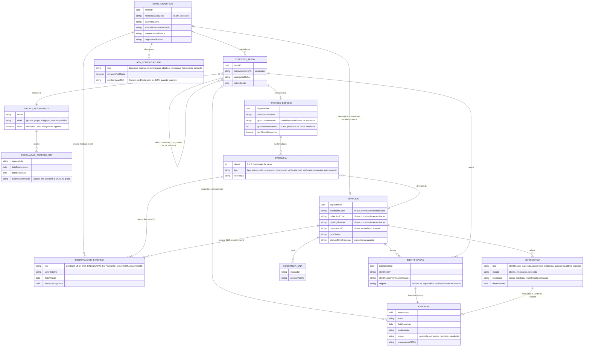
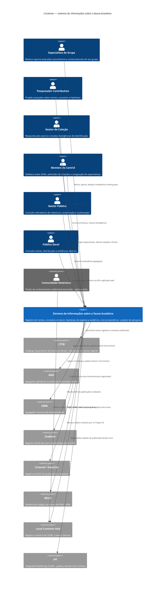
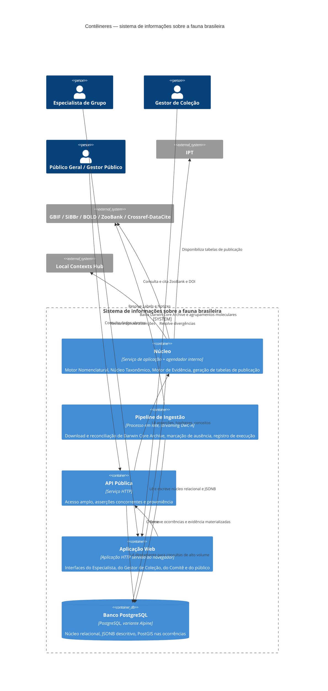
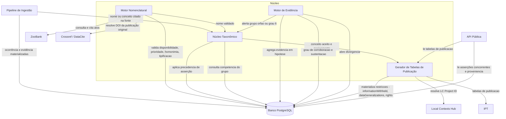
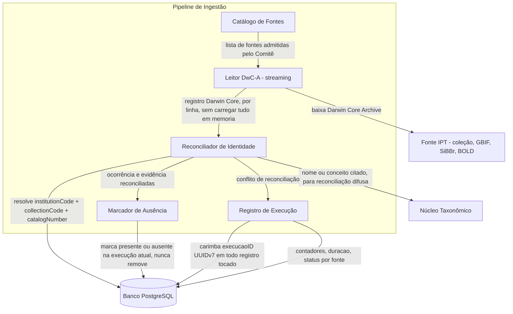
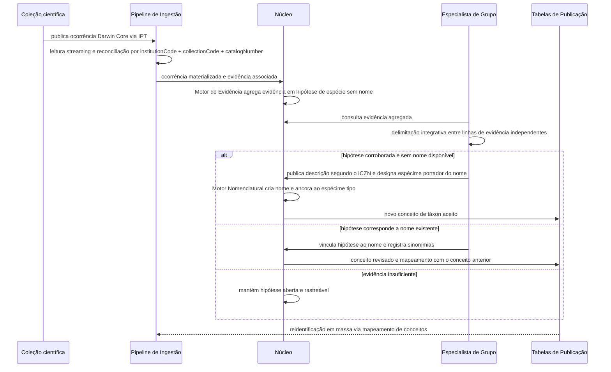
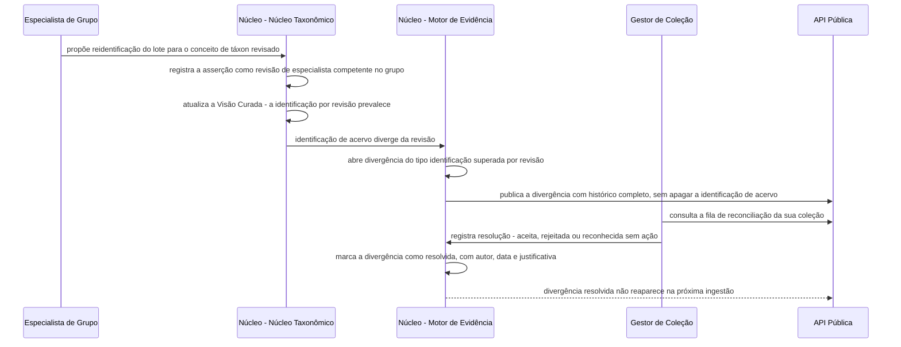
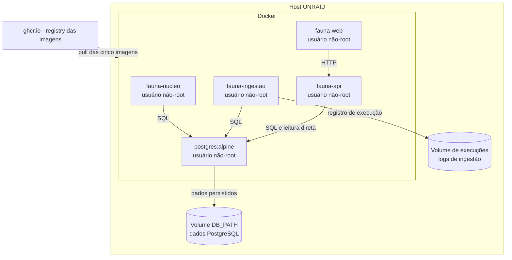

# Arquitetura técnica — sistema de informações sobre a fauna brasileira

Documento técnico para pessoal de sistemas, infraestrutura e TI. Descreve o modelo conceitual, os quatro níveis C4 aplicáveis, os fluxos principais, a persistência, a publicação de dados e a implantação da arquitetura proposta neste projeto de pesquisa.

Este documento **não** é a porta de entrada para taxonomistas e gestores de coleção — para isso, veja o [`README.md`](../README.md). Este documento também **não** substitui os registros de decisão: toda afirmação de projeto aqui feita rastreia a um ADR em [`docs/adr/`](./adr/), listado por completo na seção 11.

## Como ler este documento

- [`docs/contexto.md`](./contexto.md) — o problema de pesquisa, os produtos esperados e as diretrizes que originaram este projeto.
- [`docs/specieConcept.md`](./specieConcept.md) — o conceito de espécie adotado (De Queiroz 2007) e as quatro entidades que ele obriga a distinguir. A seção 2 deste documento aprofunda o modelo conceitual ali apresentado.
- [`CONTEXT.md`](../CONTEXT.md) — glossário do projeto. Os termos usados aqui seguem exatamente essas definições.
- [`docs/adr/`](./adr/) — as 19 decisões arquiteturais, com alternativas rejeitadas e consequências. Nada neste documento contradiz um ADR; onde há tensão aparente, o ADR prevalece.

---

## 1. Escopo e premissas

O escopo é o reino Animalia, recorte fauna brasileira, com o *International Code of Zoological Nomenclature* (ICZN) embutido no núcleo — não como plugin trocável ([ADR 0010](./adr/0010-escopo-restrito-a-animalia.md)). O sistema é desenhado como **exercício de arquitetura de pesquisa**: nenhum componente aqui descrito se destina a operar em produção ou a suceder o Catálogo Taxonômico da Fauna do Brasil (CTFB), o GBIF ou o SiBBr ([ADR 0001](./adr/0001-sistema-de-registro-greenfield.md)). A pergunta que a arquitetura responde é "como seria o sistema ideal, desenhado sem retrocompatibilidade com sistemas legados?" — não "como evoluir o CTFB".

Dezenove ADRs fecham as decisões estruturais que este documento pressupõe. A tabela a seguir lista as premissas herdadas, cada uma com sua origem — a leitura completa de cada ADR é necessária para entender as alternativas rejeitadas; aqui apenas se declara o que foi decidido.

| # | Premissa herdada | ADR de origem |
|---|---|---|
| 1 | Sistema de registro greenfield; nada substitui CTFB, GBIF ou SiBBr | [0001](./adr/0001-sistema-de-registro-greenfield.md) |
| 2 | Ocorrências ingeridas como cópia materializada, versionada e reprocessável — não índice remoto | [0002](./adr/0002-copia-materializada-de-ocorrencias.md) |
| 3 | Evidência classificada em hierarquia de seis níveis, com peso explícito e nunca equivalente entre classes | [0003](./adr/0003-hierarquia-de-evidencia.md) |
| 4 | Contribuição aberta com revisão por Especialista de Grupo; Visão Curada é um conceito de táxon entre outros | [0004](./adr/0004-autoridade-de-assercao.md) |
| 5 | Camada nomenclatural validada por regra, separada da camada taxonômica revisável; override explícito para atos da Comissão | [0005](./adr/0005-camadas-nomenclatural-e-taxonomica.md) |
| 6 | Aberto por padrão; autoridade cultural indígena modelada via TK/BC Labels do Local Contexts Hub | [0006](./adr/0006-fair-care-aberto-por-padrao.md) |
| 7 | Revisão taxonômica prevalece sobre identificação de acervo na Visão Curada; identificação de acervo nunca é apagada | [0007](./adr/0007-precedencia-da-revisao-taxonomica.md) |
| 8 | Competência de Especialista de Grupo é designada, não calculada; grupo sem designação é Grupo Órfão declarado | [0008](./adr/0008-competencia-por-grupo-taxonomico.md) |
| 9 | Pertencimento à fauna brasileira é declarado pelo especialista; grau de sustentação é computado a partir da evidência vinculada | [0009](./adr/0009-pertencimento-a-fauna-brasileira.md) |
| 10 | Escopo estritamente Animalia; ICZN embutido no núcleo, não plugável | [0010](./adr/0010-escopo-restrito-a-animalia.md) |
| 11 | Conhecimento tradicional associado entra só por vínculo (LC Project ID) ao Local Contexts Hub; nenhuma modelagem própria de CTA | [0011](./adr/0011-cta-por-vinculo-ao-local-contexts-hub.md) |
| 12 | Identificador interno próprio (UUIDv7); identificadores externos ancorados e resolvidos, nunca adotados como identidade | [0012](./adr/0012-identificadores.md) |
| 13 | *(superado)* Armazenamento em SQLite + DuckDB — avaliado e rejeitado, mantido como registro histórico | [0013](./adr/0013-armazenamento-sqlite-json-e-duckdb.md) |
| 14 | Pipeline de ingestão deriva do Biodiversidade.Online: adota parsing streaming e registro de execução, rejeita `delete-not-seen` e chave primária por identificador de fonte | [0014](./adr/0014-licoes-do-pipeline-de-ingestao.md) |
| 15 | Armazenamento único em PostgreSQL, com JSONB no núcleo descritivo e PostGIS nas ocorrências | [0015](./adr/0015-postgresql-unico-com-jsonb-e-postgis.md) |
| 16 | Divergência entre sistema e coleção é entidade de primeira classe, com ciclo de vida e resolução registrada | [0016](./adr/0016-fila-de-reconciliacao.md) |
| 17 | IPT é sistema externo; a responsabilidade do sistema termina nas tabelas de publicação | [0017](./adr/0017-ipt-como-sistema-externo.md) |
| 18 | Implantação em cinco contêineres; as demais responsabilidades são componentes internos | [0018](./adr/0018-cinco-conteineres.md) |
| 19 | Licenciamento em três regimes — código, documentação, dados — com exceção para registros com TK/BC Label | [0019](./adr/0019-licenciamento-em-tres-regimes.md) |

---

## 2. O modelo conceitual

[`docs/specieConcept.md`](./specieConcept.md) estabelece que confundir quatro entidades é o erro estrutural mais comum em sistemas taxonômicos, e a razão pela qual registros de coleção do GBIF/SiBBr hoje não sustentam diretamente o CTFB:

- **Nome Científico** — rótulo disponível segundo o ICZN, governado por prioridade, não por juízo.
- **Conceito de Táxon** — a circunscrição de um nome segundo um autor determinado (`nome + secundum`); muda a cada revisão.
- **Hipótese de Espécie** — a circunscrição de uma linhagem acompanhada da evidência que a sustenta; testável, refutável, existe com ou sem nome.
- **Linhagem** (Espécie) — a entidade evolutiva real, nunca observada diretamente, apenas inferida.

A elas se somam quatro entidades operacionais que atravessam o sistema: **Ocorrência** (registro Darwin Core de espécime ou observação), **Evidência** (todo registro que sustenta uma hipótese, com peso declarado), **Identificação** (aplicação de um Conceito de Táxon a uma Ocorrência, por alguém, em uma data) e **Asserção** (toda afirmação registrada com autor, data, fundamento e proveniência — a unidade de governança do conteúdo).

O diagrama a seguir aprofunda o modelo mínimo da seção 4.1 de `specieConcept.md`, incorporando as decisões tomadas depois dele: grau de sustentação computado ([0009](./adr/0009-pertencimento-a-fauna-brasileira.md)), grau de evidência explícito ([0003](./adr/0003-hierarquia-de-evidencia.md)), tabela de resolução de identificadores externos ([0012](./adr/0012-identificadores.md)), divergência com ciclo de vida ([0016](./adr/0016-fila-de-reconciliacao.md)) e designação de especialista por grupo taxonômico ([0008](./adr/0008-competencia-por-grupo-taxonomico.md)).

### 2.1 Grau de evidência (ADR 0003)

Nenhuma consulta agregada combina classes de evidência sem declarar o corte aplicado:

| Classe | Peso | Exemplo |
|---|---|---|
| 1 | Máximo | Espécime portador do nome — holótipo, lectótipo, neótipo |
| 2 | Alto | Espécime preservado — `PreservedSpecimen`, `FossilSpecimen`, `MaterialSample` |
| 3 | Médio-alto | Amostra com sequência associada, inclui museômica |
| 4 | Médio | Observação verificada — `HumanObservation`/`MachineObservation` com validação de especialista |
| 5 | Baixo | Observação não verificada, inclui ciência cidadã sem revisão |
| 6 | Mínimo | Unidade molecular sem material — BIN, MOTU, eDNA sem espécime associado |

O `grauCorroboracao` de uma `HIPOTESE_ESPECIE` é computado a partir das classes efetivamente vinculadas, e nunca do número bruto de registros.

### 2.2 Grau de sustentação da presença na fauna brasileira (ADR 0009)

Pertencimento continua sendo asserção do Especialista de Grupo. O sistema acrescenta, computado e recomputado a cada ingestão, o grau de sustentação dessa presença — mesma hierarquia do ADR 0003 aplicada à pergunta "por que esta espécie consta como brasileira?":

| Grau | Sustentação |
|---|---|
| 1 | Espécime portador do nome com localidade-tipo em território nacional |
| 2 | Espécime preservado em coleção, com ocorrência em território nacional |
| 3 | Amostra com sequência depositada, de origem nacional |
| 4 | Apenas literatura, sem ocorrência vinculada |
| 5 | Apenas observação |
| 6 | Nenhuma evidência vinculada |

O grau 6 é pauta de trabalho devolvida às coleções, nunca marca de erro — ver seção 6 e ADR [0016](./adr/0016-fila-de-reconciliacao.md).

### 2.3 Tabela de resolução de identificadores externos (ADR 0012)

`IDENTIFICADOR_EXTERNO` é entidade de primeira classe com proveniência própria — quando e por qual execução de ingestão cada identificador passou a apontar para a entidade interna. Nenhum vínculo interno depende de identificador de terceiro:

| Identificador externo | Ancora | Papel |
|---|---|---|
| ZooBank LSID | Ato nomenclatural | Registro oficial do ICZN |
| DOI | Publicação | Identidade de referência bibliográfica |
| BIN / MOTU | Agrupamento molecular | Hipótese de espécie sem nome |
| LC Project ID | TK/BC Label | Autoridade cultural, resolvida contra o Local Contexts Hub |
| Chave GBIF | Reconciliação de ocorrência | Identidade secundária de origem |
| `occurrenceID` | Ocorrência | Chave **secundária** — a primária é a tríplice institutionCode + collectionCode + catalogNumber (seção 6) |

### 2.4 Divergência com ciclo de vida (ADR 0016)

Toda divergência entre o sistema e uma coleção é entidade com ciclo de vida próprio: **aberta → em análise → resolvida**, com resolução em uma de três — *aceita*, *rejeitada* ou *reconhecida sem ação* — sempre com autor, data e justificativa. A resolução é asserção assinada do Gestor de Coleção e entra no histórico do registro; sem ela, a mesma divergência reapareceria a cada ingestão. Os três tipos produzidos automaticamente estão descritos na seção 6.

### 2.5 Designação de especialista (ADR 0008)

A competência do Especialista de Grupo é **designada** pelo Comitê, não calculada — mas o sistema deriva e exibe evidência de competência (autoria de atos nomenclaturais e revisões, via ZooBank e DOI) como insumo e alerta. `GRUPO_TAXONOMICO` carrega o atributo derivado `orfao`: verdadeiro quando não há `DESIGNACAO_ESPECIALISTA` vigente. Em Grupo Órfão nenhuma asserção ganha precedência automática — volta ao regime de coexistência declarada, identificações concorrentes nomeadas por `secundum` (ver seção 5.2).

---

## 3. C4 nível 1 — Contexto

Seis pessoas interagem com o sistema; oito sistemas externos trocam dados com ele. A Comunidade Detentora não interage com o sistema diretamente — sua relação é com o Local Contexts Hub, que é quem resolve TK/BC Labels ([ADR 0006](./adr/0006-fair-care-aberto-por-padrao.md), [ADR 0011](./adr/0011-cta-por-vinculo-ao-local-contexts-hub.md)).

| Ator / sistema | Natureza | Troca de dados com o sistema |
|---|---|---|
| **Especialista de Grupo** | Pessoa | Recebe evidência agregada e propostas; envia aprovação, rejeição ou revisão de asserções; designa-se competente sobre grupo (via Comitê) |
| **Pesquisador Contribuinte** | Pessoa | Propõe asserções taxonômicas e nomenclaturais; recebe histórico de decisão sobre suas propostas |
| **Gestor de Coleção** | Pessoa | Envia ocorrências (via IPT/fonte cadastrada); recebe e resolve divergências da fila de reconciliação |
| **Membro do Comitê** | Pessoa | Administra designações de especialista, admissão de coleções e catálogo de fontes; decide ADRs |
| **Gestor Público** | Pessoa | Consulta somente leitura — indicadores de cobertura, grau de sustentação agregado, conservação |
| **Público Geral** | Pessoa | Consulta somente leitura — nomes, distribuição, evidência, Visão Curada |
| **Comunidade Detentora** | Pessoa (externa ao sistema) | Sem troca direta — aplica e revisa TK/BC Labels no Local Contexts Hub, que o sistema resolve por LC Project ID |
| **CTFB** | Sistema externo | Fonte de referência de nomes vigentes; alvo de reconciliação, nunca de sobrescrita |
| **GBIF** | Sistema externo | Origem de Darwin Core Archive ingerido; destino de Darwin Core Archive publicado |
| **SiBBr** | Sistema externo | Origem de Darwin Core Archive ingerido; destino de Darwin Core Archive publicado |
| **ZooBank** | Sistema externo | Origem de identificadores de atos nomenclaturais (LSID), consultados e citados pelo Motor Nomenclatural |
| **Crossref / DataCite** | Sistema externo | Resolução de DOI de publicações originais e de datasets |
| **BOLD** | Sistema externo | Origem de BINs, ingeridos como hipótese de espécie sem nome disponível |
| **Local Contexts Hub** | Sistema externo | Resolução em tempo de consulta de TK/BC Labels e Notices por LC Project ID; nunca replicado localmente |
| **IPT** | Sistema externo | Consumidor das tabelas de publicação Taxon core + extensões geradas pelo sistema |

---

## 4. C4 nível 2 — Contêineres

Cinco contêineres implantam o sistema ([ADR 0018](./adr/0018-cinco-conteineres.md)). A separação em contêiner — e não em componente interno — só se justifica quando há motivo operacional: competir por recursos de forma incompatível, ou ciclo de vida de implantação distinto. Só a ingestão atende a esse critério com clareza (roda em lote, por horas, e não pode competir por recursos com o atendimento interativo); as demais responsabilidades internas do Núcleo — Motor Nomenclatural, Núcleo Taxonômico, Motor de Evidência, geração de tabelas de publicação — permanecem como componentes de um único contêiner (seção 5). Oito contêineres, um por responsabilidade, foi opção considerada e rejeitada: num sistema de um banco só e um operador só, oito imagens implicam oito ciclos de vida e comunicação em rede onde bastava chamada de função — microsserviço sem motivo.

| Contêiner | Tecnologia | Responsabilidade |
|---|---|---|
| **Núcleo** | Serviço de aplicação de longa duração, com agendador de tarefas internas | Motor Nomenclatural, Núcleo Taxonômico, Motor de Evidência, geração das tabelas de publicação como trabalho agendado ([0005](./adr/0005-camadas-nomenclatural-e-taxonomica.md), [0004](./adr/0004-autoridade-de-assercao.md), [0007](./adr/0007-precedencia-da-revisao-taxonomica.md), [0008](./adr/0008-competencia-por-grupo-taxonomico.md), [0003](./adr/0003-hierarquia-de-evidencia.md), [0009](./adr/0009-pertencimento-a-fauna-brasileira.md), [0016](./adr/0016-fila-de-reconciliacao.md), [0017](./adr/0017-ipt-como-sistema-externo.md)) |
| **Pipeline de Ingestão** | Processo em lote, parsing streaming de DwC-A | Download e processamento de Darwin Core Archive, reconciliação de identificadores, marcação de ausência, registro de execução ([0002](./adr/0002-copia-materializada-de-ocorrencias.md), [0012](./adr/0012-identificadores.md), [0014](./adr/0014-licoes-do-pipeline-de-ingestao.md)) |
| **API Pública** | Serviço HTTP (REST), leitura predominante | Acesso amplo e irrestrito por padrão, com asserções concorrentes e proveniência expostas simultaneamente ([0004](./adr/0004-autoridade-de-assercao.md), [0006](./adr/0006-fair-care-aberto-por-padrao.md)) |
| **Aplicação Web** | Aplicação HTTP servida ao navegador, consome a API Pública | Interfaces diferenciadas por papel: Especialista de Grupo, Gestor de Coleção, Comitê, público geral |
| **Banco PostgreSQL** | PostgreSQL, variante Alpine, com PostGIS | Núcleo relacional, ficha descritiva em `JSONB` com índice GIN, ocorrências particionadas com PostGIS ([0015](./adr/0015-postgresql-unico-com-jsonb-e-postgis.md)) |

A fusão em cinco é deliberada, não default: um sistema com um único banco e um único operador ganha pouco separando Motor Nomenclatural, Núcleo Taxonômico e Motor de Evidência em processos distintos — o custo de rede e de implantação superaria o ganho de isolamento. Extrair um componente para contêiner próprio depois (o Motor de Evidência, se precisar escalar sozinho) permanece possível, desde que a fronteira do componente seja mantida limpa desde o início — é isso que a seção 5 formaliza.

---

## 5. C4 nível 3 — Núcleo

O contêiner Núcleo tem quatro componentes, cada um implementando um conjunto fechado de ADRs.

### 5.1 Motor Nomenclatural

Implementa a camada nomenclatural do [ADR 0005](./adr/0005-camadas-nomenclatural-e-taxonomica.md). Valida por regra, contra o ICZN, os fatos que não são deliberação: disponibilidade do nome, forma e data de publicação, tipificação, homonímia e prioridade. Um ato nomenclaturalmente inválido é rejeitado pelo motor, nunca submetido a juízo de especialista — alterações nessa camada são correções de fato, não mudanças de opinião.

- **Derivação de prioridade e homonímia**: prioridade é derivada de data de publicação comparada entre nomes competindo pelo mesmo grupo (espécie, gênero, família); homonímia é derivada de coincidência de grafia dentro do mesmo grupo de nomes regido pelo Código. Nenhuma das duas é campo digitado.
- **Disponibilidade**: derivada dos critérios de publicação do Código (Art. 8–20) — forma, data, indicação de tipo, descrição ou definição — aplicados aos metadados registrados na entidade `NOME_CIENTIFICO` e `ATO_NOMENCLATURAL`. Registro insuficiente para aplicar a regra fica explicitamente marcado como não validável, nunca assumido válido por omissão.
- **Override de atos da Comissão**: nomes conservados, `nomen protectum` sobre `nomen oblitum`, Listas Oficiais e supressões decididas pela Comissão Internacional sob *plenary power* não são deriváveis por regra. O motor aceita um override explícito, com citação obrigatória de Opinion ou Declaration do *Bulletin of Zoological Nomenclature* — sem essa citação, o override é rejeitado pela mesma via que rejeitaria um ato inválido.

### 5.2 Núcleo Taxonômico

Implementa o fluxo de proposta e revisão do [ADR 0004](./adr/0004-autoridade-de-assercao.md), a precedência de asserção do [ADR 0007](./adr/0007-precedencia-da-revisao-taxonomica.md) e a competência por grupo do [ADR 0008](./adr/0008-competencia-por-grupo-taxonomico.md).

- **Fluxo de proposta**: qualquer pesquisador identificado propõe; o Especialista de Grupo aprova, rejeita ou mantém pendente. Proposta rejeitada permanece no histórico com proveniência completa — nunca é descartada.
- **Precedência de asserção**: quando a identificação de acervo diverge da revisão do Especialista de Grupo competente no grupo, a Visão Curada exibe a revisão. A identificação de acervo permanece integralmente no histórico e continua exposta pela API como asserção concorrente — a regra é de exibição na Visão Curada, nunca de substituição de dado.
- **Comportamento em Grupo Órfão**: quando o grupo da `CONCEITO_TAXON` não tem `DESIGNACAO_ESPECIALISTA` vigente (seção 2.5), o componente **não aplica precedência automática**. As identificações concorrentes são exibidas lado a lado, nomeadas por `secundum`, e a Visão Curada não escolhe uma vencedora — esse é o único caso em que a Visão Curada declara explicitamente a ausência de resposta única.
- **Visão Curada**: materializada como um `CONCEITO_TAXON` identificado por `secundum FaunaBR <data>`, sem privilégio ontológico sobre os demais — a API expõe as asserções concorrentes ao lado dela.

### 5.3 Motor de Evidência

Implementa a hierarquia de evidência do [ADR 0003](./adr/0003-hierarquia-de-evidencia.md), o grau de sustentação do [ADR 0009](./adr/0009-pertencimento-a-fauna-brasileira.md) e a geração de divergências do [ADR 0016](./adr/0016-fila-de-reconciliacao.md).

- **Grau de corroboração**: computado por hipótese de espécie, a partir das classes de evidência (1 a 6, seção 2.1) efetivamente vinculadas a ela — nunca do número bruto de registros. Congruência entre linhas independentes de evidência (morfologia, genômica, bioacústica, ecologia) eleva o grau; uma única linha, mesmo com muitos registros, não.
- **Grau de sustentação**: computado por espécie da fauna brasileira (seção 2.2), a partir da melhor classe de evidência vinculada com ocorrência em território nacional. Recomputado a cada ingestão, e restrito ao que a ingestão tocou — recomputação incremental, não varredura completa (seção 8, [ADR 0015](./adr/0015-postgresql-unico-com-jsonb-e-postgis.md)).
- **Geração de divergências**: o componente abre automaticamente os três tipos do [ADR 0016](./adr/0016-fila-de-reconciliacao.md) — identificação superada por revisão (evento do Núcleo Taxonômico), espécie em grau 6 sem evidência vinculada, e registro ausente na última ingestão (evento do Pipeline). Cada divergência nasce com estado `aberta` e aguarda resolução do Gestor de Coleção; o componente nunca resolve uma divergência por conta própria.

### 5.4 Gerador de Tabelas de Publicação

Implementa o contrato de fronteira do [ADR 0017](./adr/0017-ipt-como-sistema-externo.md), executado como trabalho agendado dentro do Núcleo. Produz Taxon core e extensões Darwin Core em formato diretamente mapeável pelo `meta.xml` esperado pelo IPT.

- Materializa nas próprias tabelas — não deixa para o IPT aplicar depois — os termos de restrição exigidos pelo [ADR 0006](./adr/0006-fair-care-aberto-por-padrao.md): `informationWithheld`, `dataGeneralizations`, `accessRights`.
- Resolve o LC Project ID de cada registro com TK/BC Label contra o Local Contexts Hub e o grava em `rights`; para registro sem Label, grava a licença do regime de dados ([ADR 0019](./adr/0019-licenciamento-em-tres-regimes.md)).
- É artefato versionado e testável contra o `meta.xml` esperado — mudança de versão do IPT não é mudança desta arquitetura, desde que o formato das tabelas permaneça válido.

---

## 6. C4 nível 3 — Pipeline de Ingestão

Cinco componentes, todos derivados com adaptação deliberada do pipeline do Biodiversidade.Online ([ADR 0014](./adr/0014-licoes-do-pipeline-de-ingestao.md)).

### 6.1 Catálogo de Fontes

Tabela de dados, não código — nome, repositório, reino, *tag* e URL por coleção IPT, mais GBIF, SiBBr e BOLD. Admitir uma fonte é decisão do Comitê e se materializa como linha nova nesse catálogo; adicionar a fonte seguinte não é alteração de código.

### 6.2 Leitor DwC-A (streaming)

Faz parsing a partir do `meta.xml` do arquivo Darwin Core Archive, lendo por índice de coluna e mapeando para termo Darwin Core, sem carregar o arquivo inteiro em memória. Compara `pubDate` e `dateStamp` do `eml.xml` com a última execução bem-sucedida antes de reprocessar — aviso ao operador quando o dataset está inalterado, nunca bloqueio automático.

### 6.3 Reconciliador de Identidade

Implementa a reconciliação do [ADR 0012](./adr/0012-identificadores.md): a chave **primária** de reconciliação de um espécime é a tríplice `institutionCode` + `collectionCode` + `catalogNumber` — é o que os curadores usam e o que a literatura taxonômica cita desde o século XIX. O `occurrenceID` é chave **secundária**: na prática brasileira frequentemente não existe, é instável, ou é reemitido a cada republicação do IPT ([ADR 0002](./adr/0002-copia-materializada-de-ocorrencias.md)) — ancorar o vínculo nome→tipo nele significaria vê-lo romper-se em silêncio na sincronização seguinte.

Para cruzar listas externas cujos nomes divergem em autoria, grafia e pontuação, o componente calcula campos computados de reconciliação difusa herdados do Biodiversidade.Online: nome canônico (gênero + epíteto específico + infraespecífico) e nome científico achatado (minúsculas, apenas `[a-z0-9]`). Conflito — duas entidades internas reivindicando a mesma tríplice — é dado devolvido ao Gestor de Coleção como divergência (seção 2.4); o componente **nunca funde automaticamente**.

### 6.4 Marcador de Ausência

Implementa a rejeição deliberada do padrão `delete-not-seen` ([ADR 0014](./adr/0014-licoes-do-pipeline-de-ingestao.md)). `delete-not-seen` é correto para um espelho — remove do banco todo registro ausente da última publicação. É destrutivo aqui, porque **ausência não é remoção**: um registro pode faltar na republicação por falha de publicação, mudança de escopo do recurso IPT, ou porque o próprio Gestor de Coleção o despublicou temporariamente. Apagar romperia a asserção que o cita e o vínculo nome→espécime-tipo do [ADR 0012](./adr/0012-identificadores.md). O componente, em vez de apagar, marca o registro como **ausente na última ingestão**, com data e execução, e o mantém integralmente consultável — inclusive abrindo a divergência correspondente (seção 2.4).

### 6.5 Registro de Execução

`ingest_runs`: contadores, duração e status por fonte, mais um identificador de execução (UUIDv7) carimbado em todo registro tocado. É o que torna a ingestão auditável e reversível registro a registro, e é a proveniência de ingestão exigida pelo [ADR 0012](./adr/0012-identificadores.md) — quando e por qual execução cada identificador externo passou a apontar para a entidade interna.

---

## 7. Fluxos

### 7.1 Da evidência ao nome

Ingestão de evidência, agregação em hipótese de espécie, delimitação por especialista e, conforme o resultado, descrição formal ou vinculação a nome existente ([`specieConcept.md`](./specieConcept.md) §4.3, adaptado aos contêineres desta arquitetura).

### 7.2 Revisão taxonômica, divergência e resolução

Um Especialista de Grupo reidentifica um lote; a identificação diverge da identificação de acervo; a Visão Curada passa a exibir a revisão; a divergência abre e aguarda o Gestor de Coleção ([ADR 0007](./adr/0007-precedencia-da-revisao-taxonomica.md), [ADR 0016](./adr/0016-fila-de-reconciliacao.md)).

---

## 8. Persistência

Um único motor: **PostgreSQL** ([ADR 0015](./adr/0015-postgresql-unico-com-jsonb-e-postgis.md)), que supera a alternativa de dois arquivos embutidos avaliada e rejeitada no [ADR 0013](./adr/0013-armazenamento-sqlite-json-e-duckdb.md) — o motivo é concorrência de escrita real: edição curatorial interativa de muitos taxonomistas simultâneos disputando o mesmo recurso que lotes longos de reidentificação em massa, recomputação de grau de sustentação e marcação de ausência. Um escritor único (SQLite) travaria o sistema inteiro a cada lote; o MVCC do PostgreSQL elimina o bloqueio mútuo. Somam-se papéis e permissões no servidor — exigidos pelo modelo de autoridade dos ADRs [0004](./adr/0004-autoridade-de-assercao.md) e [0008](./adr/0008-competencia-por-grupo-taxonomico.md) — e replicação/*point-in-time recovery*, ausentes no SQLite.

**Permanece relacional**, com integridade referencial e consulta transversal: nome, conceito de táxon, hipótese de espécie, asserção, proveniência, evidência e a tabela de resolução de identificadores externos. É o que a governança versiona e o que a camada nomenclatural valida por regra.

**Entra em `JSONB`**, com índice GIN: a ficha descritiva do táxon — distribuição, nomes vernaculares, perfil, referências, tipos e espécimes, atributos vindos de extensões Darwin Core. O padrão evita normalizar em N tabelas por extensão para montar uma ficha, seguindo o que o Biodiversidade.Online já valida em produção ([ADR 0014](./adr/0014-licoes-do-pipeline-de-ingestao.md)). Consulta descritiva usa `JSONB`; consulta sobre autoridade, proveniência ou identidade usa SQL relacional — misturar os dois regimes no mesmo campo é o erro que a arquitetura evita por desenho.

**PostGIS** cobre toda consulta espacial sobre ocorrências: generalização de coordenada para localidade sensível ([ADR 0006](./adr/0006-fair-care-aberto-por-padrao.md)), cruzamento com unidades de conservação, consulta de distribuição. É requisito central, não acessório — motivo declarado da rejeição da alternativa PostgreSQL+DuckDB no ADR 0015.

**Ocorrências ficam em tabela particionada.** A chave de particionamento é decisão de implementação, não do ADR — mas o volume (dezenas de milhões de linhas, [ADR 0002](./adr/0002-copia-materializada-de-ocorrencias.md)) torna partição pré-requisito de qualquer plano de manutenção viável (VACUUM, reindexação, purga de execuções antigas de ingestão).

**Recomputação incremental é exigência de arquitetura, não otimização posterior.** Grau de sustentação (seção 2.2) é recomputado a cada ingestão; uma varredura completa recorrente sobre dezenas de milhões de linhas em armazenamento por linha é da ordem de dezenas de segundos a minutos `[ESTIMATIVA]` — tolerável isoladamente, mas caro o bastante para desestimular execução frequente, e recomputação que se evita é recomputação que fica errada. O Motor de Evidência (seção 5.3) precisa restringir a recomputação ao que a execução de ingestão tocou desde o início, não como melhoria posterior.

---

## 9. Publicação e acesso

**API Pública**: acesso amplo por padrão ([ADR 0006](./adr/0006-fair-care-aberto-por-padrao.md)), com as asserções concorrentes e a proveniência expostas simultaneamente à Visão Curada — um consumidor que precise da identificação de acervo original, e não da revisão, consegue reconstruí-la ([ADR 0007](./adr/0007-precedencia-da-revisao-taxonomica.md)). Toda resposta que envolva evidência expõe a classe de evidência do registro (seção 2.1); toda resposta com generalização de coordenada ou de táxon expõe o fato da generalização, nunca a omite silenciosamente.

**Tabelas de publicação para o IPT** ([ADR 0017](./adr/0017-ipt-como-sistema-externo.md)): Taxon core e extensões Darwin Core, geradas pelo Gerador de Tabelas de Publicação (seção 5.4) como trabalho agendado dentro do Núcleo, versionadas e testáveis contra o `meta.xml` esperado pelo IPT. O IPT em si — instalação, operação, periodicidade de publicação, registro no GBIF — é responsabilidade da instituição publicadora, fora da fronteira desta arquitetura.

**Termos Darwin Core de restrição**, materializados nas próprias tabelas de publicação e não aplicados depois pelo IPT:

| Termo Darwin Core | Uso |
|---|---|
| `informationWithheld` | Declara o que foi retido e por quê |
| `dataGeneralizations` | Declara a generalização aplicada — de coordenada ou de táxon |
| `accessRights` | Política de acesso aplicável ao registro |
| `rights` | LC Project ID do Local Contexts Hub, quando há TK/BC Label; caso contrário, a licença de dados vigente |

**Licença por registro** ([ADR 0019](./adr/0019-licenciamento-em-tres-regimes.md)): nunca uma licença global do conjunto.

| Camada | Licença |
|---|---|
| Código | Apache-2.0 |
| Documentação e ADRs | CC BY 4.0 |
| Dados sem TK/BC Label | CC BY 4.0 |
| Dados com TK/BC Label | Fora de licença aberta — LC Project ID em `rights`, nunca licença Creative Commons |

A exceção do TK/BC Label é deliberada: uma licença Creative Commons é juridicamente irrevogável, e o [ADR 0006](./adr/0006-fair-care-aberto-por-padrao.md) dá à Comunidade Detentora autoridade final e revisável sobre suas Labels — inclusive para restringir depois de ter permitido. Um CC BY sobre esse registro anularia essa autoridade na prática.

---

## 10. Implantação

Cinco imagens Docker — quatro da aplicação (Núcleo, Pipeline de Ingestão, API Pública, Aplicação Web) mais PostgreSQL variante Alpine ([ADR 0015](./adr/0015-postgresql-unico-com-jsonb-e-postgis.md), [ADR 0018](./adr/0018-cinco-conteineres.md)). Publicadas em registry **GHCR** (`ghcr.io/<organização>/<imagem>`), consistente com um projeto de pesquisa aberto sem infraestrutura de registry própria.

- **`DB_PATH` / volume externo**: o diretório de dados do PostgreSQL é montado em volume externo ao contêiner, nunca gravado na camada de imagem — coerente com a diretriz de backup como arquivos, não como *dumps* aplicativos.
- **Usuário não-root**: todos os cinco contêineres executam com usuário sem privilégio de root, reduzindo a superfície de um host doméstico compartilhado.
- **UNRAID**: ambiente de implantação de referência do projeto — servidor doméstico de baixo custo operacional, sem equipe de infraestrutura dedicada. A separação em cinco contêineres, e não em oito, é o que torna essa implantação viável sem custear ciclos de vida e comunicação de rede que o volume do sistema não justifica ([ADR 0018](./adr/0018-cinco-conteineres.md)).
- **Registry GHCR**: as cinco imagens são publicadas em `ghcr.io`, versionadas por tag, sem infraestrutura de registry própria a operar.

---

## 11. Índice de ADRs

| # | Título | Decisão | Link |
|---|---|---|---|
| 0001 | Sistema de registro greenfield, não camada sobre o CTFB | Sistema de registro autônomo de pesquisa; CTFB, GBIF e SiBBr são sistemas externos, nunca donos do modelo | [adr/0001-sistema-de-registro-greenfield.md](./adr/0001-sistema-de-registro-greenfield.md) |
| 0002 | Ocorrências ingeridas como cópia materializada | Ocorrências são copiadas, versionadas e reprocessáveis localmente, não referenciadas em tempo real | [adr/0002-copia-materializada-de-ocorrencias.md](./adr/0002-copia-materializada-de-ocorrencias.md) |
| 0003 | Universo de evidência amplo, com peso evidencial explícito | Seis classes de evidência, hierarquizadas, nunca combinadas sem declarar o corte | [adr/0003-hierarquia-de-evidencia.md](./adr/0003-hierarquia-de-evidencia.md) |
| 0004 | Contribuição aberta com revisão por especialista, e visão curada como um conceito entre outros | Qualquer pesquisador propõe; especialista aprova; Visão Curada é conceito sem privilégio ontológico | [adr/0004-autoridade-de-assercao.md](./adr/0004-autoridade-de-assercao.md) |
| 0005 | Camada nomenclatural validada por regra, separada da camada taxonômica revisável | Nomenclatura é derivada automaticamente do Código; taxonomia é juízo revisável; override citado para atos da Comissão | [adr/0005-camadas-nomenclatural-e-taxonomica.md](./adr/0005-camadas-nomenclatural-e-taxonomica.md) |
| 0006 | Aberto por padrão, com autoridade cultural indígena modelada via Local Contexts | Irrestrito por padrão, não sem exceção; TK/BC Labels aplicadas pela comunidade via Local Contexts Hub | [adr/0006-fair-care-aberto-por-padrao.md](./adr/0006-fair-care-aberto-por-padrao.md) |
| 0007 | Revisão taxonômica prevalece sobre a identificação de acervo na Visão Curada | Visão Curada exibe a reidentificação de especialista; identificação de acervo preservada como asserção concorrente | [adr/0007-precedencia-da-revisao-taxonomica.md](./adr/0007-precedencia-da-revisao-taxonomica.md) |
| 0008 | Competência designada por grupo, com evidência derivada como sinal e grupos órfãos declarados | Competência é designada pelo Comitê, não calculada; grupo sem designação é Grupo Órfão explícito | [adr/0008-competencia-por-grupo-taxonomico.md](./adr/0008-competencia-por-grupo-taxonomico.md) |
| 0009 | Pertencimento à fauna brasileira: declarado pelo especialista, sustentação computada ao lado | Pertencimento continua asserção do especialista; grau de sustentação (1–6) é computado e recomputado | [adr/0009-pertencimento-a-fauna-brasileira.md](./adr/0009-pertencimento-a-fauna-brasileira.md) |
| 0010 | Escopo estritamente Animalia, com o ICZN embutido no núcleo | ICZN é premissa do núcleo, não fronteira plugável; generalizar exigirá refatoração | [adr/0010-escopo-restrito-a-animalia.md](./adr/0010-escopo-restrito-a-animalia.md) |
| 0011 | Conhecimento tradicional por vínculo ao Local Contexts Hub, sem modelagem própria | Nenhuma entidade de CTA modelada aqui; apenas o vínculo por LC Project ID | [adr/0011-cta-por-vinculo-ao-local-contexts-hub.md](./adr/0011-cta-por-vinculo-ao-local-contexts-hub.md) |
| 0012 | Identificador interno próprio, com identificadores externos ancorados e resolvidos | UUIDv7 interno; reconciliação de espécime pela tríplice institutionCode+collectionCode+catalogNumber | [adr/0012-identificadores.md](./adr/0012-identificadores.md) |
| 0013 | Armazenamento: SQLite com JSON1 no núcleo, DuckDB nas ocorrências | **Superado pelo ADR 0015** — escrita concorrente real inviabiliza o escritor único do SQLite | [adr/0013-armazenamento-sqlite-json-e-duckdb.md](./adr/0013-armazenamento-sqlite-json-e-duckdb.md) |
| 0014 | Lições do pipeline de ingestão do Biodiversidade.Online | Adota parsing streaming e registro de execução; rejeita `delete-not-seen` e identificador de fonte como chave primária | [adr/0014-licoes-do-pipeline-de-ingestao.md](./adr/0014-licoes-do-pipeline-de-ingestao.md) |
| 0015 | PostgreSQL único, com JSONB no núcleo e PostGIS nas ocorrências | Um único motor PostgreSQL; supera o ADR 0013 pela concorrência de escrita real e pelo PostGIS maduro | [adr/0015-postgresql-unico-com-jsonb-e-postgis.md](./adr/0015-postgresql-unico-com-jsonb-e-postgis.md) |
| 0016 | Divergência como entidade com resolução registrada | Toda divergência é entidade com ciclo de vida (aberta→em análise→resolvida) e resolução assinada | [adr/0016-fila-de-reconciliacao.md](./adr/0016-fila-de-reconciliacao.md) |
| 0017 | IPT como sistema externo; o sistema expõe tabelas de publicação | IPT fica fora da fronteira; a responsabilidade do sistema termina nas tabelas de publicação | [adr/0017-ipt-como-sistema-externo.md](./adr/0017-ipt-como-sistema-externo.md) |
| 0018 | Cinco contêineres; as demais responsabilidades são componentes | Só a ingestão tem motivo operacional para contêiner próprio; o resto é componente do Núcleo | [adr/0018-cinco-conteineres.md](./adr/0018-cinco-conteineres.md) |
| 0019 | Licenciamento em três regimes | Código sob Apache-2.0, documentação e dados sob CC BY 4.0, exceto registros com TK/BC Label (sem licença aberta) | [adr/0019-licenciamento-em-tres-regimes.md](./adr/0019-licenciamento-em-tres-regimes.md) |
