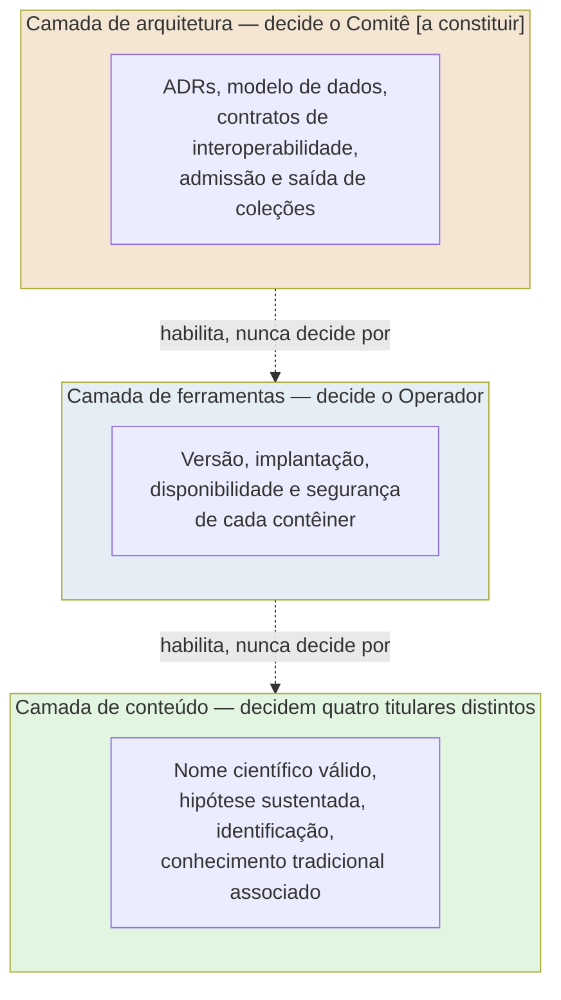
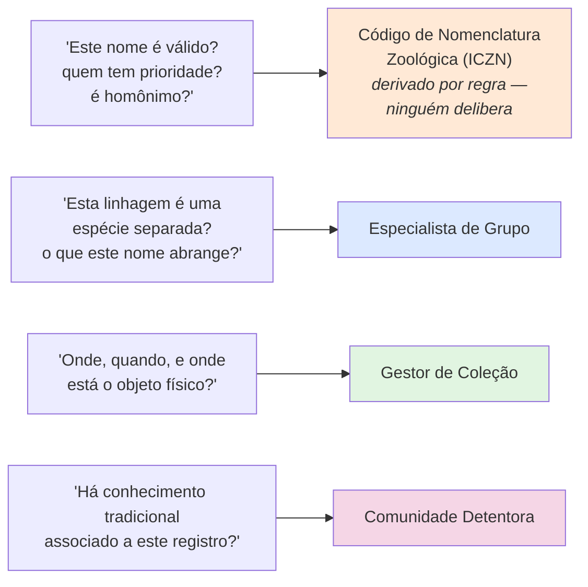
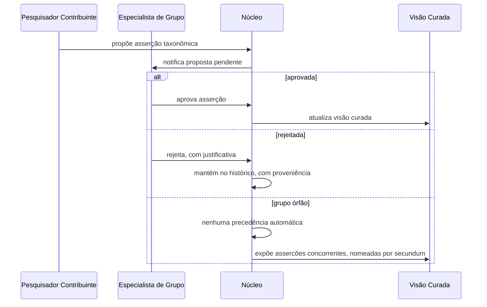
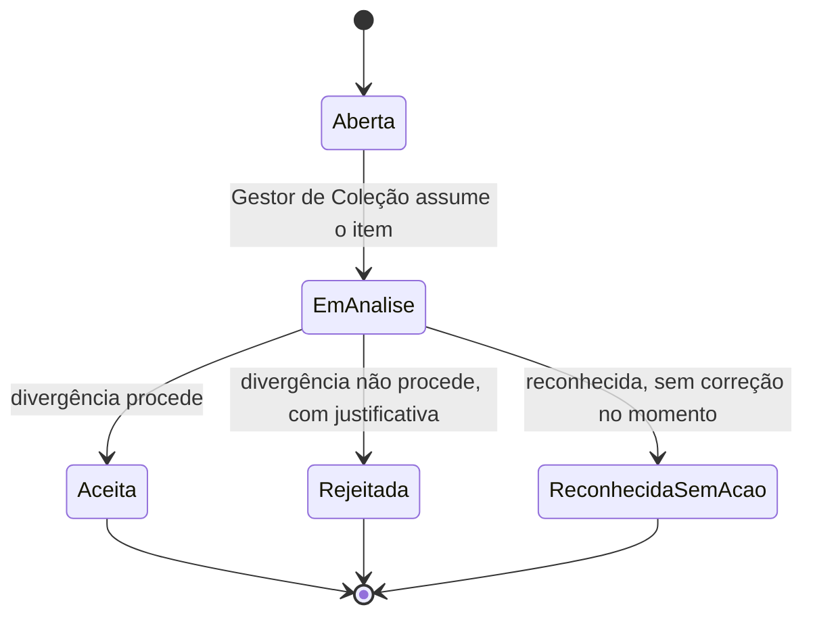
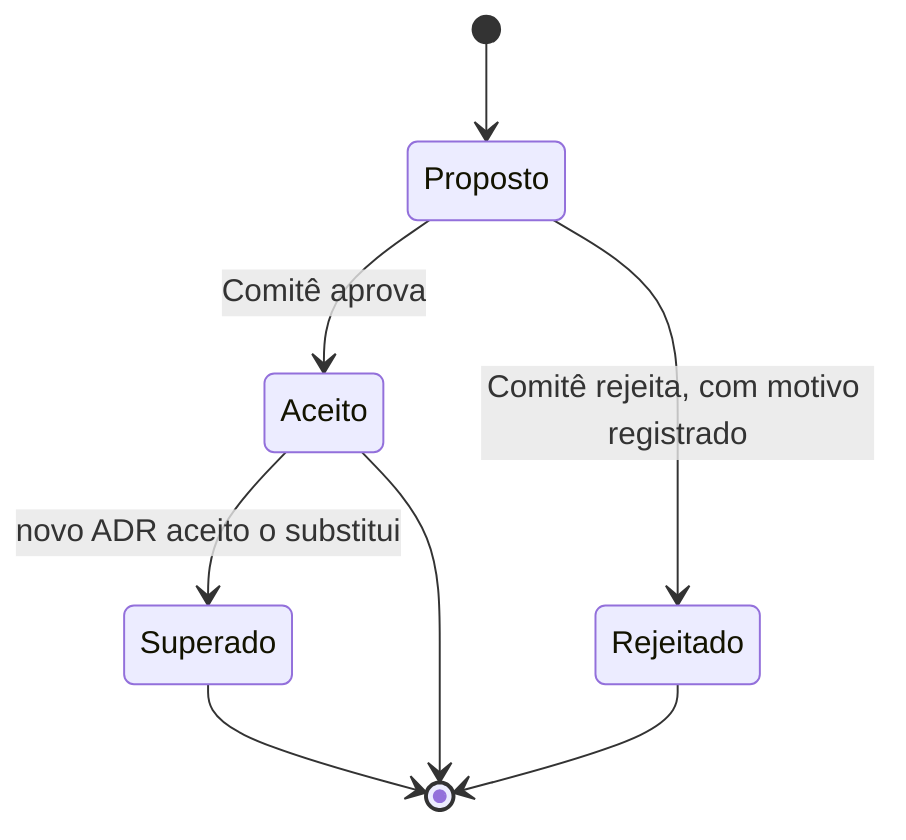

# Proposta de Governança — FaunaBR

> **Status: proposta de pesquisa, não norma vigente.** Este documento nomeia, para toda a arquitetura do sistema de informações sobre a fauna brasileira — não apenas para o conhecimento tradicional associado —, quem decide o quê, com que processo, e o que acontece quando uma decisão muda. Nenhuma seção afirma que um mecanismo já opera quando ainda não opera: pendências são marcadas **`[a constituir]`**, **`[a implementar]`** ou **`[lacuna]`**, com o responsável nomeado.
>
> **Nenhum corpo colegiado está constituído.** O "Comitê" descrito adiante é vocabulário desta proposta e dos ADRs que a antecedem (ver [`docs/adr/`](./adr/)), não uma instância com membros, regimento ou processo decisório real. Hoje as três camadas de governança que este documento separa — conteúdo, ferramentas, arquitetura — estão **acumuladas em uma única pessoa**, o pesquisador proponente, e a arquitetura inteira é conduzida como projeto de pesquisa acadêmica (ver [`docs/projetoPesquisa.md`](./projetoPesquisa.md)). Nada aqui substitui o Catálogo Taxonômico da Fauna do Brasil (CTFB), o GBIF ou o SiBBr, e nada aqui está implantado em produção — ver [ADR 0001](./adr/0001-sistema-de-registro-greenfield.md).
>
> O modelo de três camadas e a matriz de decisão adotados aqui adaptam a estrutura já desenvolvida em [Dalcin, E. *Proposta de Governança — Arquitetura BioCultural*](https://github.com/edalcin/Arquitetura-BioCultural/blob/main/governanca/propostaGovernanca.md) (mesmo autor) ao domínio faunístico. O domínio muda: aqui não há Consentimento Livre, Prévio e Informado sobre relatos de conhecimento tradicional a modelar — essa competência permanece fora desta arquitetura, delegada ao Local Contexts Hub ([ADR 0011](./adr/0011-cta-por-vinculo-ao-local-contexts-hub.md)). O que muda de mais estrutural é que aqui existe um titular de conteúdo que **não é uma pessoa nem uma comunidade**: o Código de nomenclatura zoológica.

## Sumário

1. [Por que uma proposta de governança](#1-por-que-uma-proposta-de-governança)
2. [Três camadas de governança](#2-três-camadas-de-governança)
3. [Quatro titulares de conteúdo](#3-quatro-titulares-de-conteúdo)
4. [Princípios transversais](#4-princípios-transversais)
5. [Fundamentos](#5-fundamentos)
6. [Governança do conteúdo](#6-governança-do-conteúdo)
7. [Governança das ferramentas](#7-governança-das-ferramentas)
8. [Governança da arquitetura](#8-governança-da-arquitetura)
9. [Matriz: quem decide o quê](#9-matriz-quem-decide-o-quê)
10. [Interoperabilidade com iniciativas nacionais](#10-interoperabilidade-com-iniciativas-nacionais)
11. [Lacunas abertas](#11-lacunas-abertas)
12. [Referências](#12-referências)

---

## 1. Por que uma proposta de governança

Os ADRs em [`docs/adr/`](./adr/) decidem **como** o sistema representa nomes, conceitos de táxon, hipóteses de espécie e ocorrências, e **como** esses dados são armazenados, versionados e publicados. Nenhum ADR decide **quem** tem autoridade para afirmar que um nome é válido, que uma hipótese de espécie está sustentada, que a identificação de um Espécime está correta, ou que um Espécime carrega conhecimento tradicional associado. Arquitetura não é governança: o [ADR 0004](./adr/0004-autoridade-de-assercao.md) define que qualquer Pesquisador Contribuinte pode propor uma Asserção e que o Especialista de Grupo a aprova — mas não diz quem é designado Especialista de Grupo, nem o que acontece quando dois especialistas discordam, nem quem responde quando uma coleção contesta uma reidentificação. É essa lacuna que este documento fecha.

Três lacunas concretas tornam esta proposta necessária agora, e não depois:

- **O corpo que a arquitetura pressupõe não existe.** Os ADRs 0008, 0009, 0014 e 0016 atribuem decisões a "o Comitê" — designação de Especialista de Grupo, admissão de coleção ao catálogo de fontes IPT — como se fosse instância operante. Não é: é vocabulário de uma proposta ainda não constituída (ver nota de estado, acima).
- **A autoridade sobre identificação e a autoridade sobre o dado do espécime foram deliberadamente separadas** ([ADR 0007](./adr/0007-precedencia-da-revisao-taxonomica.md)), e essa separação — soberania da coleção sobre o dado, não sobre a identificação — precisa de um documento que a explique para quem vai operar o sistema, não apenas para quem o desenhou.
- **O sistema mistura, na mesma arquitetura, um domínio regido por regra determinística (nomenclatura zoológica) e três domínios de juízo humano revisável** (taxonomia, curadoria de coleção, autoridade cultural indígena). Tratar os quatro como se fossem a mesma espécie de decisão — todos "aprovados por alguém", todos "votados por comitê" — corrompe justamente o que os ADRs 0005 e 0010 protegem: prioridade, homonímia e disponibilidade de nomes não são deliberação, são derivação.

Este documento não substitui nenhuma decisão já registrada em ADR. Ele nomeia, para cada uma, quem decide, quem é consultado e quem pode vetar — e onde a resposta é "ninguém decide, porque é derivado".

---

## 2. Três camadas de governança

A palavra "governança" cobre aqui três decisões de natureza distinta, que a [`docs/contexto.md`](./contexto.md) já separa e que este documento detalha:

- **Governança do conteúdo** — o que é Nome Científico válido, o que é Hipótese de Espécie sustentada, qual Identificação um Espécime carrega na Visão Curada, o que é conhecimento tradicional associado a um Espécime. Nenhuma dessas quatro perguntas tem o mesmo titular (§3).
- **Governança das ferramentas** — versão, implantação, disponibilidade e segurança de cada contêiner que implementa a arquitetura ([ADR 0018](./adr/0018-cinco-conteineres.md)). Decidida por quem opera a ferramenta.
- **Governança da arquitetura** — ADRs, modelo de dados, contratos de interoperabilidade (tabelas de publicação para o IPT, resolução de identificadores externos), admissão e saída de coleções do catálogo de fontes. Decidida por corpo colegiado com representação de taxonomistas, gestores de coleção e repositórios de dados — o Comitê `[a constituir]`.

As três camadas formam uma hierarquia de **habilitação, não de subordinação** — mesmo princípio adotado pela Arquitetura BioCultural. O Comitê aprova, por exemplo, a criação de um novo tipo de divergência na fila de reconciliação ([ADR 0016](./adr/0016-fila-de-reconciliacao.md)); não decide, para uma divergência concreta, se ela procede — essa decisão é do Gestor de Coleção. O Operador decide quando fazer deploy de uma nova versão do Núcleo; não decide o que essa versão considera nome válido — isso é derivado do Código ([ADR 0005](./adr/0005-camadas-nomenclatural-e-taxonomica.md)) ou julgado pelo Especialista de Grupo. Uma camada superior que decidisse pela inferior anularia exatamente a separação que o [ADR 0007](./adr/0007-precedencia-da-revisao-taxonomica.md) e o [ADR 0008](./adr/0008-competencia-por-grupo-taxonomico.md) constroem.

Três princípios atravessam as três camadas e são detalhados em §4: **soberania da coleção sobre o dado do espécime, mas não sobre a identificação**; **autoridade não uniforme**; **reversibilidade**.

---

## 3. Quatro titulares de conteúdo

Este é o ponto em que a governança de conteúdo do FaunaBR difere estruturalmente da Arquitetura BioCultural, e de qualquer proposta de governança de dado biológico que trate toda decisão como humana. **O primeiro titular de conteúdo não é uma pessoa.**

### 3.1 O Código — titular sem ser pessoa

Prioridade, homonímia e disponibilidade de Nome Científico são fatos **derivados** pelo Motor Nomenclatural contra o *International Code of Zoological Nomenclature*, não deliberados por ninguém dentro da arquitetura ([ADR 0005](./adr/0005-camadas-nomenclatural-e-taxonomica.md), [ADR 0010](./adr/0010-escopo-restrito-a-animalia.md)). Um ato nomenclaturalmente inválido é rejeitado pelo motor; corrigir a camada nomenclatural é corrigir um fato mal derivado, nunca votar uma opinião diferente. A única exceção é um **ato da Comissão Internacional de Nomenclatura Zoológica** sob *plenary power* (nome conservado, `nomen protectum` sobre `nomen oblitum`, Lista Oficial) — e mesmo aí, quem decide é a Comissão, órgão externo ao sistema; o sistema apenas registra o ato como *override* citável no *Bulletin of Zoological Nomenclature*.

Consequência de governança: nenhum papel interno ao FaunaBR — nem Especialista de Grupo, nem Comitê — tem autoridade para alterar prioridade, homonímia ou disponibilidade de um nome por deliberação. Tratar isso como decisão humana é o erro que o [ADR 0005](./adr/0005-camadas-nomenclatural-e-taxonomica.md) foi desenhado para impedir.

### 3.2 Especialista de Grupo — titular da hipótese e da identificação exibida

O Especialista de Grupo detém autoridade designada de revisão sobre um grupo taxonômico determinado ([ADR 0008](./adr/0008-competencia-por-grupo-taxonomico.md)). Sua Asserção mais recente decide, para o grupo sob sua competência, **o que um Nome Científico abrange** (o Conceito de Táxon) e, por extensão do [ADR 0007](./adr/0007-precedencia-da-revisao-taxonomica.md), **qual Identificação a Visão Curada exibe** quando ele reidentifica um lote cuja identificação de acervo diverge. O Especialista de Grupo não decide nomenclatura — essa é do Código — e não decide o dado do Espécime — esse é do Gestor de Coleção.

### 3.3 Gestor de Coleção — titular do dado do espécime, não da identificação exibida

O Gestor de Coleção é titular do dado do Espécime que sua coleção custodia: número de tombo, evento de coleta, localidade, mídia. Pode corrigi-lo e retirá-lo da cópia materializada mantida pelo sistema ([ADR 0002](./adr/0002-copia-materializada-de-ocorrencias.md), [ADR 0012](./adr/0012-identificadores.md)). **A soberania da coleção não alcança a Identificação exibida na Visão Curada** — esse é precisamente o "princípio estreitado" que o [ADR 0007](./adr/0007-precedencia-da-revisao-taxonomica.md) declara: a identificação de acervo permanece no histórico da Ocorrência, com autor, data e proveniência, e continua exposta pela API como Asserção concorrente; nunca é apagada. A fronteira entre os dois titulares — Especialista de Grupo e Gestor de Coleção — é exatamente essa: onde termina "o dado do espécime" e começa "a identificação exibida como vigente" é a linha que o [ADR 0016](./adr/0016-fila-de-reconciliacao.md) transforma em fila de reconciliação (§6.3), não em disputa silenciosa.

### 3.4 Comunidade Detentora — titular do conhecimento tradicional associado

A Comunidade Detentora é titular coletiva do conhecimento tradicional associado a um Espécime ou a um território, e sua autoridade sobre suas Labels não é revisada por nenhuma outra instância desta arquitetura ([ADR 0006](./adr/0006-fair-care-aberto-por-padrao.md)). O FaunaBR **não modela** essa titularidade: guarda apenas o vínculo (LC Project ID) resolvido contra o Local Contexts Hub, que é o registro canônico ([ADR 0011](./adr/0011-cta-por-vinculo-ao-local-contexts-hub.md)). É o único dos quatro titulares cuja autoridade é exercida **fora** da fronteira técnica do sistema.

### 3.5 Por que nenhum decide pelos outros

Um Comitê que renomeasse um Conceito de Táxon por votação estaria usurpando o Especialista de Grupo. Um Especialista de Grupo que corrigisse a localidade de coleta de um lote estaria usurpando o Gestor de Coleção. Um Gestor de Coleção que aplicasse uma TK Label em nome de uma comunidade estaria usurpando a Comunidade Detentora — e é exatamente o erro que o [ADR 0006](./adr/0006-fair-care-aberto-por-padrao.md) nomeia como Notice, não Label, quando quem reconhece a existência do direito não é quem o detém. E o próprio Comitê, se tentasse arbitrar prioridade de nomes, estaria usurpando o Código. As quatro fronteiras não são cortesia procedimental: são o que impede que a arquitetura colapse em um único ponto de autoridade.

---

## 4. Princípios transversais

Os quatro princípios abaixo adaptam ao domínio faunístico os mesmos que atravessam a Arquitetura BioCultural — soberania, autoridade não uniforme e reversibilidade têm nome quase idêntico nos dois documentos, porque descrevem o mesmo compromisso de desenho aplicado a domínios distintos. A diferença relevante já foi nomeada em §3: aqui a autoridade não uniforme inclui um titular que não delibera porque é regra, não pessoa — o que a Arquitetura BioCultural, tratando exclusivamente de conhecimento humano, não precisa prever.

### 4.1 Soberania da coleção sobre o dado do espécime, mas não sobre a identificação

Detalhado em §3.3. Consequência prática: um Gestor de Coleção pode, a qualquer momento, corrigir o número de tombo, o evento de coleta, a localidade ou a mídia associada a um Espécime, e essa correção se propaga na próxima ingestão. Não pode, unilateralmente, reverter uma reidentificação de Especialista de Grupo na Visão Curada — pode apenas contestá-la, o que abre item na fila de reconciliação ([ADR 0016](./adr/0016-fila-de-reconciliacao.md)), nunca sobrescrevê-la por acesso direto ao banco.

### 4.2 Autoridade não uniforme

Parte do conteúdo não é decidida por ninguém — é derivada. Tratar toda a arquitetura como se fosse deliberação uniforme (tudo votado, tudo aprovado por alguém) é o erro que corrompe a nomenclatura ([ADR 0005](./adr/0005-camadas-nomenclatural-e-taxonomica.md)). Consequência prática: qualquer proposta de processo de governança que inclua "aprovação de prioridade de nome pelo Comitê" deve ser rejeitada na origem — não é uma opção de desenho, é uma contradição com decisão já tomada.

### 4.3 Reversibilidade

Toda Asserção é datada, assinada e reversível; nada é sobrescrito ([ADR 0004](./adr/0004-autoridade-de-assercao.md)). Uma identificação de acervo superada por revisão continua consultável via API como Asserção concorrente ([ADR 0007](./adr/0007-precedencia-da-revisao-taxonomica.md)). Uma proposta de Asserção rejeitada permanece no histórico com proveniência completa, nunca é descartada ([ADR 0004](./adr/0004-autoridade-de-assercao.md)). Consequência prática: nenhuma operação de correção no sistema é fisicamente um `UPDATE` que apaga o estado anterior — é sempre um novo registro versionado, com o antigo preservado e navegável.

### 4.4 Habilitação e não subordinação

Detalhado em §2. Consequência prática, testável: se uma decisão da camada de arquitetura (por exemplo, um ADR sobre o formato da fila de reconciliação) tenta decidir o mérito de uma divergência concreta entre uma coleção e uma revisão taxonômica, essa decisão está fora de escopo da camada de arquitetura — o ADR pode mudar o mecanismo, nunca o veredito de um caso.

---

## 5. Fundamentos

### 5.1 O Código como fonte normativa da camada nomenclatural

O *International Code of Zoological Nomenclature* (ICZN) é a norma que a camada nomenclatural do sistema implementa por regra automatizada, não por interpretação de operador ([ADR 0005](./adr/0005-camadas-nomenclatural-e-taxonomica.md), [ADR 0010](./adr/0010-escopo-restrito-a-animalia.md)). O texto vigente do Código está em <https://www.iczn.org/the-code/the-international-code-of-zoological-nomenclature/>; atos da Comissão sob *plenary power* são publicados no *Bulletin of Zoological Nomenclature* e citados individualmente quando usados como *override* (§3.1).

### 5.2 FAIR e CARE

O acesso amplo e irrestrito exigido em [`docs/contexto.md`](./contexto.md) segue os princípios **FAIR** — *Findable, Accessible, Interoperable, Reusable* (WILKINSON et al., 2016) — como padrão técnico de publicação de dado. Os princípios **CARE** — *Collective Benefit, Authority to Control, Responsibility, Ethics* (CARROLL et al., 2020) — governam especificamente o conhecimento tradicional associado e o corrigem onde FAIR é silencioso: FAIR descreve propriedades técnicas do dado, não diz nada sobre quem tem autoridade cultural sobre ele. O [ADR 0006](./adr/0006-fair-care-aberto-por-padrao.md) adota a formulação "tão aberto quanto possível, tão fechado quanto necessário" como regra de desenho, com a decisão de onde fica essa linha pertencendo à Comunidade Detentora — nunca à curadoria nem ao sistema.

### 5.3 O guia *Guidance for Indigenous Collections and Indigenous Data*

Referência normativa adotada pelo [ADR 0006](./adr/0006-fair-care-aberto-por-padrao.md): ANDERSON, J.; HUDSON, M.; HOPKINS, H.; ROE, C.; SMITH, V. *Guidance for Indigenous Collections and Indigenous Data*. Creative Commons e Local Contexts, 2026. DOI: [10.5281/zenodo.21071544](https://doi.org/10.5281/zenodo.21071544). Publicado sob licença CC BY-NC 4.0; cópia local em [`docs/referencias/Guidance for Indigenous Collections and Data.pdf`](./referencias/Guidance%20for%20Indigenous%20Collections%20and%20Data.pdf).

O guia organiza a prática de coleções em **cinco áreas de ação**, cada uma com um requisito arquitetural direto neste sistema:

| Área de ação | Requisito no FaunaBR |
|---|---|
| **Acknowledgment** | Registro explícito de território e comunidade de origem do Espécime, mesmo quando a proveniência é incompleta |
| **Attribution** | *Attribution Incomplete Notice* aplicável a registros históricos de proveniência duvidosa — a lacuna é declarada, não silenciada |
| **Authorship** | Coautoria e afiliação comunitária como dado citável, não texto livre |
| **Access** | Campos de metadado indígena nativos; contato institucional publicado por acervo |
| **Authority** | Comunidade Detentora com poder de escrita sobre suas próprias Labels, sem intermediação da curadoria |

### 5.4 Marco legal brasileiro e internacional

**Lei nº 13.123, de 20 de maio de 2015** — regula o acesso ao patrimônio genético, a proteção e o acesso ao conhecimento tradicional associado, e a repartição de benefícios. Incide sobre este sistema sempre que um Espécime carrega conhecimento tradicional associado — o que aqui é vínculo, nunca conteúdo modelado ([ADR 0011](./adr/0011-cta-por-vinculo-ao-local-contexts-hub.md)). O art. 9º, §1º admite quatro formas de comprovação de consentimento prévio, à escolha da comunidade; o art. 10, §1º trata o conhecimento tradicional associado como de natureza coletiva mesmo quando um único indivíduo o detém. Nenhuma dessas obrigações é resolvida por este sistema — são resolvidas pelo Local Contexts Hub, que já as implementa.

**Decreto nº 11.865, de 28 de dezembro de 2023** — promulga o **Protocolo de Nagoya** sobre Acesso a Recursos Genéticos e Repartição Justa e Equitativa de Benefícios no Brasil. O art. 12 do Protocolo é a base internacional dos protocolos comunitários que a Lei nº 13.123/2015, art. 9º, §1º, IV recebe no direito interno.

### 5.5 Darwin Core como padrão de intercâmbio

O modelo de Ocorrência segue Darwin Core (<https://dwc.tdwg.org/terms/>), condição para publicação via IPT ([ADR 0017](./adr/0017-ipt-como-sistema-externo.md)) e para o intercâmbio de conceito de táxon via TCS 2 ([ADR 0001](./adr/0001-sistema-de-registro-greenfield.md), [`docs/specieConcept.md`](./specieConcept.md)). Darwin Core não é fundamento de governança em si — é o vocabulário técnico comum que torna a governança de conteúdo (§6) verificável por qualquer consumidor externo.

---

## 6. Governança do conteúdo

### 6.1 Designação de Especialista de Grupo e Grupo Órfão

A competência de Especialista de Grupo é **designada** pelo Comitê, não calculada ([ADR 0008](./adr/0008-competencia-por-grupo-taxonomico.md)). O sistema deriva e exibe evidência de competência — autoria de atos nomenclaturais e de revisões no grupo, a partir de ZooBank e DOIs já indexados — como insumo à designação, nunca como substituto dela. A estrutura reproduz a já operante no CTFB: coordenador de grande grupo, subcoordenador, autor de táxon, hoje com mais de 800 especialistas majoritariamente voluntários (BOEGER et al., 2024).

Um grupo taxonômico sem designação vigente é marcado **Grupo Órfão**, estado declarado e mensurável. Nele, nenhuma Asserção ganha precedência automática: as identificações concorrentes coexistem, nomeadas por `secundum`, e o regime de precedência do §6.3 não se aplica. A designação vencida e não renovada converte automaticamente o grupo em órfão — este é o comportamento desejado, não uma falha a corrigir.

`[a constituir]` — o critério exato de designação (produção mínima exigida, indicação institucional versus autocandidatura, prazo de renovação) não está pactuado. Ver §11.

### 6.2 Fluxo de proposta e revisão

Qualquer Pesquisador Contribuinte identificado pode propor uma Asserção taxonômica ou nomenclatural. O Especialista de Grupo do grupo afetado aprova, rejeita ou mantém pendente. Nada é descartado: propostas rejeitadas permanecem no histórico com proveniência completa ([ADR 0004](./adr/0004-autoridade-de-assercao.md)).

A Visão Curada resultante — `secundum FaunaBR <data>` — é publicada por padrão, mas é **apenas um Conceito de Táxon entre outros**, sem privilégio ontológico: a API expõe simultaneamente todas as Asserções concorrentes, e qualquer consumidor pode reconstruir uma visão alternativa.

### 6.3 Precedência e fila de reconciliação

Quando um Especialista de Grupo reidentifica um lote cuja Identificação de acervo diverge, a Visão Curada exibe a reidentificação; a identificação de acervo permanece no histórico, exposta pela API como Asserção concorrente ([ADR 0007](./adr/0007-precedencia-da-revisao-taxonomica.md)). Essa divergência não desaparece — vira item de primeira classe na **fila de reconciliação** ([ADR 0016](./adr/0016-fila-de-reconciliacao.md)), com três origens automáticas:

| Tipo de divergência | Origem |
|---|---|
| Identificação superada por revisão | [ADR 0007](./adr/0007-precedencia-da-revisao-taxonomica.md) |
| Espécie sem evidência vinculada (grau de sustentação 6) | [ADR 0009](./adr/0009-pertencimento-a-fauna-brasileira.md) |
| Registro ausente na última ingestão | [ADR 0014](./adr/0014-licoes-do-pipeline-de-ingestao.md) |

A resolução — sempre assinada pelo Gestor de Coleção, com autor, data e justificativa — é ela própria dado científico, e entra no histórico do registro: "esta coleção examinou a divergência e a rejeitou, por este motivo" é informação que hoje não existe em nenhum catálogo nacional. Uma divergência rejeitada permanece visível como discordância declarada — nunca vira consenso silencioso, nunca desaparece.

### 6.4 Labels e Notices — quem aplica o quê

Correção deliberada a um erro de modelagem comum ([ADR 0006](./adr/0006-fair-care-aberto-por-padrao.md)): a instituição **não** classifica a sensibilidade cultural do dado.

| Instrumento | Quem aplica | O que expressa |
|---|---|---|
| **TK Label / BC Label** | Comunidade Detentora, via Local Contexts Hub | Direito cultural — autoridade final, revisável a qualquer tempo, sem revisão por nenhuma outra instância |
| **Notice** (Engagement, Disclosure, Collections Care) | Gestor de Coleção ou Pesquisador Contribuinte | Reconhecimento provisório de que existe direito indígena sobre o acervo — nunca substitui a Label, cede lugar a ela quando a comunidade se manifesta |

Uma Label nunca é aplicada por quem não a detém; uma Notice nunca se apresenta como Label. O sistema não replica nem congela o texto das Labels — resolve-as pelo identificador (LC Project ID) contra o Local Contexts Hub, porque a comunidade pode revisar o texto a qualquer momento e uma cópia local envelhecida reintroduziria a apropriação que a Label existe para impedir ([ADR 0006](./adr/0006-fair-care-aberto-por-padrao.md)).

### 6.5 Declaração de pertencimento à fauna brasileira

A presença de uma espécie na fauna brasileira permanece Asserção do Especialista de Grupo — o sistema não a deriva ([ADR 0009](./adr/0009-pertencimento-a-fauna-brasileira.md)). O que o sistema acrescenta é um **grau de sustentação** computado, em seis níveis, do Espécime Portador do Nome com localidade-tipo nacional (grau 1) à ausência total de evidência vinculada (grau 6). O grau é derivado, nunca digitado, recomputado a cada ingestão — e o grau 6 é pauta de trabalho devolvida às coleções, não marca de erro do Especialista.

### 6.6 Métricas públicas de governança do conteúdo

A designação por grupo ([ADR 0008](./adr/0008-competencia-por-grupo-taxonomico.md)) e o grau de sustentação ([ADR 0009](./adr/0009-pertencimento-a-fauna-brasileira.md)) transformam pergunta hoje sem resposta em série temporal consultável. A tabela a seguir consolida os indicadores que a governança de conteúdo já produz como subproduto, sem exigir coleta adicional:

| Indicador | Como se mede | Titular que o produz |
|---|---|---|
| Cobertura de especialistas | Proporção de grupos taxonômicos com designação vigente sobre o total de grupos | Comitê, por designação (§6.1) |
| Grupos órfãos | Número de grupos sem designação vigente, com tempo decorrido desde a última designação expirada | Automático, por ausência de designação (§6.1) |
| Distribuição do grau de sustentação | Contagem de espécies por grau 1–6, recomputada a cada ingestão | Motor de Evidência, derivado (§6.5, [ADR 0009](./adr/0009-pertencimento-a-fauna-brasileira.md)) |
| Itens abertos na fila de reconciliação | Número de divergências em aberto ou em análise sobre o total já resolvido | Gestor de Coleção, por resolução (§6.3) |

Nenhum desses indicadores mede volume de dado — mede exercício de autoridade. Uma base com poucas espécies bem sustentadas e poucos grupos órfãos cumpre esta proposta melhor que uma base maior com metade dos grupos sem especialista designado. O [ADR 0009](./adr/0009-pertencimento-a-fauna-brasileira.md) já assinala que a métrica de grau de sustentação é **politicamente sensível**: publicar que milhares de espécies do catálogo nacional não têm evidência vinculada é, ao mesmo tempo, resultado de pesquisa legítimo e constrangimento institucional. Este documento adota a mesma leitura: a métrica mede lacuna de digitalização e de vinculação, não erro de taxonomista — e cabe ao Comitê, quando constituído, garantir que ela seja publicada com esse enquadramento, nunca usada para atribuir culpa individual.

---

## 7. Governança das ferramentas

### 7.1 Papéis do operador

Hoje, o Operador é a mesma pessoa que acumula as três camadas (nota de estado, topo). A separação de papel que este documento propõe, para quando a operação deixar de ser unipessoal:

| Papel | Responsabilidade | Camada |
|---|---|---|
| **Operador** | Deploy, versão, backup, disponibilidade e segurança de cada um dos cinco contêineres ([ADR 0018](./adr/0018-cinco-conteineres.md)) | Ferramentas |
| **Especialista de Grupo / Gestor de Coleção com credencial de escrita** | Uso interativo da Aplicação Web sobre o Núcleo — proposta e revisão de Asserção, resolução de item da fila de reconciliação | Ferramentas (a credencial e a sessão são decisão de ferramenta; o conteúdo da Asserção é decisão de conteúdo, §6) |
| **Comitê** | Aprova mudança de contrato antes de o Operador implementá-la (§7.3) | Arquitetura, com efeito sobre ferramentas |

A concessão de credencial de escrita a um Especialista de Grupo ou Gestor de Coleção é, ela própria, decisão de ferramenta — quem pode autenticar-se em qual contêiner, com qual nível de permissão — tomada pelo Operador, **informada** pela designação de competência do Comitê (§6.1), mas não idêntica a ela: designação de competência é conteúdo; concessão de credencial é operação.

Consequência que o [ADR 0015](./adr/0015-postgresql-unico-com-jsonb-e-postgis.md) já antecipa: a edição curatorial interativa de muitos taxonomistas simultâneos concorre, no mesmo banco, com escrita em lote longa — reidentificação em massa, recomputação de grau de sustentação, marcação de ausência de registro. Agendar essa janela de manutenção é decisão de ferramenta do Operador, mas com **Especialista de Grupo e Gestor de Coleção em edição ativa como parte consultada** — não porque decidam o agendamento, mas porque o MVCC do PostgreSQL não elimina toda contenção, e um lote iniciado sem aviso pode degradar a sessão de quem está revisando um grupo naquele momento.

### 7.2 Ciclo de versão

Proposta, não prática hoje observada no repositório `[a implementar]`: versionamento semântico (SemVer) para cada contêiner publicável, com `CHANGELOG.md` descrevendo o que mudou entre versões, e cada mudança de contrato — de modelo de dado, de formato de tabela de publicação, de identificador externo aceito — rastreável a um ADR aceito antes de existir em código, nunca depois.

### 7.3 Mudança de contrato exige ADR aceito antes da implementação

Regra herdada da disciplina que os 19 ADRs já em [`docs/adr/`](./adr/) demonstram: nenhuma mudança que altere o contrato entre contêineres — o formato das tabelas de publicação consumidas pelo IPT ([ADR 0017](./adr/0017-ipt-como-sistema-externo.md)), a chave de reconciliação de Espécime ([ADR 0012](./adr/0012-identificadores.md)), o esquema do núcleo relacional ([ADR 0015](./adr/0015-postgresql-unico-com-jsonb-e-postgis.md)) — entra em implementação sem ADR aceito. Um ADR proposto e não aceito não autoriza código; um ADR aceito e ainda não implementado não é, por si, mudança de comportamento. A ordem é sempre decisão primeiro, código depois — nunca o inverso, e nunca por edição silenciosa do ADR já aceito (ver §8.1).

### 7.4 Segurança operacional

Requisitos propostos para qualquer implantação desta arquitetura, hoje sem ADR próprio que os formalize `[a implementar]`:

- **OWASP Top Ten** (edição 2025) e **OWASP ASVS 5.0.0** como referência de verificação para a API Pública e a Aplicação Web.
- **HTTPS obrigatório** em toda superfície exposta — API Pública, Aplicação Web, qualquer endpoint consumido pelo IPT.
- **Controle de acesso aplicado no servidor**, nunca apenas na interface — a distinção de papel entre Especialista de Grupo, Pesquisador Contribuinte, Gestor de Coleção, Membro do Comitê, Gestor Público e Público Geral precisa ser reforçada em cada rota da API, não presumida pela UI.
- **Log de auditoria *append-only*** de toda escrita que altere Asserção, Identificação ou dado do Espécime — coerente com a exigência de reversibilidade (§4.3) e com a proveniência W3C PROV já exigida pelo [`docs/specieConcept.md`](./specieConcept.md), requisito 8.
- **Usuário não-root** em todo contêiner, incluindo o processo do Pipeline de Ingestão, que roda em lote com maior superfície de escrita.

### 7.5 Licenciamento

Já decidido, não proposto: três regimes distintos — código sob Apache-2.0, documentação e dados sob CC BY 4.0, dados com TK/BC Label fora de licença aberta ([ADR 0019](./adr/0019-licenciamento-em-tres-regimes.md), detalhado em [`LICENSES.md`](../LICENSES.md)). A camada de ferramentas aplica esse regime por registro — nunca por conjunto — na saída de toda API e de toda tabela de publicação.

---

## 8. Governança da arquitetura

### 8.1 Ciclo de vida de um ADR

Um ADR nasce **proposto**, com alternativas consideradas e rejeitadas registradas no próprio documento — os 19 ADRs já existentes seguem esse formato. É **aceito** pelo Comitê quando constituído; até lá, pelo pesquisador proponente, com a limitação de que essa concentração é o próprio objeto da nota de estado no topo deste documento. Um ADR aceito só é **superado** por outro ADR aceito que o cite explicitamente — nunca por edição silenciosa do texto original. O [ADR 0013](./adr/0013-armazenamento-sqlite-json-e-duckdb.md) é o exemplo já registrado no repositório: seu texto permanece íntegro, com a nota "superado pelo ADR 0015" no cabeçalho, não apagado nem reescrito.

### 8.2 Composição proposta do Comitê

`[a constituir]`. A composição que este documento propõe, coerente com o que [`docs/contexto.md`](./contexto.md) já exige ("corpo colegiado com representação de taxonomistas, gestores de coleções e repositórios de dados"):

| Assento | Papel | Motivo do assento |
|---|---|---|
| Taxonomistas (Especialistas de Grupo em exercício) | Julgam mudança de modelo taxonômico e nomenclatural | Quem usa a camada taxonômica todo dia é quem detecta se um ADR a quebra |
| Gestores de Coleção | Julgam mudança em identificador de reconciliação, formato de ingestão, fila de reconciliação | Quem sofre a mudança de contrato de ingestão em produção é a coleção |
| Repositório de dados / infraestrutura (GBIF, SiBBr, IPT) | Julgam mudança em contrato de publicação e formato Darwin Core Archive | Quem consome a saída é quem detecta ruptura de compatibilidade |
| Operador técnico | Relata viabilidade de implementação, sem voto de mérito sobre conteúdo | Separação de papel de §2: quem opera não decide conteúdo |

O Comitê decide por consenso ou maioria qualificada `[a pactuar]` — o mecanismo exato de votação e quórum é lacuna aberta (§11), assim como o é na Arquitetura BioCultural para seu Comitê Federado.

### 8.3 Admissão e saída de coleções

Admitir uma coleção — ou uma fonte IPT — ao catálogo de fontes é decisão do Comitê, materializada como linha no catálogo de fontes IPT ([ADR 0014](./adr/0014-licoes-do-pipeline-de-ingestao.md)). Saída não é destrutiva: consistente com o princípio de reversibilidade (§4.3) e com a regra de que ausência na última ingestão marca o registro, não o apaga ([ADR 0014](./adr/0014-licoes-do-pipeline-de-ingestao.md)), a saída de uma coleção do catálogo de fontes suspende novas ingestões dela, sem apagar as Ocorrências já materializadas — que permanecem consultáveis, com a data em que a fonte deixou de publicar.

`[a constituir]` — critério de admissão (metadados mínimos, licença compatível, Darwin Core Archive válido contra `meta.xml`) não está pactuado. Ver §11.

### 8.4 Taxonomistas e gestores de coleção nas três camadas — síntese

Nenhum dos dois papéis fica confinado à camada de conteúdo. A tabela consolida onde cada um decide, é consultado, ou ocupa assento formal, ao longo de todo este documento:

| Papel | Camada de conteúdo (§3, §6) | Camada de ferramentas (§7) | Camada de arquitetura (§8) |
|---|---|---|---|
| **Especialista de Grupo** (taxonomista) | Titular da hipótese de espécie sustentada e da identificação exibida na Visão Curada (§3.2, §6.2) | Credencial de escrita na Aplicação Web (§7.1); consultado antes de janela de manutenção com lote longo (§7.1) | Assento proposto no Comitê, com poder de julgar mudança de modelo taxonômico e nomenclatural (§8.2) |
| **Gestor de Coleção** | Titular do dado do Espécime; resolve item da fila de reconciliação (§3.3, §6.3) | Credencial de escrita para dado de acervo e para a fila de reconciliação (§7.1); consultado antes de janela de manutenção (§7.1) | Assento proposto no Comitê, com poder de julgar mudança de identificador de reconciliação e formato de ingestão (§8.2); parte consultada na admissão da própria coleção (§8.3) |

A razão de nomear os dois papéis nas três linhas, e não apenas na primeira, é a mesma que justifica a existência deste documento: uma mudança de ferramenta — por exemplo, trocar o mecanismo de autenticação da Aplicação Web — ou uma mudança de arquitetura — por exemplo, um ADR que altere o formato da fila de reconciliação — afeta o trabalho diário de quem exerce esses dois papéis tanto quanto uma mudança de conteúdo afeta. Governança que os nomeasse apenas como titulares de conteúdo, tratando-os como usuários passivos nas outras duas camadas, esconderia justamente o ponto que este documento existe para tornar explícito.

---

## 9. Matriz: quem decide o quê

A matriz cobre dezessete decisões, cada uma com quatro colunas: **quem decide** — o titular final, cuja assinatura fecha a decisão; **quem é consultado** — quem tem direito a ser ouvido antes, sem poder de bloqueio; **quem veta** — quem pode impedir a decisão de valer, distinto de quem apenas discorda dela publicamente. A ausência de veto não significa ausência de contestação: a linha 4, por exemplo, não dá à coleção poder de veto sobre a identificação exibida, mas garante que a identificação de acervo permaneça publicada como Asserção concorrente — contestação registrada, não silenciada.

| # | Decisão | Quem decide | Quem é consultado | Quem veta |
|---|---|---|---|---|
| 1 | Prioridade, homonímia, disponibilidade de Nome Científico | **Ninguém — é derivado** pelo Motor Nomenclatural contra o Código | — | — (só *override* citado por ato da Comissão) |
| 2 | Ato sob *plenary power* (nome conservado, Lista Oficial) | Comissão Internacional de Nomenclatura Zoológica (externa) | Especialista de Grupo do táxon afetado | — |
| 3 | Circunscrição de um Conceito de Táxon | Especialista de Grupo do grupo | Comunidade científica, via proposta aberta | Nenhum veto formal; discordância registrada, nunca suprimida |
| 4 | Identificação exibida na Visão Curada | Especialista de Grupo (Asserção mais recente) | Gestor de Coleção da Ocorrência | Nenhum; identificação de acervo permanece Asserção concorrente |
| 5 | Dado do Espécime (tombo, evento, localidade, mídia) | Gestor de Coleção da coleção custodiante | Especialista de Grupo, quando reidentifica | Nenhum; correção e retirada são prerrogativa da coleção |
| 6 | Aprovação ou rejeição de Asserção proposta | Especialista de Grupo do grupo | Pesquisador Contribuinte proponente | Nenhum veto de terceiros; rejeição fica no histórico com proveniência |
| 7 | Designação de Especialista de Grupo | Comitê `[a constituir]` | Evidência derivada de ZooBank/DOI; comunidade do grupo | Nenhum critério pactuado hoje — lacuna (§11) |
| 8 | Declaração de Grupo Órfão | Automática, por ausência de designação vigente | Comitê | Nenhum |
| 9 | Aplicação de TK/BC Label | Comunidade Detentora, via Local Contexts Hub | Nenhum — é autoridade final | Nenhuma outra instância revê |
| 10 | Aplicação de Notice | Gestor de Coleção ou Pesquisador Contribuinte | Nenhum | Comunidade Detentora substitui por Label a qualquer momento |
| 11 | Declaração de pertencimento à fauna brasileira | Especialista de Grupo | Grau de sustentação computado (evidência vinculada) | Nenhum |
| 12 | Resolução de item da fila de reconciliação | Gestor de Coleção da coleção | Especialista de Grupo que gerou a divergência | Nenhum; discordância rejeitada permanece visível |
| 13 | Conflito de reconciliação (mesma tríplice `institutionCode`+`collectionCode`+`catalogNumber`) | Gestor de Coleção | Operador do Pipeline de Ingestão | Fusão automática proibida por desenho ([ADR 0012](./adr/0012-identificadores.md)) |
| 14 | Admissão de coleção/fonte IPT ao catálogo | Comitê `[a constituir]` | Gestor de Coleção candidato | Nenhum critério pactuado hoje — lacuna (§11) |
| 15 | Mudança de contrato / modelo de dado (novo ADR) | Comitê, por ADR aceito | Especialistas de Grupo, Gestores de Coleção, Operador | Implementação bloqueada sem ADR aceito (§7.3) |
| 16 | Versão, deploy e disponibilidade de contêiner | Operador | Comitê, apenas se a mudança alterar contrato | Nenhum |
| 17 | Licenciamento de código, documentação e dados | Já fixado — [ADR 0019](./adr/0019-licenciamento-em-tres-regimes.md) | — | Alteração exigiria novo ADR aceito |

A linha 1 é a que separa esta proposta de qualquer modelo de governança genérico: parte do conteúdo do sistema **não é decisão de ninguém**, e uma matriz de governança que omitisse essa linha implicaria, por omissão, que tudo é deliberável — o que é falso e é exatamente o erro que o [ADR 0005](./adr/0005-camadas-nomenclatural-e-taxonomica.md) evita.

Lida por camada, a matriz confirma a hierarquia de habilitação do §2: as linhas 1–13 pertencem à camada de conteúdo, decididas pelos quatro titulares do §3; as linhas 14–15 pertencem à fronteira entre conteúdo e arquitetura, porque admissão de coleção e mudança de contrato afetam diretamente o que os titulares de conteúdo podem decidir depois; e as linhas 16–17 pertencem, respectivamente, à camada de ferramentas e a uma decisão de arquitetura já fechada. Nenhuma linha atribui a um titular de conteúdo uma decisão de ferramenta, nem o inverso — é o teste que valida a separação de camadas na prática, não apenas na definição.

---

## 10. Interoperabilidade com iniciativas nacionais

O FaunaBR é projeto de pesquisa greenfield ([ADR 0001](./adr/0001-sistema-de-registro-greenfield.md)); não substitui nem se acopla como camada sobre nenhum sistema em produção. A interoperabilidade proposta é sempre por **contrato de dado**, nunca por dependência de código ou de modelo:

### 10.1 CTFB

O [Catálogo Taxonômico da Fauna do Brasil](https://fauna.jbrj.gov.br/) aparece como sistema externo de origem e destino de nomes, nunca como camada a substituir ([ADR 0001](./adr/0001-sistema-de-registro-greenfield.md)). A estrutura de designação de Especialista de Grupo (§6.1) reproduz deliberadamente a hierarquia já operante no CTFB — coordenador de grande grupo, subcoordenador, autor de táxon, hoje com mais de 800 especialistas majoritariamente voluntários (BOEGER et al., 2024) — sem depender do seu banco de dados nem do seu ciclo de publicação mensal via IPT. A diferença que esta arquitetura propõe sobre a prática do CTFB é tornar a **ausência** de designação um estado visível (Grupo Órfão, §6.1), não a estrutura de designação em si.

### 10.2 GBIF e SiBBr

Fontes de Ocorrência ingeridas como cópia materializada, versionada e reprocessável ([ADR 0002](./adr/0002-copia-materializada-de-ocorrencias.md)), e destino de publicação via IPT operado pela instituição publicadora — nunca pelo próprio sistema ([ADR 0017](./adr/0017-ipt-como-sistema-externo.md)). A relação é assimétrica por desenho: o FaunaBR consome Darwin Core Archive de ambos no Pipeline de Ingestão, e devolve tabelas de publicação enriquecidas — com Asserções concorrentes, grau de sustentação e proveniência que as fontes originais não carregam — para quem quiser consumi-las de volta pelo mesmo canal IPT.

### 10.3 ZooBank

Fonte do identificador externo (LSID) ancorado a cada Ato Nomenclatural, nunca substituído por identificador interno ([ADR 0012](./adr/0012-identificadores.md)). É também a fonte de evidência derivada que alimenta a designação de Especialista de Grupo (§6.1) — dependência que hoje é apenas de desenho: o pipeline de indexação de ZooBank e DOI por grupo taxonômico não está implementado (§11, lacuna 8).

### 10.4 Local Contexts Hub

Único sistema externo para conhecimento tradicional associado ([ADR 0006](./adr/0006-fair-care-aberto-por-padrao.md), [ADR 0011](./adr/0011-cta-por-vinculo-ao-local-contexts-hub.md)). O FaunaBR não modela Relato, detentor individual nem consentimento — guarda apenas o LC Project ID e resolve Labels contra a API do Hub em tempo de leitura. Indisponibilidade do Hub degrada a exibição da Label; nunca a converte silenciosamente em ausência de restrição. É a única dependência externa desta arquitetura cuja falha tem efeito direto sobre autoridade cultural, e não apenas sobre disponibilidade de serviço.

### 10.5 Futuro Catálogo da Vida do Brasil

Hipotético — não existe hoje como sistema operante. O [ADR 0010](./adr/0010-escopo-restrito-a-animalia.md) fixa, preventivamente, o limite desta arquitetura frente a ele: **interoperabilidade entre catálogos, nunca unificação de modelo**. O núcleo do FaunaBR assume o ICZN diretamente em qualquer ponto — tipificação por Espécime Portador do Nome, prioridade por data de publicação, homonímia, atos da Comissão —, sem camada de tradução para o Código botânico ou outros regimes nomenclaturais. Estender o escopo para além de Animalia exigiria refatoração do núcleo, não configuração, e essa refatoração é explicitamente aceita como custo futuro, não como trabalho desta proposta.

Nenhuma dessas integrações está implementada. São contratos de interoperabilidade descritos nos ADRs correspondentes, não conexões em operação — este é projeto de pesquisa, não sistema em produção ([ADR 0001](./adr/0001-sistema-de-registro-greenfield.md)).

---

## 11. Lacunas abertas

Nomeadas com responsável e o que falta, em vez de descritas como resolvidas. As lacunas abaixo não se concentram numa camada: cobrem constituição de arquitetura (1, 2, 3, 10, 11), critério de conteúdo (4, 5, 12) e implementação de ferramenta (6, 7, 8, 9, 13) — nenhuma das três camadas desta proposta está mais adiantada que as outras.

| # | Lacuna | Responsável | O que falta |
|---|---|---|---|
| 1 | Comitê não constituído | Pesquisador proponente | Convite formal aos três grupos de assento (§8.2), regimento, mecanismo de convocação |
| 2 | Autenticação de decisão colegiada | Comitê, quando constituído | Mecanismo técnico que comprove que uma decisão de admissão, designação ou aceite de ADR reflete deliberação do colegiado, e não ação isolada de quem tem acesso ao sistema |
| 3 | Ausência de interlocutor institucional | Pesquisador proponente | Pedido formal de indicação de representante junto a instituições como o Jardim Botânico do Rio de Janeiro (mantenedor do CTFB) ou a comunidade de gestores de coleção zoológica brasileira — hoje inexistente, por analogia ao pedido já feito pela Arquitetura BioCultural ao Comitê Gestor do USEFLORA |
| 4 | Critério de designação de Especialista de Grupo não pactuado | Comitê, quando constituído | Regra explícita de quando evidência derivada (autoria em ZooBank/DOI) é suficiente para designação, e quando exige indicação institucional; prazo e critério de renovação |
| 5 | Critério de admissão de coleção/fonte IPT não pactuado | Comitê, quando constituído | Requisitos mínimos de metadados, licença compatível e validade do Darwin Core Archive contra `meta.xml` |
| 6 | Log de auditoria *append-only* | Operador | Hoje é requisito proposto (§7.4), não mecanismo implementado |
| 7 | Ciclo de versão (SemVer, `CHANGELOG.md`) | Operador | Hoje o repositório não tem processo de release formalizado |
| 8 | Indexação de ZooBank e DOI por grupo taxonômico | Operador do Núcleo | Pipeline de indexação que alimenta a evidência de competência (§6.1) não está implementado — é insumo, ainda inexistente, de uma proposta de pesquisa |
| 9 | Motor Nomenclatural (validação automatizada contra o Código) | Operador do Núcleo | O [ADR 0005](./adr/0005-camadas-nomenclatural-e-taxonomica.md) especifica o comportamento; a implementação do motor não existe |
| 10 | Regra de quórum e maioria do Comitê | Comitê, quando constituído | Consenso ou maioria qualificada é mencionado (§8.2) sem mecanismo de votação definido |
| 11 | Relação formal com um futuro Catálogo da Vida do Brasil | Comitê, quando constituído | O catálogo referido em §10 ainda não existe; qualquer contrato de interoperabilidade com ele é, hoje, hipotético |
| 12 | Enquadramento público do grau de sustentação, para não ser lido como erro de taxonomista | Comitê, quando constituído | Diretriz de comunicação que enquadre a métrica como lacuna de digitalização e vinculação — ainda não redigida (§6.6) |
| 13 | Implementação das tabelas de publicação para o IPT | Operador do Núcleo | O [ADR 0017](./adr/0017-ipt-como-sistema-externo.md) especifica o contrato; a geração das tabelas não está implementada |

---

## 12. Referências

Formatadas segundo a **ABNT NBR 6023:2018**.

BOEGER, W. A. et al. Catálogo Taxonômico da Fauna do Brasil: Setting the baseline knowledge on the animal diversity in Brazil. **Zoologia**, v. 41, e24005, 2024. DOI: <https://doi.org/10.1590/S1984-4689.v41.e24005>

BRASIL. **Decreto nº 11.865, de 28 de dezembro de 2023**. Promulga o Protocolo de Nagoia sobre Acesso a Recursos Genéticos e Repartição Justa e Equitativa de Benefícios Advindos de sua Utilização à Convenção sobre Diversidade Biológica. *Diário Oficial da União*, Brasília, 2023. Disponível em: <https://www.planalto.gov.br/ccivil_03/_ato2023-2026/2023/decreto/d11865.htm>

BRASIL. **Lei nº 13.123, de 20 de maio de 2015**. Regulamenta o acesso ao patrimônio genético, a proteção e o acesso ao conhecimento tradicional associado e a repartição de benefícios. *Diário Oficial da União*, Brasília, 2015. Disponível em: <https://www.planalto.gov.br/ccivil_03/_ato2015-2018/2015/lei/l13123.htm>

CARROLL, S. R.; GARBA, I.; FIGUEROA-RODRÍGUEZ, O. L.; HOLBROOK, J.; LOVETT, R.; MATERECHERA, S.; PARSONS, M.; RASEROKA, K.; RODRIGUEZ-LONEBEAR, D.; ROWE, R.; SARA, R.; WALKER, J. D.; ANDERSON, J.; HUDSON, M. The CARE Principles for Indigenous Data Governance. **Data Science Journal**, v. 19, n. 1, art. 43, 2020. DOI: <https://doi.org/10.5334/dsj-2020-043>

CBD SECRETARIAT — CONVENTION ON BIOLOGICAL DIVERSITY SECRETARIAT. **Nagoya Protocol on Access to Genetic Resources and the Fair and Equitable Sharing of Benefits Arising from their Utilization to the Convention on Biological Diversity: Text and Annex**. Montreal: CBD Secretariat, 2011. Disponível em: <https://www.cbd.int/abs/doc/protocol/nagoya-protocol-en.pdf>

DALCIN, E. **Proposta de Governança — Arquitetura BioCultural**. Versão de referência 3.4, 1 ago. 2026. Disponível em: <https://github.com/edalcin/Arquitetura-BioCultural/blob/main/governanca/propostaGovernanca.md> — modelo de três camadas adaptado por este documento.

DE QUEIROZ, K. Species Concepts and Species Delimitation. **Systematic Biology**, v. 56, n. 6, p. 879-886, 2007. Disponível em: <https://pubmed.ncbi.nlm.nih.gov/18027281/>

GLOBAL BIODIVERSITY INFORMATION FACILITY. **Open data for people and purpose: GBIF establishes task group on Indigenous data governance**, 28 jul. 2025. Disponível em: <https://www.gbif.org/news/1Ke3Gk2USgdIW5OgDlBIKY/open-data-for-people-and-purpose-gbif-establishes-task-group-on-indigenous-data-governance>

INTERNATIONAL COMMISSION ON ZOOLOGICAL NOMENCLATURE. **International Code of Zoological Nomenclature**. 4. ed. Londres: ICZN, 1999. Disponível em: <https://www.iczn.org/the-code/the-international-code-of-zoological-nomenclature/>

LOCAL CONTEXTS. **TK Labels, BC Labels e Notices**. Disponível em: <https://localcontexts.org/labels/traditional-knowledge-labels/> ; <https://localcontexts.org/labels/biocultural-labels/> ; <https://localcontexts.org/notices/about-the-notices/>

ANDERSON, J.; HUDSON, M.; HOPKINS, H.; ROE, C.; SMITH, V. **Guidance for Indigenous Collections and Indigenous Data**. Creative Commons; Local Contexts, 2026. DOI: <https://doi.org/10.5281/zenodo.21071544>

OWASP FOUNDATION. **OWASP Top Ten Web Application Security Risks**, edição 2025. Disponível em: <https://owasp.org/Top10/2025/>

OWASP FOUNDATION. **OWASP Application Security Verification Standard (ASVS) 5.0.0**, 2025. Disponível em: <https://github.com/OWASP/ASVS>

WILKINSON, M. D.; DUMONTIER, M.; AALBERSBERG, I. J. et al. The FAIR Guiding Principles for scientific data management and stewardship. **Scientific Data**, v. 3, art. 160018, 2016. DOI: <https://doi.org/10.1038/sdata.2016.18>

BROWN, S. **The C4 model for visualising software architecture**. Disponível em: <https://c4model.com/>

GBIF — GLOBAL BIODIVERSITY INFORMATION FACILITY. Disponível em: <https://www.gbif.org/>

GBIF — GLOBAL BIODIVERSITY INFORMATION FACILITY. **Integrated Publishing Toolkit (IPT)**. Disponível em: <https://github.com/gbif/ipt>

SISTEMA DE INFORMAÇÃO SOBRE A BIODIVERSIDADE BRASILEIRA (SiBBr). Disponível em: <https://sibbr.gov.br/>

TDWG — BIODIVERSITY INFORMATION STANDARDS. **Darwin Core**. Disponível em: <https://github.com/tdwg/dwc> ; guia de referência de termos: <https://dwc.tdwg.org/terms/>

### Documentação interna do projeto

- [`CONTEXT.md`](../CONTEXT.md) — glossário de termos do projeto
- [`docs/contexto.md`](./contexto.md) — requisitos e diretrizes do projeto de pesquisa
- [`docs/specieConcept.md`](./specieConcept.md) — conceito de espécie adotado
- [`docs/adr/`](./adr/) — os 19 ADRs citados ao longo deste documento
- [`LICENSES.md`](../LICENSES.md) — detalhamento dos três regimes de licenciamento

---

Este documento é, ele próprio, objeto de governança: alterações materiais a qualquer seção — não correções editoriais — seguem o processo de ADR descrito em §8.1, e serão versionadas e atualizadas sempre que uma decisão aqui registrada mudar, conforme já determina [`docs/contexto.md`](./contexto.md).

---

## Apêndice: os 19 ADRs citados

Referência rápida, com a camada de governança predominante que cada ADR afeta — muitos tocam mais de uma; a coluna indica onde o efeito é mais direto.

| ADR | Título | Camada principal |
|---|---|---|
| [0001](./adr/0001-sistema-de-registro-greenfield.md) | Sistema de registro greenfield, não camada sobre o CTFB | Arquitetura |
| [0002](./adr/0002-copia-materializada-de-ocorrencias.md) | Ocorrências ingeridas como cópia materializada | Arquitetura |
| [0003](./adr/0003-hierarquia-de-evidencia.md) | Universo de evidência amplo, com peso evidencial explícito | Conteúdo |
| [0004](./adr/0004-autoridade-de-assercao.md) | Contribuição aberta com revisão por especialista | Conteúdo |
| [0005](./adr/0005-camadas-nomenclatural-e-taxonomica.md) | Camada nomenclatural validada por regra, separada da taxonômica | Conteúdo |
| [0006](./adr/0006-fair-care-aberto-por-padrao.md) | Aberto por padrão, com autoridade cultural indígena via Local Contexts | Conteúdo |
| [0007](./adr/0007-precedencia-da-revisao-taxonomica.md) | Revisão taxonômica prevalece sobre identificação de acervo | Conteúdo |
| [0008](./adr/0008-competencia-por-grupo-taxonomico.md) | Competência designada por grupo, com grupos órfãos declarados | Conteúdo |
| [0009](./adr/0009-pertencimento-a-fauna-brasileira.md) | Pertencimento à fauna brasileira declarado, sustentação computada | Conteúdo |
| [0010](./adr/0010-escopo-restrito-a-animalia.md) | Escopo restrito a Animalia, com o ICZN embutido | Arquitetura |
| [0011](./adr/0011-cta-por-vinculo-ao-local-contexts-hub.md) | Conhecimento tradicional por vínculo ao Local Contexts Hub | Conteúdo |
| [0012](./adr/0012-identificadores.md) | Identificador interno próprio, com identificadores externos ancorados | Arquitetura |
| [0013](./adr/0013-armazenamento-sqlite-json-e-duckdb.md) | Armazenamento SQLite+JSON e DuckDB — **superado pelo ADR 0015** | Ferramentas |
| [0014](./adr/0014-licoes-do-pipeline-de-ingestao.md) | Lições do pipeline de ingestão do Biodiversidade.Online | Ferramentas |
| [0015](./adr/0015-postgresql-unico-com-jsonb-e-postgis.md) | PostgreSQL único, com JSONB e PostGIS | Ferramentas |
| [0016](./adr/0016-fila-de-reconciliacao.md) | Divergência como entidade com resolução registrada | Conteúdo |
| [0017](./adr/0017-ipt-como-sistema-externo.md) | IPT como sistema externo; o sistema expõe tabelas de publicação | Arquitetura |
| [0018](./adr/0018-cinco-conteineres.md) | Cinco contêineres; as demais responsabilidades são componentes | Arquitetura |
| [0019](./adr/0019-licenciamento-em-tres-regimes.md) | Licenciamento em três regimes | Ferramentas |

A distribuição não é uniforme por acaso: nove ADRs tocam predominantemente conteúdo, contra seis de arquitetura e quatro de ferramentas — reflexo de que o objeto de pesquisa deste projeto é a integração entre nome e evidência (§1), não a operação de infraestrutura.
