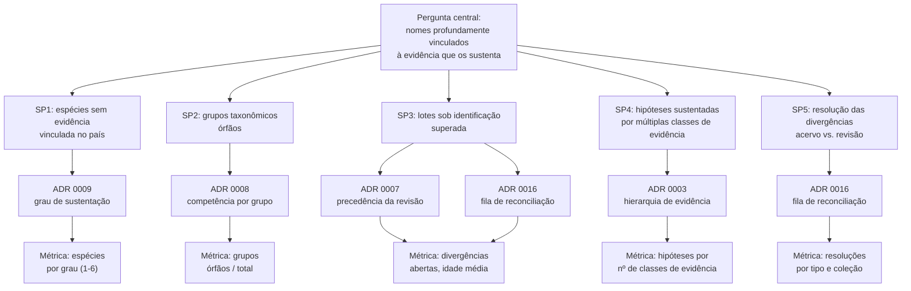
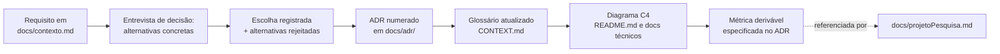

# Projeto de pesquisa

Este repositório documenta um **exercício acadêmico de arquitetura de informação**: a proposta de um sistema de informações sobre a fauna brasileira (reino Animalia) em que cada nome científico esteja profundamente vinculado às evidências que o sustentam. Nada aqui está implantado, nada está em produção, e nada substitui o Catálogo Taxonômico da Fauna do Brasil (CTFB), o GBIF ou o SiBBr — essa é a delimitação central da arquitetura, registrada no [ADR 0001](./adr/0001-sistema-de-registro-greenfield.md), e vale para todo documento deste repositório sem exceção.

## Responsáveis

| Responsável | Vínculo |
|---|---|
| **Dr. Eduardo Dalcin** | Instituto de Pesquisas Jardim Botânico do Rio de Janeiro |
| **Dr. Walter Boeger** | Coordenador do Catálogo Taxonômico da Fauna do Brasil |

## 1. Natureza e delimitação

O que este projeto **é**: um desenho de arquitetura de software, produzido pelo método C4 Model e por Architecture Decision Records (ADRs), que responde à pergunta "como seria o sistema ideal?" sem as restrições de retrocompatibilidade, orçamento ou base instalada que um sistema em produção carrega. É um artefato de pesquisa em arquitetura de informação biológica, não um produto.

O que este projeto **não é**:

- Não é um sistema em produção, nem um roteiro de implantação com prazo. Nenhum componente descrito nos diagramas C4 foi codificado, hospedado ou testado com dados reais.
- Não substitui o CTFB. O CTFB é, hoje, o sistema de registro oficial dos nomes da fauna brasileira, mantido por mais de 800 especialistas, majoritariamente voluntários, sob hierarquia de coordenação por grande grupo (BOEGER et al., 2024). O [ADR 0001](./adr/0001-sistema-de-registro-greenfield.md) desenha este projeto como se fosse *o* sistema de registro, deliberadamente livre do modelo de dados do CTFB, precisamente para poder examinar suas limitações sem estar preso a elas — isso não confere a este projeto autoridade nomenclatural ou taxonômica alguma sobre a fauna brasileira.
- Não substitui o GBIF nem o SiBBr como agregadores de ocorrências. Ambos aparecem na arquitetura como sistemas externos de origem de dados ([ADR 0001](./adr/0001-sistema-de-registro-greenfield.md); ver também [`README.md`](../README.md) para o diagrama de contexto C4 nível 1).
- Não modela conhecimento tradicional associado. A autoridade cultural permanece no Local Contexts Hub e na Comunidade Detentora; este projeto apenas referencia esse vínculo ([ADR 0011](./adr/0011-cta-por-vinculo-ao-local-contexts-hub.md)).
- Não decide nomenclatura. O que o Código Internacional de Nomenclatura Zoológica (ICZN) determina por regra — prioridade, disponibilidade, homonímia — é derivado, nunca deliberado por este projeto ou por qualquer papel que ele descreve ([`CONTEXT.md`](../CONTEXT.md), verbete "Camada Nomenclatural").

Eventuais provas de conceito ou MVPs que venham a ser planejados a partir deste desenho permanecem, em qualquer hipótese, artefatos de pesquisa — nunca substitutos do CTFB, do GBIF ou do SiBBr ([ADR 0001](./adr/0001-sistema-de-registro-greenfield.md)).

A tabela a seguir resume a delimitação em formato de consulta rápida:

| | Este projeto | Sistema em produção equivalente |
|---|---|---|
| Natureza | Exercício acadêmico de arquitetura, registrado em ADRs | Serviço operado, com SLA e usuários reais |
| Autoridade nomenclatural | Nenhuma — deriva do ICZN, como qualquer sistema | CTFB |
| Autoridade sobre ocorrências agregadas | Nenhuma | GBIF, SiBBr |
| Autoridade sobre conhecimento tradicional | Nenhuma — vínculo por referência | Local Contexts Hub |
| Código-fonte executável | Não existe | Existe |
| Dados reais processados | Nenhum | Milhões de registros |
| Produto entregue | Documento, diagrama, decisão registrada | Software em operação |

## 2. Pergunta de pesquisa

**Pergunta central:** como seria um sistema de informações sobre a fauna brasileira em que cada nome científico esteja profundamente vinculado às evidências que o sustentam — espécimes portadores do nome, espécimes preservados, amostras com sequência, observações verificadas — em vez de ser apenas um rótulo em uma lista?

Essa pergunta se desdobra em subperguntas verificáveis, cada uma amarrada a uma decisão registrada e a uma métrica computável pela arquitetura proposta:

| # | Subpergunta | ADR que a sustenta | Métrica resultante |
|---|---|---|---|
| SP1 | Quantas espécies do catálogo nacional não têm nenhuma evidência rastreável vinculada à sua presença no território brasileiro? | [ADR 0009](./adr/0009-pertencimento-a-fauna-brasileira.md) | Distribuição de espécies por grau de sustentação (1 a 6), com grau 6 = nenhuma evidência vinculada |
| SP2 | Quantos grupos taxonômicos da fauna brasileira estão sem Especialista de Grupo designado — órfãos — e portanto sem precedência automática de asserção? | [ADR 0008](./adr/0008-competencia-por-grupo-taxonomico.md) | Contagem de grupos órfãos / total de grupos, como série temporal |
| SP3 | Quantos lotes de coleção estão sob identificação superada por revisão taxonômica, e quanto tempo permanecem nesse estado antes de resolução? | [ADR 0007](./adr/0007-precedencia-da-revisao-taxonomica.md) e [ADR 0016](./adr/0016-fila-de-reconciliacao.md) | Volume e idade média das divergências abertas na fila de reconciliação, por tipo |
| SP4 | Que fração das hipóteses de espécie é sustentada por mais de uma classe de evidência (espécime + sequência + observação verificada), versus sustentada por uma única classe de baixo peso? | [ADR 0003](./adr/0003-hierarquia-de-evidencia.md) | Distribuição de hipóteses por número e classe de linhas de evidência independentes |
| SP5 | Quantas divergências entre identificação de acervo e revisão taxonômica são, ao final, aceitas, rejeitadas ou reconhecidas sem ação pela coleção — e essa proporção muda a leitura de quem "erra" mais, o acervo ou a revisão? | [ADR 0016](./adr/0016-fila-de-reconciliacao.md) | Proporção de resoluções por tipo (aceita / rejeitada / reconhecida sem ação), por coleção e por grupo |

Cada subpergunta é verificável no sentido estrito: a arquitetura descrita neste repositório especifica, para cada uma, de onde o dado viria (qual entidade, qual ADR, qual regra de derivação) e como o resultado seria publicado. Nenhuma delas depende de juízo qualitativo não registrado.

## 3. Justificativa

Três motivos, cada um apoiado em fonte específica, sustentam a pergunta de pesquisa.

**3.1 O impedimento taxonômico é reconhecido e mensurável, mas não é monitorado como série temporal.** O CTFB opera desde 2015 uma estrutura de designação em três níveis — coordenador de grande grupo, subcoordenador, autor de táxon — reunindo mais de 800 especialistas, catalogando 133.691 nomes nominais e reconhecendo 125.138 espécies válidas em 01/01/2024 (BOEGER et al., 2024, *Zoologia* 41:e24005, DOI 10.1590/S1984-4689.v41.e24005). O mesmo trabalho identifica a perda de especialistas como risco central à manutenção do catálogo. Beal-Neves et al. (2022) confirmam esse risco a partir de outro ângulo: em levantamento de 126 instituições brasileiras de ensino superior com programas em ciências biológicas, apenas 16% oferecem alguma disciplina relacionada a coleções científicas ou taxonomia — todas em instituições públicas —, o que estreita a formação de novos taxonomistas exatamente onde o CTFB depende de renovação de quadros (BEAL-NEVES et al., 2022, *Zoologia* 39:e21045, DOI 10.1590/S1984-4689.v39.e21045). O [ADR 0008](./adr/0008-competencia-por-grupo-taxonomico.md) responde a esse diagnóstico tornando a **ausência** de especialista designado um estado visível e mensurável — não apenas uma constatação qualitativa recorrente na literatura.

**3.2 A detecção de determinações desatualizadas em coleções é uma possibilidade anunciada e não realizada.** Boeger et al. (2024) apontam que a integração entre revisão taxonômica e acervos de coleção poderia, em princípio, detectar automaticamente identificações superadas — mas essa integração não está implementada em nenhum sistema em operação hoje. O [ADR 0007](./adr/0007-precedencia-da-revisao-taxonomica.md) e o [ADR 0016](./adr/0016-fila-de-reconciliacao.md) desenham exatamente esse mecanismo: toda divergência entre identificação de acervo e revisão de especialista vira entidade de primeira classe, com ciclo de vida e resolução registrada, em vez de permanecer invisível até que alguém a note manualmente.

**3.3 O valor do espécime físico como evidência não é substituível por dado derivado, e a arquitetura precisa refletir essa hierarquia.** Nachman et al. (2023) argumentam, contra propostas de substituir a coleta de espécimes inteiros por métodos não letais, que fotografias, gravações e sequências de DNA não fornecem, individual ou coletivamente, a mesma qualidade de informação que um espécime-testemunho — a verificação de espécies crípticas ou quase crípticas continua a exigir análise anatômica de material físico, e a maior parte da diversidade animal (pequenos artrópodes) não pode ser identificada sem exame microscópico de material coletado (NACHMAN et al., 2023, *PLOS Biology* 21(11):e3002318, DOI 10.1371/journal.pbio.3002318). Essa hierarquia entre classes de evidência — espécime físico, amostra com sequência, observação verificada, observação não verificada — é o que o [ADR 0003](./adr/0003-hierarquia-de-evidencia.md) formaliza como grau declarado de peso evidencial, e o que o [ADR 0009](./adr/0009-pertencimento-a-fauna-brasileira.md) aplica à pergunta "por que esta espécie consta como brasileira?".

Os três motivos convergem: a literatura já reconhece o problema (impedimento taxonômico, desconexão entre coleção e catálogo, insubstituibilidade do espécime), mas nenhum sistema em operação hoje mede esse problema como dado publicado e consultável. É essa lacuna de instrumentação, não de diagnóstico, que a pergunta de pesquisa deste projeto ataca.

**3.4 Síntese.** A tabela relaciona cada fonte externa ao ADR que ela sustenta diretamente:

| Fonte | Achado citado | ADR sustentado |
|---|---|---|
| Boeger et al. (2024) | Estrutura de designação em três níveis; risco de perda de especialistas; detecção automática de identificação desatualizada como possibilidade não realizada | [ADR 0008](./adr/0008-competencia-por-grupo-taxonomico.md), [ADR 0007](./adr/0007-precedencia-da-revisao-taxonomica.md), [ADR 0016](./adr/0016-fila-de-reconciliacao.md) |
| Beal-Neves et al. (2022) | Apenas 16% das instituições de ensino superior pesquisadas oferecem disciplina de coleções/taxonomia | [ADR 0008](./adr/0008-competencia-por-grupo-taxonomico.md) |
| Nachman et al. (2023) | Espécime físico insubstituível por dado derivado para verificação de espécies crípticas e para a maioria dos artrópodes | [ADR 0003](./adr/0003-hierarquia-de-evidencia.md), [ADR 0009](./adr/0009-pertencimento-a-fauna-brasileira.md) |
| De Queiroz (2007) | Conceito Unificado de Espécie: linhagem, não isolamento reprodutivo, como propriedade definidora | [`docs/specieConcept.md`](./specieConcept.md); subjacente a todos os ADRs de camada taxonômica |
| Struck et al. (2018) | Espécie crítica como disparidade fenotípica anômala face à divergência genética | [`CONTEXT.md`](../CONTEXT.md), verbete "Espécie Crítica" |

## 4. Metodologia

O método empregado nesta sessão de trabalho combina cinco instrumentos, na ordem em que foram usados:

1. **Entrevista de decisão estruturada.** As decisões arquiteturais não foram definidas a priori; foram extraídas por uma sequência de perguntas dirigidas sobre alternativas concretas — por exemplo, "a Visão Curada deve exibir a identificação de acervo ou a revisão taxonômica quando divergem?" ou "a competência do Especialista de Grupo deve ser calculada ou designada?". Cada pergunta gerou opções explicitamente nomeadas, das quais uma foi escolhida e as demais registradas como rejeitadas com sua razão. Esse processo produziu os dezenove ADRs em [`docs/adr/`](./adr/).
2. **Architecture Decision Records (ADRs) com alternativas rejeitadas.** Cada ADR segue o formato: decisão, alinhamento com a prática existente quando aplicável, opções consideradas e rejeitadas com motivo, e consequências — inclusive consequências desconfortáveis, como a sensibilidade política da métrica do [ADR 0009](./adr/0009-pertencimento-a-fauna-brasileira.md). O registro da alternativa rejeitada é deliberado: torna a decisão auditável e revisável, em vez de apresentá-la como óbvia.
3. **C4 Model.** A arquitetura é visualizada em camadas de abstração crescente — contexto (pessoas e sistemas externos), contêineres (as cinco unidades de implantação do [ADR 0018](./adr/0018-cinco-conteineres.md)) e componentes (apenas para o Núcleo e o Pipeline de Ingestão, onde a decisão de design é densa o suficiente para justificar o detalhe). Os diagramas ficam no [`README.md`](../README.md) e na documentação técnica referenciada a partir dele.
4. **Glossário como modelo de domínio.** O [`CONTEXT.md`](../CONTEXT.md) não é material de referência posterior: foi o instrumento usado durante a entrevista para impedir que dois papéis distintos (Especialista de Grupo e Gestor de Coleção, por exemplo) fossem tratados como equivalentes por imprecisão de linguagem. Cada verbete lista explicitamente os termos a evitar (`_Avoid_`), e essa disciplina de vocabulário é o que permite que os ADRs se refiram uns aos outros sem ambiguidade.
5. **Inteligência Artificial agêntica como instrumento e como objeto.** Todas as fases descritas acima — pesquisa bibliográfica, condução da entrevista de decisão, redação dos ADRs, construção do glossário, produção dos diagramas C4 e da documentação técnica — foram executadas em colaboração com um agente de IA (Anthropic Claude, operado no harness Oh My Pi). Isso não é detalhe operacional: **é parte declarada do objeto de pesquisa**. Ver Seção 4.1.

### 4.1 A IA agêntica como objeto de pesquisa

Este projeto avalia, simultaneamente à arquitetura de fauna, **o uso de IA agêntica em todas as fases de um projeto de pesquisa em arquitetura de informação**. As perguntas que se investiga aqui são:

- **Onde o agente agrega e onde não agrega.** A IA sustentou pesquisa bibliográfica com verificação de DOI, produziu texto técnico extenso em paralelo por subagentes, e manteve consistência de vocabulário entre dezenove ADRs e cinco documentos. Não substituiu, em nenhum momento, a decisão: cada uma das dezenove escolhas registradas foi tomada por um responsável humano, entre alternativas que o agente apresentou.
- **A entrevista de decisão como técnica de uso.** O padrão adotado — o agente formula uma pergunta por vez, com alternativas concretas e uma recomendação argumentada, e o humano decide — foi escolhido deliberadamente contra o padrão mais comum de "peça o documento pronto". A hipótese em teste é que esse formato produz decisão auditável, em vez de texto plausível sem dono.
- **Rastreabilidade da autoria.** Todo ADR registra a alternativa rejeitada e a razão. Isso permite, depois, distinguir o que foi decisão humana informada do que foi sugestão do agente aceita sem exame — distinção que a maior parte da produção assistida por IA não preserva.
- **Modos de falha observados.** Foram registrados na prática: recomendação inicial errada por subvalorizar restrição não declarada (a escolha de armazenamento, revista no [ADR 0015](./adr/0015-postgresql-unico-com-jsonb-e-postgis.md) após o responsável apontar concorrência de escrita real); e a necessidade de rejeitar explicitamente padrões herdados de projetos anteriores para que não reaparecessem por inércia ([ADR 0014](./adr/0014-licoes-do-pipeline-de-ingestao.md)).

A avaliação é qualitativa e declarada, não experimento controlado: não há grupo de comparação sem IA, e o resultado não é generalizável a outros domínios ou outros modelos. O que este projeto pode oferecer é um **registro auditável** de um processo de arquitetura conduzido de ponta a ponta com IA agêntica, em que cada decisão tem autor humano nomeado e cada alternativa rejeitada está escrita.

A sequência efetivamente seguida nesta sessão, do requisito inicial ao artefato publicado, foi:

O [`docs/specieConcept.md`](./specieConcept.md) cumpriu papel de subsídio conceitual anterior aos ADRs: fixou o Conceito Unificado de Espécie (DE QUEIROZ, 2007) como base, o que tornou possível tratar espécie como hipótese sustentada por evidência — e não como linha de tabela com um nome — em toda decisão subsequente.

Este método não produz software. Produz decisão registrada, revisável e datada — o produto que um projeto de pesquisa em arquitetura de informação, sem base de código a manter, pode legitimamente entregar.

## 5. Resultados esperados

Os resultados deste projeto de pesquisa são de duas naturezas.

**5.1 Documentos.** O repositório entrega:

- [`README.md`](../README.md) — visão geral, C4 nível 1, voltado a taxonomistas e gestores de coleção.
- [`CONTEXT.md`](../CONTEXT.md) — glossário/modelo de domínio.
- [`docs/specieConcept.md`](./specieConcept.md) — conceito de espécie adotado e suas consequências para o modelo de dados.
- [`docs/adr/`](./adr/) — dezenove ADRs com alternativas rejeitadas.
- Documentação de governança em três camadas (conteúdo, ferramentas, arquitetura), com a matriz de decisão e as lacunas nomeadas.
- Documentação técnica de C4 nível 2 (cinco contêineres) e nível 3 (Núcleo e Pipeline de Ingestão).

**5.2 Métricas como resultado de pesquisa em si.** As métricas descritas pelos ADRs 0008 e 0009 não são subproduto operacional — são, elas mesmas, resposta às subperguntas SP1 e SP2 da Seção 2:

- **ADR 0008**: a proporção de grupos taxonômicos da fauna brasileira sem Especialista de Grupo designado é, hoje, pergunta sem resposta publicada. Uma arquitetura que deriva e expõe evidência de competência a partir de ZooBank e DOIs, e marca a ausência de designação como estado explícito, converte essa pergunta em série temporal consultável — o impedimento taxonômico deixa de ser diagnóstico qualitativo recorrente na literatura (seção 3.1) e vira dado.
- **ADR 0009**: a proporção de espécies do catálogo nacional sem nenhum espécime rastreável sustentando sua presença no país também é, hoje, pergunta sem resposta. O grau de sustentação (1 a 6) torna essa cobertura mensurável e reprodutível a cada ingestão, com série histórica preservada — o indicador é a evolução da cobertura ao longo do tempo, não o valor instantâneo.

Produzir essas duas métricas — ainda que apenas como especificação de como seriam calculadas, sem execução sobre dados reais — é, em si, o resultado científico deste projeto: transformar um problema reconhecido pela literatura (impedimento taxonômico, desconexão evidência-catálogo) em uma pergunta com protocolo de resposta definido.

## 6. Limitações declaradas

- **Nada foi implementado.** A arquitetura descreve como as métricas das Seções 2 e 5 seriam calculadas; nenhuma delas foi executada sobre dados reais do CTFB, do GBIF, do SiBBr ou de qualquer coleção. Os números "125.138 espécies válidas" e "mais de 800 especialistas" citados neste documento são do CTFB relatado por Boeger et al. (2024), não produzidos por este projeto.
- **As métricas dependem de dados que podem não existir ainda.** O grau de sustentação do [ADR 0009](./adr/0009-pertencimento-a-fauna-brasileira.md) e a cobertura de especialistas do [ADR 0008](./adr/0008-competencia-por-grupo-taxonomico.md) só são computáveis na medida em que ZooBank, DOIs e ocorrências de coleção estejam indexados e vinculados; onde a vinculação não existe, a métrica reflete a lacuna de indexação, não necessariamente a ausência real de evidência ou de especialista.
- **A métrica de cobertura evidencial é politicamente sensível e mede outra coisa do que parece medir.** Publicar que um número expressivo de espécies do catálogo nacional não tem evidência vinculada é, ao mesmo tempo, resultado de pesquisa legítimo e constrangimento institucional. O [ADR 0009](./adr/0009-pertencimento-a-fauna-brasileira.md) é explícito quanto a isso: essa métrica mede **lacuna de digitalização e de vinculação**, não erro de taxonomista. O grau 6 (nenhuma evidência vinculada) é pauta de trabalho devolvida às coleções, não marca de erro — e qualquer leitura deste projeto ou de trabalhos dele derivados deve preservar esse enquadramento.
- **O escopo é restrito a Animalia e ao ICZN.** Nada aqui se estende a outros reinos ou a outros códigos de nomenclatura ([ADR 0010](./adr/0010-escopo-restrito-a-animalia.md)); resultados não são generalizáveis a sistemas de informação de flora ou de outros grupos sem novo desenho.
- **A justificativa de conservação da coleta de espécimes físicos (Seção 3.3) é objeto de debate na literatura.** Nachman et al. (2023) respondem a uma posição divergente (BYRNE, 2023) que defende métodos não letais como substitutos; este projeto adota a posição de Nachman et al. porque ela sustenta diretamente a hierarquia de evidência do [ADR 0003](./adr/0003-hierarquia-de-evidencia.md), mas o debate não está encerrado na comunidade científica.
- **A avaliação do uso de IA agêntica (Seção 4.1) não é experimento controlado.** Não há grupo de comparação sem IA, não há métrica de produtividade medida, e a observação se restringe a um modelo, um harness e um domínio. O que se pode afirmar é o que está registrado: quais decisões foram humanas, quais alternativas foram rejeitadas e por quê, e quais modos de falha do agente foram observados. Qualquer inferência sobre eficácia da IA além disso não é sustentada por este projeto.

## 7. Anexo — índice dos dezenove ADRs

Registro completo das decisões produzidas pela entrevista descrita na Seção 4, para consulta cruzada com as métricas e limitações discutidas acima. Título e status conforme o arquivo correspondente em [`docs/adr/`](./adr/).

| ADR | Título |
|---|---|
| [0001](./adr/0001-sistema-de-registro-greenfield.md) | Sistema de registro greenfield, não camada sobre o CTFB |
| [0002](./adr/0002-copia-materializada-de-ocorrencias.md) | Ocorrências ingeridas como cópia materializada |
| [0003](./adr/0003-hierarquia-de-evidencia.md) | Universo de evidência amplo, com peso evidencial explícito |
| [0004](./adr/0004-autoridade-de-assercao.md) | Contribuição aberta com revisão por especialista, e Visão Curada como um conceito entre outros |
| [0005](./adr/0005-camadas-nomenclatural-e-taxonomica.md) | Camada nomenclatural validada por regra, separada da camada taxonômica revisável |
| [0006](./adr/0006-fair-care-aberto-por-padrao.md) | Aberto por padrão, com autoridade cultural indígena modelada via Local Contexts |
| [0007](./adr/0007-precedencia-da-revisao-taxonomica.md) | Revisão taxonômica prevalece sobre a identificação de acervo na Visão Curada |
| [0008](./adr/0008-competencia-por-grupo-taxonomico.md) | Competência designada por grupo, com evidência derivada como sinal e grupos órfãos declarados |
| [0009](./adr/0009-pertencimento-a-fauna-brasileira.md) | Pertencimento à fauna brasileira: declarado pelo especialista, sustentação computada ao lado |
| [0010](./adr/0010-escopo-restrito-a-animalia.md) | Escopo estritamente Animalia, com o ICZN embutido no núcleo |
| [0011](./adr/0011-cta-por-vinculo-ao-local-contexts-hub.md) | Conhecimento tradicional por vínculo ao Local Contexts Hub, sem modelagem própria |
| [0012](./adr/0012-identificadores.md) | Identificador interno próprio, com identificadores externos ancorados e resolvidos |
| [0013](./adr/0013-armazenamento-sqlite-json-e-duckdb.md) | Armazenamento: SQLite com JSON1 no núcleo, DuckDB nas ocorrências — **superado pelo ADR 0015** |
| [0014](./adr/0014-licoes-do-pipeline-de-ingestao.md) | Lições do pipeline de ingestão do Biodiversidade.Online — o que adotar e o que rejeitar |
| [0015](./adr/0015-postgresql-unico-com-jsonb-e-postgis.md) | PostgreSQL único, com JSONB no núcleo e PostGIS nas ocorrências |
| [0016](./adr/0016-fila-de-reconciliacao.md) | Divergência como entidade com resolução registrada |
| [0017](./adr/0017-ipt-como-sistema-externo.md) | IPT como sistema externo; o sistema expõe tabelas de publicação |
| [0018](./adr/0018-cinco-conteineres.md) | Cinco contêineres; as demais responsabilidades são componentes |
| [0019](./adr/0019-licenciamento-em-tres-regimes.md) | Licenciamento em três regimes |

Apenas os ADRs 0001, 0003, 0007, 0008, 0009, 0010, 0011 e 0016 são citados diretamente no corpo deste documento, por sustentarem a pergunta de pesquisa e suas métricas (Seções 2, 3 e 5). Os demais compõem a arquitetura completa, descrita no [`README.md`](../README.md) e na documentação técnica de contêineres e componentes.

## 8. Relação com os demais documentos do repositório

Este documento não substitui o `README.md`, o `CONTEXT.md` ou os ADRs — ele os enquadra. A tabela indica onde cada leitor deveria começar:

| Se você é... | Comece por | E volte a este documento para |
|---|---|---|
| Taxonomista ou Especialista de Grupo | [`README.md`](../README.md) | Entender por que competência e precedência de revisão são medidas (Seção 2, SP2 e SP3) |
| Gestor de Coleção | [`docs/adr/0007-precedencia-da-revisao-taxonomica.md`](./adr/0007-precedencia-da-revisao-taxonomica.md) e [`docs/adr/0016-fila-de-reconciliacao.md`](./adr/0016-fila-de-reconciliacao.md) | Entender o enquadramento da fila de reconciliação como dado científico, não como auditoria (Seção 6) |
| Gestor público ou formulador de política | [`docs/adr/0009-pertencimento-a-fauna-brasileira.md`](./adr/0009-pertencimento-a-fauna-brasileira.md) | Entender por que a métrica de cobertura evidencial não é indicador de erro de taxonomista (Seção 6) |
| Revisor de governança | `docs/governanca.md` | Ver como as quatro perguntas de conteúdo (Seção sobre governança do `docs/contexto.md`) se relacionam com a pergunta de pesquisa desta Seção 2 |
| Quem avalia este projeto como pesquisa | Este documento, do início | Localizar cada afirmação em um ADR nomeado (Seção 7) antes de aceitar qualquer número citado |

## 9. Referências

BEAL-NEVES, M.; MIELKE, A.; GAMARRA, S. de P.; BEIER, C.; FONTANA, C. S. A students' opinion on the importance of natural history collections and taxonomy in Brazil. **Zoologia**, Curitiba, v. 39, e21045, 2022. DOI: https://doi.org/10.1590/S1984-4689.v39.e21045.

BOEGER, W. A. et al. Catálogo Taxonômico da Fauna do Brasil: setting the baseline knowledge on the animal diversity in Brazil. **Zoologia**, Curitiba, v. 41, e24005, 2024. DOI: https://doi.org/10.1590/S1984-4689.v41.e24005.

DE QUEIROZ, K. Species concepts and species delimitation. **Systematic Biology**, v. 56, n. 6, p. 879-886, 2007. DOI: https://doi.org/10.1080/10635150701701083.

NACHMAN, M. W. et al. Specimen collection is essential for modern science. **PLOS Biology**, v. 21, n. 11, e3002318, 2023. DOI: https://doi.org/10.1371/journal.pbio.3002318.

STRUCK, T. H. et al. Finding evolutionary processes hidden in cryptic species. **Trends in Ecology & Evolution**, v. 33, n. 3, p. 153-163, 2018. DOI: https://doi.org/10.1016/j.tree.2017.11.007.

Ver também as referências completas do conceito de espécie adotado em [`docs/specieConcept.md`](./specieConcept.md), seção 7, e as referências específicas de cada decisão nos respectivos ADRs em [`docs/adr/`](./adr/).
