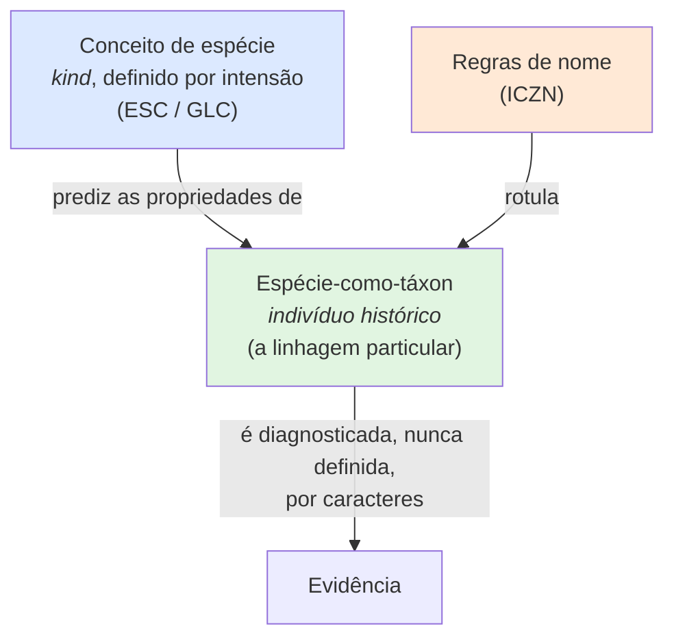

# Avaliação de impacto — Wiley & Lieberman (2011), cap. 2, sobre `docs/specieConcept.md`

**Fonte avaliada**: Wiley, E.O. & Lieberman, B.S. (2011). *Phylogenetics: Theory and Practice of Phylogenetic Systematics*, 2ª ed., Cap. 2 "Species and Speciation", p. 23–37. Wiley-Blackwell.
**Documento afetado**: [`docs/specieConcept.md`](../specieConcept.md) · secundariamente [`CONTEXT.md`](../../CONTEXT.md) e ADR 0003 (hierarquia de evidência).
**Veredito**: a decisão central do projeto **não muda**. O capítulo corrobora o conceito adotado, mas corrige sua **atribuição**, endurece o tratamento dos critérios operacionais e revela **três lacunas reais** no modelo de dados.

---

## 1. Resumo em uma tabela

| Ponto do capítulo | Efeito em `specieConcept.md` | Ação |
|---|---|---|
| ESC ≡ General Lineage Concept; Wiley recusa o nome novo | **Contradiz a atribuição** ("Conceito Unificado, De Queiroz 2007" como inovação) | Alta |
| Espécie-como-táxon é **indivíduo histórico**; conceito de espécie é *kind* | Agrega a camada ontológica que falta | Alta |
| Espécie **não é** um conjunto (*set*) de organismos | Corrige leitura possível do `erDiagram` | Alta |
| ESC **não** é sinônimo de BSC, RSC nem PSC | **Tensiona** a frase "todos os demais conceitos são linhas de evidência" | Alta |
| Especiação reticulada forma um **terceiro** sistema tokogenético | Lacuna: relações entre conceitos não modelam origem com dois parentais | Média |
| Espécie ancestral é necessariamente parafilética sob PSC-I | Lacuna: monofilia não pode ser critério obrigatório | Média |
| Hipóteses sobre espécies são *singular statements*, testadas por *weight of evidence* | Corrobora ADR 0003 com fundamento citável | Baixa (reforço) |
| Não-operacionalidade do ESC é força, não defeito | Corrobora o requisito 1 (nunca armazenar "é espécie: sim/não") | Baixa (reforço) |
| Especiação alopátrica é a regra ("Mayr's Law") | Corrobora a rejeição do BSC como critério primário | Baixa (reforço) |

---

## 2. O que agrega

### 2.1 A camada ontológica ausente: três usos da palavra "espécie"

O capítulo abre distinguindo três usos independentes (p. 23):

1. **Espécie-como-táxon** — a linhagem particular a que se aplica um binômio (`Fundulus nottii`). É um **indivíduo histórico**: tem nascimento por especiação, fim por extinção, troca suas partes sem trocar de nome, e "can be named and diagnosed, but never defined" (p. 27).
2. **Conceito de espécie** — o *kind concept*, definido por intensão, que enumera as propriedades da "speciesness".
3. **Regras de nome e posição hierárquica** — o Código.

`specieConcept.md` §2 já separa quatro entidades (Linhagem, Nome, Conceito de Táxon, Hipótese de Espécie), e a separação está correta. O que ele não diz é **por que** a separação é obrigatória: porque (1) e (2) são categorias lógicas diferentes — um indivíduo e um *kind*. Isso dá dois ganhos diretos ao modelo:

- **"Diagnosed, but never defined"** é a justificação formal de por que a diagnose entra no sistema como `EVIDENCIA` e nunca como definição de `HIPOTESE_ESPECIE`. Hoje o documento afirma isso como escolha de projeto; passa a ser consequência ontológica.
- **Indivíduo histórico tem origem e fim.** `HIPOTESE_ESPECIE` não registra nada sobre o intervalo de existência da linhagem. Para um sistema que precisa acomodar material de coleção histórico, extinções e fósseis (o próprio documento invoca museômica), a ausência é sensível.

### 2.2 Espécie **não** é um conjunto de espécimes

Wiley & Lieberman rejeitam explicitamente *species-as-sets* (p. 26–27): conjuntos com pertinências diferentes são conjuntos diferentes, logo o nascimento e a morte de um organismo criariam uma espécie nova a cada instante; e conjuntos não evoluem (Hull 1981). A tentativa de salvamento de Kitcher (1984) — união de subconjuntos temporais — é avaliada como "more seems to be lost than gained".

Consequência direta para a arquitetura: **`HIPOTESE_ESPECIE` nunca deve ser materializada como a coleção dos espécimes que a compõem.** O `erDiagram` atual está tecnicamente correto (`HIPOTESE_ESPECIE ||--o{ EVIDENCIA`, `EVIDENCIA }o--|| ESPECIME`) — o espécime é *evidência sobre* a linhagem, não *parte constituinte* dela. Mas a leitura extensional é o erro de implementação mais natural e o documento não o proíbe em nenhum lugar. Deve proibir: contagem de espécimes não é a espécie, e ganho ou perda de espécime não altera a hipótese.

### 2.3 Fundamento filosófico para a hierarquia de evidência (ADR 0003)

"If species are individuals, then hypotheses about species are singular statements, and historical singular statements at that. If so, then hypotheses about species and about species' relationships are tested by weight of evidence" (p. 27).

Isto é exatamente o mecanismo do ADR 0003 e do campo `grauCorroboracao`, com uma origem citável mais forte do que "prática atual da taxonomia integrativa". Enunciados singulares históricos não são falseáveis por experimento repetível; só admitem pesagem de evidência. A hierarquia de seis níveis deixa de ser convenção de projeto e passa a ser a forma de teste apropriada à natureza do objeto.

### 2.4 A não-operacionalidade é intencional

"The ESC is the logical analog of the kind 'monophyletic group'. Neither is 'operational', and this is a strength of the concept, not a weakness" (p. 33). E a crítica a Bridgman (p. 28): sob operacionalismo, **dois critérios operacionais produzem dois tipos de espécie** — a ontologia passa a ser determinada pelo instrumento de medida.

Isto é o argumento decisivo contra qualquer futuro pedido de "um botão que decida se é espécie". Também explica por que `criteriosAplicados` precisa ser registro explícito: sem ele, cada critério cria silenciosamente sua própria ontologia dentro do mesmo banco.

### 2.5 Especiação alopátrica como regra, e hibridação como fato

- "The overwhelming answer is that most newly formed species live in allopatry, not sympatry" (p. 34). Logo, isolamento reprodutivo **não é testável** para a maior parte dos táxons do CTFB. A rejeição do BSC como critério primário em `specieConcept.md` §1 fica sustentada por dado empírico, não só por conveniência.
- Como ictiólogos, Wiley & Mayden declaram não conhecer espécie recente de peixe de água doce norte-americano 100% isolada reprodutivamente, e conhecem muitos casos de hibridação entre espécies que não são irmãs (p. 36). Conclusão: "occasional tokogenetic events (rare hybridization, for example) were not synonymous with defining the extent of tokogenetic systems".

A linha "hibridação e fluxo gênico residual → fluxo não anula separação" da tabela de §1 ganha aqui sua fundamentação. Relevante para a fauna brasileira, onde complexos com hibridação são comuns em Characiformes, Anura e Psittacidae.

---

## 3. O que contradiz

### 3.1 Atribuição do conceito adotado — a contradição principal

`specieConcept.md` apresenta o conceito adotado como "Conceito Unificado de Espécie (De Queiroz 2007)" e afirma que ele "é o consenso operacional atual da sistemática porque remove o conflito entre concepção e delimitação".

Wiley & Lieberman discordam em dois pontos, e explicitamente:

> "*The General Lineage Concept (GLC) of de Queiroz (1998) is the ESC.* […] The difference between de Queiroz (1998) and Mayden (1997) is that Mayden made the decision that all other concepts were reflections on the ESC while de Queiroz (1998) made the decision that a new name for the ESC was needed. **We do not agree.**" (p. 34)

E a lista de sinônimos do ESC (p. 31, item 4) inclui: Lineage Concept (Hennig 1966), Cohesion Concept (Templeton 1989), Cladistic Concept (Ridley 1986), Internodal Concept (Kornet 1993), Population Lineages (O'Hara 1993; de Queiroz & Gauthier 1994), General Lineage Concept (de Queiroz 1998), Hennigian Species Concept (Meier & Willmann 2000). A cadeia de origem é Simpson (1961) → Hennig (1966) → Wiley (1978) → Frost & Kluge (1994) → Mayden (1997).

Também a separação entre conceito geral e critério operacional não nasce em 2007: "It is exactly this distinction that led Frost and Kluge (1994), Mayden and Wood (1995), Mayden (1997), and de Queiroz (1998) to suggest that a distinction can be drawn between what might be termed 'general' concepts and 'operational' concepts" (p. 28).

**O que não muda**: a decisão do projeto. Linhagem que evolui separadamente continua sendo o conceito adotado, e os critérios continuam sendo evidência.

**O que muda**:

1. A afirmação de que o Conceito Unificado é a inovação que "remove o conflito" está mal datada por ~35 anos. A formulação correta: o projeto adota o **conceito de espécie-como-linhagem** (Simpson 1961; Hennig 1966; Wiley 1978), na formulação nominalmente unificada de De Queiroz (1998, 2007).
2. **Risco operacional concreto.** A literatura taxonômica brasileira de peixes, anfíbios e répteis — as fontes primárias do CTFB — usa majoritariamente o rótulo *Evolutionary Species Concept*, não *Unified*. Um sistema cujo vocabulário controlado de `criteriosAplicados` só reconheça "Unified" falhará ao mapear asserções que declaram ESC, ClSC, CoSC ou HSC. Estes rótulos são **o mesmo conceito** e devem ser registrados como sinônimos, não como conceitos concorrentes.
3. A palavra "consenso" é forte demais. Wiley & Lieberman (2011) representam uma escola ativa que recusa o rótulo. O documento deve dizer "a formulação dominante", e registrar a discordância.

### 3.2 "Todos os demais conceitos são linhas de evidência" é generoso demais

`specieConcept.md` §1 afirma que os conceitos biológico, filogenético, ecológico, de reconhecimento e diagnóstico são todos "linhas de evidência que testam a hipótese de separação da linhagem". O capítulo faz uma classificação mais dura:

> "the ESC is **not** synonymous with the BSC […], the Recognition Concept of Paterson (1984), or various forms of the Phylogenetic Species Concept" (p. 31, item 5)

E a distinção que o capítulo constrói é entre **natural kinds** (conceitos que decorrem de teoria de processo) e **nominal kinds** (conceitos inventados por sistematas por conveniência de descoberta, sem vínculo com teoria — p. 28). Conceitos morfológico e fenético são explicitamente colocados fora, por tratarem espécies particulares como classes definidas por traços (Ghiselin 1974:539).

O ajuste necessário não é abandonar a arquitetura de critérios-como-evidência — ela é correta e é o que o próprio Mayden (1997) propõe. É **declarar o escopo de validade de cada critério**, em vez de tratá-los como intercambiáveis:

| Critério | Escopo de validade | Fora do escopo |
|---|---|---|
| Isolamento reprodutivo (BSC) | Linhagens simpátricas com isolamento já adquirido | Alopatria, assexuados, fósseis, material de coleção |
| Reconhecimento de parceiro (RSC) | Biparentais, com SMRS caracterizado | Assexuados, alopatria não testada |
| Monofilia recíproca (PSC-I) | Linhagens terminais | **Espécies ancestrais** (ver 3.3) |
| Diagnosticabilidade (PSC-II) | Qualquer material, inclusive tipo único | Populações alopátricas em cline: diagnostica estrutura |
| Coesão (CoSC) | Coextensivo ao ESC | — |

A última linha da tabela é a mais importante, e é nova em relação ao documento. `specieConcept.md` §3.2 já registra que o *multispecies coalescent* diagnostica **estrutura populacional e não divergência de nível específico** (Sukumaran & Knowles 2017). O capítulo estende o mesmo argumento aos **caracteres morfológicos**: sob PSC-II levado ao limite, qualquer amostra alopátrica com estado de caráter fixado é uma "espécie". O viés de *oversplitting* não é uma patologia de método molecular; é uma patologia de **critério operacional tomado como definição**, e a taxonomia morfológica clássica está sujeita a ele pela mesma via. O risco de inflação taxonômica de §3.3 é portanto mais antigo e mais amplo do que o documento sugere.

### 3.3 Espécie ancestral não pode ser monofilética

Sob o PSC-I (espécie = táxon monofilético diagnosticado por apomorfia), toda espécie ancestral persistente é parafilética: é caracterizada por plesiomorfias e não inclui todos os seus descendentes. Daí a pergunta de Wiley & Mayden (p. 36): "if the phylogenetic system allows for 'paraphyletic species' (all ancestral species), then how can the phylogenetic system reject paraphyletic groups of species?"

O `timeline` de `specieConcept.md` §1 lista "monofilia recíproca de todos os locos" como propriedade de divergência avançada. Correto para linhagens terminais, e **logicamente inalcançável** para uma linhagem ancestral que persiste. Consequências:

- Monofilia não pode ser critério obrigatório nem ordenador do `grauCorroboracao`. Uma hipótese de espécie ancestral corretamente delimitada terá monofilia ausente **por construção**, e um cálculo de corroboração ingênuo a penalizará.
- O sistema deve admitir hipóteses de espécie sem monofilia sem marcá-las como fracas.

### 3.4 Lacuna: origem reticulada não é representável

O capítulo trata especiação por hibridação como caso real que forma um **terceiro** sistema tokogenético a partir de dois (p. 29), com efeito conhecido nas análises: "a confusing pattern of synapomorphies" (Funk 1985; Smith 1992).

O modelo de `specieConcept.md` §4.2, requisito 2, registra relações entre conceitos com o vocabulário `congruente | inclui | incluído em | sobrepõe | disjunto`. Este vocabulário é de **teoria de conjuntos sobre circunscrições** — ele descreve como duas circunscrições se comparam, e não descreve **descendência**. Não há como afirmar "a linhagem C originou-se da hibridação das linhagens A e B". Isto é uma lacuna de modelagem, não um erro: a relação de origem de linhagem (uni ou biparental) é uma aresta distinta da relação de congruência entre conceitos, e o `erDiagram` não a tem.

Relevante para a fauna brasileira: linhagens de origem híbrida são documentadas em peixes neotropicais e em Squamata partenogenéticos — e um sistema que registra táxons obscuros por sequência molecular encontrará mais.

---

## 4. Limites desta fonte

- O capítulo é de **2011** e discute De Queiroz **1998** (GLC). Não responde ao artigo de **2007** que `specieConcept.md` cita como fonte primária. A discordância registrada em 3.1 é sobre a necessidade do novo nome e sobre prioridade — não sobre o conteúdo de 2007.
- É um texto de **teoria e ontologia**, escrito antes da genômica de delimitação. Não contribui para §3.1 (taxonomia integrativa), §3.2 (MSC, gdi, `hhsd`), §3.4 (táxons obscuros, BINs, MOTUs) nem para os padrões de dados de §4. Nessas seções o documento permanece a fonte melhor.
- Nada no capítulo afeta a camada nomenclatural, o ICZN, Darwin Core, TCS 2 ou W3C PROV.

---

## 5. Ações possíveis em `docs/specieConcept.md` — não aplicadas

> **Status: em aberto.** Nada deste relatório foi aplicado a `docs/specieConcept.md`, `CONTEXT.md` ou aos ADR. A lista abaixo é registro de possibilidades, para discussão com Walter Boeger antes de qualquer decisão.

Nenhuma altera a decisão adotada. Todas são de precisão ou de lacuna.

1. **§1** — reatribuir: conceito de espécie-como-linhagem (Simpson 1961; Hennig 1966; Wiley 1978), na formulação unificada de De Queiroz (1998, 2007). Trocar "consenso" por "formulação dominante" e registrar a discordância de Wiley & Lieberman (2011) quanto ao rótulo.
2. **§1** — acrescentar nota de sinonímia: ESC ≡ GLC ≡ Cohesion ≡ Cladistic ≡ Internodal ≡ Hennigian ≡ Population Lineages. Alimenta o vocabulário controlado de `criteriosAplicados`.
3. **§2** — acrescentar a distinção *espécie-como-táxon (indivíduo histórico)* × *conceito de espécie (kind)*, com "diagnosed but never defined" como justificação de por que a diagnose é evidência.
4. **§2** — proibir explicitamente a leitura extensional: hipótese de espécie não é o conjunto de seus espécimes.
5. **§3.2** — generalizar o viés de superdivisão: é patologia de critério-tomado-como-definição, não de método molecular. Vale para diagnosticabilidade morfológica em clines alopátricos.
6. **§3** — acrescentar a tabela de escopo de validade por critério (seção 3.2 deste relatório).
7. **§4.2** — acrescentar requisito: monofilia não é critério obrigatório; hipótese de espécie ancestral é parafilética por construção e não deve ser penalizada no `grauCorroboracao`.
8. **§4.1/§4.2** — acrescentar relação de **origem de linhagem** ao modelo, admitindo dois parentais (especiação reticulada), distinta das relações de congruência entre conceitos.
9. **§4.1** — acrescentar a `HIPOTESE_ESPECIE` o intervalo de existência inferido da linhagem (origem/fim), necessário para fósseis, extintos e material histórico.
10. **§7** — incluir Wiley & Lieberman (2011) e Wiley & Mayden (2000a–c) nas fontes de conceito.

Itens 7 e 8 podem justificar ADR próprio, por afetarem o modelo de dados. Os demais são edição do documento. Ambos ficam suspensos até a discussão.
