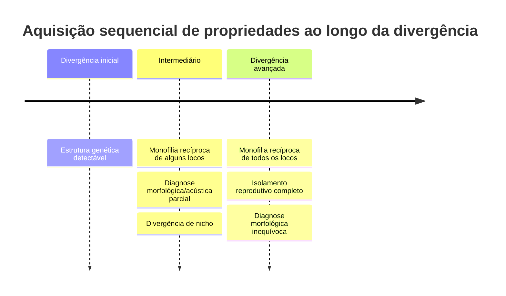
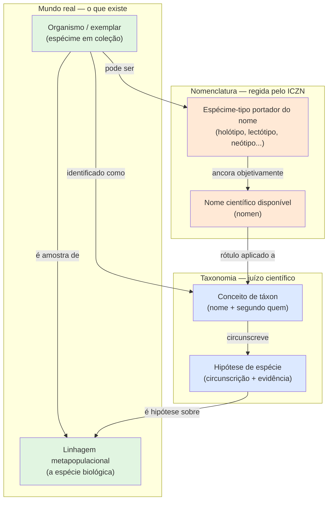
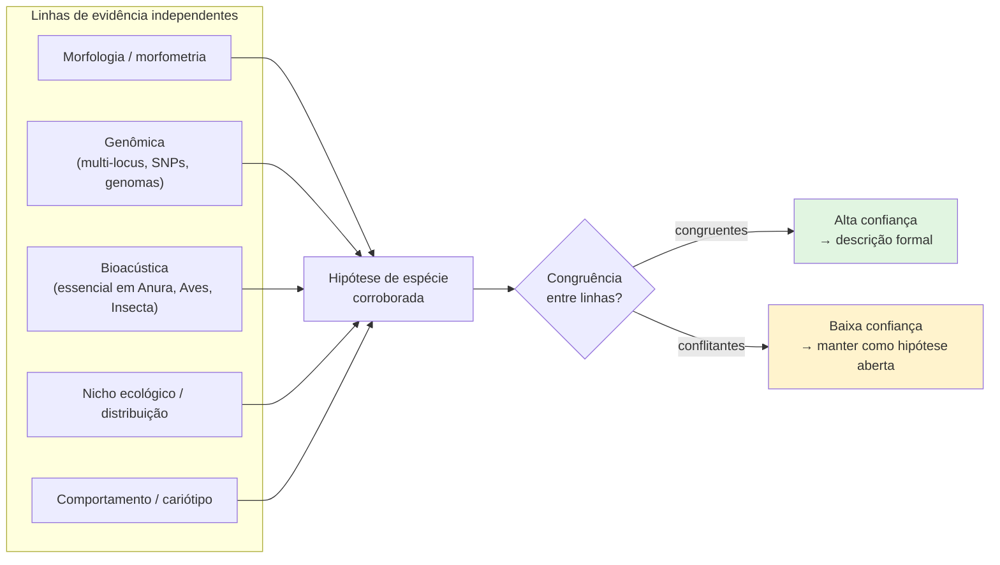
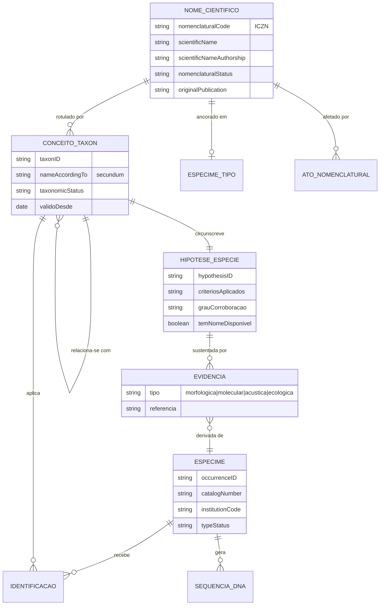
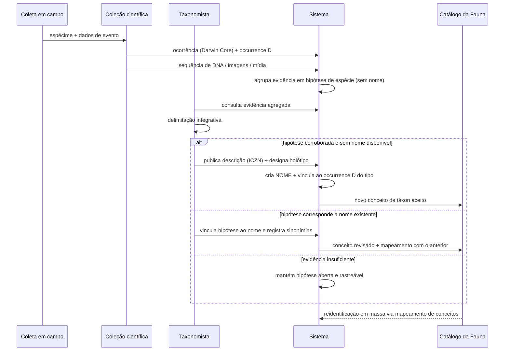

# O conceito de espécie para o reino Animalia

Documento de subsídio conceitual para a arquitetura do sistema de informações sobre a fauna brasileira. Define **qual conceito de espécie o sistema adota**, por quê, e quais consequências isso tem para o modelo de dados.

---

## 1. Decisão adotada

> **O sistema adota o Conceito Unificado de Espécie (De Queiroz 2007): uma espécie é um _linhagem metapopulacional que evolui separadamente_.**
>
> Todos os demais "conceitos de espécie" (biológico, filogenético, ecológico, diagnóstico, de reconhecimento) são tratados no modelo de dados **não como definições concorrentes, mas como linhas de evidência (critérios operacionais)** que testam a hipótese de separação da linhagem.

Consequência direta para a arquitetura: **espécie não é uma linha de tabela com um nome científico. É uma hipótese, datada, assinada e sustentada por evidências.** O nome é o rótulo; a evidência é o conteúdo.

### Por que este conceito, e não o Conceito Biológico de Espécie (Mayr)

| Critério | Conceito Biológico (isolamento reprodutivo) | Conceito Unificado (linhagem) |
|---|---|---|
| Aplica-se a taxa assexuados/partenogenéticos | Não | Sim |
| Aplica-se a fósseis e material de coleção antigo | Não | Sim |
| Aplica-se a alopátricos (não testáveis quanto a cruzamento) | Não operacional | Sim |
| Aplica-se com hibridação e fluxo gênico residual | Conflitante | Sim (fluxo não anula separação) |
| Permite evidência molecular, morfológica, acústica, ecológica no mesmo arcabouço | Não | Sim |
| Separa *o que é uma espécie* de *como se reconhece uma espécie* | Não | Sim |

O Conceito Unificado é o consenso operacional atual da sistemática porque **remove o conflito entre concepção e delimitação**: as propriedades antes tratadas como definidoras (isolamento reprodutivo, monofilia, diagnosticabilidade) passam a ser evidência de separação, adquirida em momentos diferentes ao longo da divergência (De Queiroz 2007, *Systematic Biology* 56:879–886).

### A "zona cinzenta"

Durante a divergência, uma linhagem adquire suas propriedades de forma **sequencial e não simultânea**. Existe portanto um intervalo em que duas linhagens são detectavelmente distintas por um critério e indistintas por outro. Esse intervalo — a *gray zone* da especiação — não é uma falha do conceito: é a propriedade central que o modelo de dados precisa representar.

Implicação de projeto: **o sistema NUNCA deve armazenar "é espécie: sim/não" como fato**. Deve armazenar *quem afirmou, com base em qual evidência, quando, e qual o grau de corroboração*.

---

## 2. As quatro entidades que o sistema precisa distinguir

Confundir estas quatro coisas é o erro estrutural mais comum em sistemas taxonômicos — e é a razão pela qual registros de coleção do GBIF/SiBBr hoje não sustentam diretamente o Catálogo Taxonômico da Fauna Brasileira.

| Entidade | Natureza | Governança | Estável? |
|---|---|---|---|
| **Linhagem** | Entidade evolutiva real | Natureza | Sim (mas desconhecida) |
| **Nome** | Rótulo | ICZN | Sim, por prioridade |
| **Espécime-tipo** | Objeto físico | ICZN (Art. 72–75) | Sim |
| **Conceito de táxon** | Juízo autoral: `nome + secundum` | Comunidade científica | **Não** — muda a cada revisão |
| **Hipótese de espécie** | Conjunto de evidências | Método científico | **Não** — é testável e refutável |
| **Espécime (ocorrência)** | Objeto físico + registro digital | Coleção / Darwin Core | Sim |

### O ponto crítico: nomenclatura ≠ taxonomia

O ICZN governa **nomes**, não **limites de táxons**. O Código determina qual nome é disponível e qual tem prioridade; ele **não** determina se duas populações são a mesma espécie. Essa é uma decisão taxonômica — uma hipótese.

Portanto:

- `Nome` responde: *"como se chama, e quem tem prioridade?"* → ICZN.
- `Conceito` responde: *"o que este nome abrange, segundo quem?"* → autor + referência.
- `Hipótese` responde: *"por que acreditamos que esta linhagem é separada?"* → evidência.
- `Espécime` responde: *"onde e quando isto foi observado, e onde está o objeto?"* → coleção.

O espécime-tipo é a **única ponte objetiva** entre o nome e o mundo real (ICZN Art. 61, princípio da tipificação): um nome está permanentemente ancorado ao seu espécime portador, independentemente de como qualquer autor circunscreva o táxon.

---

## 3. Delimitação de espécies: o estado da arte (e suas armadilhas)

### 3.1 Taxonomia integrativa

Dado que a separação de linhagens é inferida, e não observada, a prática atual é a **taxonomia integrativa**: corroboração de múltiplas linhas independentes de evidência.

Tendências consolidadas 2022–2025:

- Abandono do **loco único** (código de barras COI isolado) em favor de conjuntos **multi-locus e genomas completos**.
- **Museômica**: recuperação de DNA histórico de espécimes de coleção, permitindo incluir linhagens extintas ou de difícil coleta na delimitação — o que aumenta drasticamente o valor científico das coleções zoológicas brasileiras.
- Integração estatística/automatizada de dados genômicos e fenotípicos no mesmo modelo, em vez de comparação qualitativa sequencial.

### 3.2 Armadilha central: superdivisão (*oversplitting*)

Métodos baseados no **coalescente multiespécie (MSC)**, notadamente a seleção bayesiana de modelos em **BPP**, tendem a diagnosticar **estrutura populacional** e não **divergência de nível específico**. O viés **aumenta com o número de locos analisados**: mais dados genômicos produzem mais "espécies" espúrias, não maior acurácia.

- Casos documentados em herpetofauna (*Lampropeltis*) e ictiofauna (*Lepomis*): o método sustentou "espécies" que correspondem a fatias arbitrárias de clines geográficos contínuos (Sukumaran & Knowles 2017, *PNAS*; Chambers & Hillis 2020, *Systematic Biology*).
- Mitigação recomendada: usar BPP para **estimação de parâmetros**, não para seleção de modelos; aplicar o **índice de divergência genealógica (gdi)** como heurística de validação; e desde 2024, pipelines hierárquicos (`hhsd`) de fusão/divisão baseados em gdi.
- Consequência: **saída de método de delimitação é hipótese de estrutura, não delimitação definitiva.**

### 3.3 Espécies críticas e inflação taxonômica

Espécies críticas (*cryptic species*) são linhagens separadas com disparidade fenotípica anomalamente baixa **em relação** à sua divergência genética e tempo de divergência (Struck et al. 2018, *TREE*). Duas consequências para o sistema:

1. **Consequência de conservação**: dividir uma espécie nominal em várias linhagens críticas produz táxons com distribuição menor e risco de extinção maior — muda o resultado de qualquer análise de conservação baseada em nomes.
2. **Risco de inflação taxonômica**: aumento de contagens de espécies por mudança de critério, e não por descoberta biológica. Um sistema que armazena apenas o nome vigente é incapaz de distinguir os dois casos. Um sistema que armazena o conceito e a evidência é capaz.

### 3.4 Táxons obscuros (*dark taxa*)

Grande parte da diversidade animal existe hoje apenas como sequência molecular sem nome linneano: agrupamentos operacionais como **BINs** (BOLD) e **MOTUs** (metabarcoding, eDNA). São hipóteses de espécie legítimas e rastreáveis, **sem nome disponível segundo o ICZN**.

Posição adotada por este projeto:

- BINs/MOTUs **entram no sistema como hipóteses de espécie com identificador próprio**, explicitamente marcadas como sem nome nomenclatural.
- Não são promovidas a nome. A promoção exige publicação conforme o Código.
- Rejeita-se a *colheita nomenclatural* (geração massiva de nomes para OTUs sem estudo biológico), prática criticada como desestabilizadora da nomenclatura.

---

## 4. Consequências para a arquitetura

### 4.1 Modelo conceitual mínimo

### 4.2 Requisitos derivados (não negociáveis)

1. **Identificadores de conceito, não só de nome.** Toda asserção taxonômica carrega `nome + segundo quem` (Darwin Core `nameAccordingTo` / `nameAccordingToID`; TDWG **TCS 2** para intercâmbio). Sem isso, "*Chrysocyon brachyurus*" em dois datasets pode significar circunscrições diferentes e o sistema não terá como saber.
2. **Relações entre conceitos são dados de primeira classe.** Quando uma revisão divide ou funde táxons, registrar o mapeamento (`congruente`, `inclui`, `incluído em`, `sobrepõe`, `disjunto`) entre o conceito antigo e o novo. É isso que permite reinterpretar retroativamente milhões de ocorrências sem perda de informação.
3. **Nomenclatura e taxonomia em camadas separadas.** Atos nomenclaturais (descrição original, sinonimização objetiva, designação de lectótipo, homonímia) obedecem ao ICZN e são imutáveis quanto a fato; decisões taxonômicas são versionadas e reversíveis.
4. **Ligação obrigatória nome → espécime-tipo.** Sempre que o tipo estiver depositado em coleção brasileira, o registro nomenclatural deve apontar para o `occurrenceID` do espécime real. É a espinha dorsal do sistema baseado em evidências.
5. **Identificações versionadas.** Um espécime pode ser reidentificado. O histórico de identificações (`identifiedBy`, `dateIdentified`, `identificationVerificationStatus`) é preservado, nunca sobrescrito.
6. **Hipóteses sem nome são cidadãs de primeira classe.** BINs, MOTUs e linhagens em avaliação existem no sistema com identificador estável antes de qualquer nome.
7. **Grau de corroboração explícito.** Cada hipótese registra quais critérios foram aplicados e se são congruentes. Uma espécie sustentada por genômica + bioacústica + morfologia não é epistemicamente equivalente a uma sustentada por um único algoritmo de MSC.
8. **Proveniência (W3C PROV) em toda asserção.** Quem afirmou, com base em que, quando, e derivado de qual asserção anterior.

### 4.3 Fluxo: da evidência ao nome

---

## 5. Vocabulário adotado no projeto

Termos a serem usados de forma consistente em toda a documentação e no código.

| Termo | Significado no projeto | Não confundir com |
|---|---|---|
| **Espécie** | Linhagem metapopulacional que evolui separadamente | O nome que a rotula |
| **Nome científico** (`nomen`) | Rótulo disponível segundo o ICZN | Espécie |
| **Conceito de táxon** | `nome + secundum` (circunscrição autoral) | Nome |
| **Hipótese de espécie** | Circunscrição + evidência que a sustenta | Conceito (o conceito é o rótulo autoral da hipótese) |
| **Critério operacional** | Linha de evidência de separação de linhagem | Conceito de espécie |
| **Espécime portador do nome** | Holótipo, lectótipo, neótipo (ICZN Art. 72–75) | Parátipo, tópotipo |
| **Ocorrência** | Registro Darwin Core de espécime/observação | Espécie |
| **Táxon obscuro** (*dark taxon*) | Hipótese molecular sem nome disponível | Espécie não descrita nomeada informalmente |
| **Espécie crítica** (*cryptic*) | Linhagem separada com baixa disparidade fenotípica relativa | Espécie mal descrita |

---

## 6. Riscos conhecidos e como o modelo os mitiga

| Risco | Mitigação arquitetural |
|---|---|
| Inflação taxonômica por superdivisão algorítmica | Registrar critérios e grau de corroboração; nunca aceitar hipótese de MSC isolada como fato |
| Perda de informação em revisões taxonômicas | Mapeamento explícito entre conceitos antigos e novos |
| Ambiguidade de nomes entre datasets (GBIF/SiBBr/CTFB) | `nameAccordingToID` obrigatório; TCS 2 no intercâmbio |
| Diversidade molecular invisível à política pública | Hipóteses sem nome com identificador estável e reportáveis |
| Nome sem evidência física rastreável | Vínculo obrigatório nome → `occurrenceID` do tipo, quando existente |
| Homonímia/sinonímia tratada como decisão taxonômica | Camada nomenclatural separada, regida pelo ICZN |

---

## 7. Fontes

### Conceito e delimitação

- De Queiroz, K. (2007). *Species Concepts and Species Delimitation*. **Systematic Biology** 56(6):879–886. https://pubmed.ncbi.nlm.nih.gov/18027281/ — fonte primária do Conceito Unificado adotado neste documento.
- De Queiroz, K. (2025). *Recent Developments in Species Delimitation and Taxonomy Considered in the Context of the Unified Species Concept*. https://www.researchgate.net/publication/392342735
- Sukumaran, J. & Knowles, L.L. (2017). *Multispecies coalescent delimits structure, not species*. **PNAS** 114(7):1607–1612. https://www.pnas.org/doi/10.1073/pnas.1607921114
- Chambers, E.A. & Hillis, D.M. (2020). *The Multispecies Coalescent Over-splits Species in the Case of Geographically Widespread Taxa*. **Systematic Biology**. https://pmc.ncbi.nlm.nih.gov/articles/PMC6292489/ · PDF: http://www.zo.utexas.edu/faculty/antisense/papers/ChambersandHillisCoalescent.pdf
- Ali, R.H. et al. (2024). *hhsd: hierarchical heuristic species delimitation* (pipeline baseado em gdi). https://pmc.ncbi.nlm.nih.gov/articles/PMC11637770/
- *Species delimitation 4.0: integrative taxonomy meets artificial intelligence* (2024). **TREE**. https://digital.csic.es/handle/10261/359747
- Struck, T.H. et al. (2018). *Finding Evolutionary Processes Hidden in Cryptic Species*. **TREE** 33(3):153–163. https://pubmed.ncbi.nlm.nih.gov/29241941/ · PDF: http://macroecointern.dk/pdf-reprints/Struck_TEE_2018(2).pdf
- Hending, D. et al. (2024). *Cryptic species conservation: a review*. **Biological Reviews**. https://pubmed.ncbi.nlm.nih.gov/39234845/

### Nomenclatura

- **International Code of Zoological Nomenclature** (4ª ed., com a emenda de 2012 sobre publicação eletrônica). https://www.iczn.org/the-code/the-international-code-of-zoological-nomenclature/
- ICZN Commissioners (2023), sobre requisitos mais estritos de diagnose em descrições baseadas em DNA. https://pmc.ncbi.nlm.nih.gov/articles/PMC10443861/
- *Naming and gaming: the illicit taxonomic practice of 'nomenclatural harvesting' and how to avoid it* (2023). https://www.researchgate.net/publication/370300736

### Conceitos de táxon e padrões de dados

- TDWG **Taxon Concept Schema (TCS)**. https://www.tdwg.org/standards/tcs/ · TCS 2: https://tcs.tdwg.org/ · repositório: https://github.com/tdwg/tcs
- TDWG **Darwin Core**. https://github.com/tdwg/dwc
- *The Taxon Hypothesis Paradigm — On the Unambiguous Detection and Communication of Taxa* (2020). **Microorganisms** 8(12):1910. https://www.mdpi.com/2076-2607/8/12/1910
- UNITE Species Hypotheses (implementação operacional de hipóteses de espécie com identificador persistente). **Nucleic Acids Research** 52(D1):D791. https://academic.oup.com/nar/article/52/D1/D791/7416391
- BOLD **Barcode Index Numbers (BINs)**. https://portal.boldsystems.org/bin
- *Dark taxa* — conceito e implicações. https://en.wikipedia.org/wiki/Dark_taxon · https://pubmed.ncbi.nlm.nih.gov/29681731/
- Meier, R. & Srivathsan, A. et al. *"Dark taxonomy": a new protocol for overcoming the taxonomic impediments*. https://www.biorxiv.org/content/10.1101/2023.08.31.555664v1.full.pdf

---

## 8. Em uma frase

**O sistema não catalogará nomes de espécies. Catalogará hipóteses sobre linhagens, rotuladas por nomes regidos pelo ICZN, ancoradas em espécimes de coleções científicas, e versionadas com proveniência explícita.**
